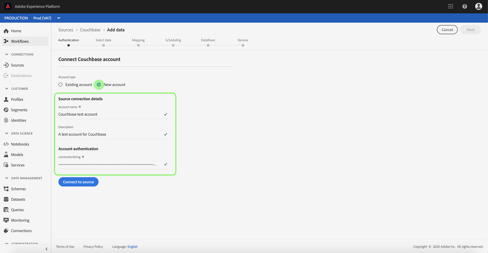

# Criar um [!DNL Couchbase] conexão de origem na interface

>[!NOTE]
>
> A variável [!DNL Couchbase] o conector está na versão beta. Consulte a [Visão geral das fontes](../../../../home.md#terms-and-conditions) para obter mais informações sobre o uso de conectores rotulados com beta.

Conectores de origem em [!DNL Adobe Experience Platform] fornecer a capacidade de assimilar dados obtidos externamente de forma programada. Este tutorial fornece etapas para a criação de um [!DNL Couchbase] conector de origem usando o [!DNL Platform] interface do usuário.

## Introdução

Este tutorial requer um entendimento prático dos seguintes componentes do [!DNL Platform]:

* [[!DNL Experience Data Model (XDM)] Sistema](../../../../../xdm/home.md): o quadro normalizado pelo qual [!DNL Experience Platform] organiza os dados de experiência do cliente.
   * [Noções básicas da composição do esquema](../../../../../xdm/schema/composition.md): saiba mais sobre os componentes básicos dos esquemas XDM, incluindo princípios fundamentais e práticas recomendadas na composição do esquema.
   * [Tutorial do Editor de esquemas](../../../../../xdm/tutorials/create-schema-ui.md): saiba como criar esquemas personalizados usando a interface do Editor de esquemas.
* [[!DNL Real-Time Customer Profile]](../../../../../profile/home.md): fornece um perfil de consumidor unificado em tempo real com base em dados agregados de várias fontes.

Se você já tiver um [!DNL Couchbase] conexão, você pode ignorar o restante deste documento e prosseguir para o tutorial em [configuração de um fluxo de dados](../../dataflow/databases.md).

### Coletar credenciais necessárias

Para autenticar seu [!DNL Couchbase] conector de origem, você deve fornecer valores para a seguinte propriedade de conexão:

| Credencial | Descrição |
| ---------- | ----------- |
| `connectionString` | A cadeia de conexão usada para se conectar ao [!DNL Couchbase] instância. O padrão da cadeia de conexão para [!DNL Couchbase] é `Server={SERVER}; Port={PORT};AuthMech=1;CredString=[{\"user\": \"{USER}\", \"pass\":\"{PASS}\"}];`. Para obter mais informações sobre como adquirir uma cadeia de conexão, consulte a documentação em [[!DNL Couchbase] conexão](https://docs.Couchbase.com/c-sdk/2.10/client-settings.html#configuring-overview). |

## Conecte seu [!DNL Couchbase] account

Depois de obter as credenciais necessárias, siga as etapas abaixo para vincular [!DNL Couchbase] conta para [!DNL Platform].

Efetue logon no [Adobe Experience Platform](https://platform.adobe.com) e selecione **[!UICONTROL Origens]** na barra de navegação esquerda, para acessar a **[!UICONTROL Origens]** espaço de trabalho. A variável **[!UICONTROL Catálogo]** A tela exibe uma variedade de fontes com as quais você pode criar uma conta.

Você pode selecionar a categoria apropriada no catálogo no lado esquerdo da tela. Como alternativa, você pode encontrar a fonte específica com a qual deseja trabalhar usando a opção de pesquisa.

No **[!UICONTROL Bancos de dados]** categoria, selecione **[!UICONTROL Couchbase]**. Se esta for a primeira vez que você usa este conector, selecione **[!UICONTROL Configurar]**. Caso contrário, selecione **[!UICONTROL Adicionar dados]** para criar um novo [!DNL Couchbase] conector.

A variável **[!UICONTROL Conectar à Couchbase]** é exibida. Nesta página, você pode usar credenciais novas ou existentes.

### Nova conta

Se estiver usando novas credenciais, selecione **[!UICONTROL Nova conta]**. No formulário de entrada que aparece, forneça um nome, uma descrição opcional e [!DNL Couchbase] credenciais. Quando terminar, selecione **[!UICONTROL Conectar à origem]** e aguarde algum tempo para estabelecer a nova conexão.

### Conta existente

Para conectar uma conta existente, selecione a [!DNL Couchbase] conta à qual deseja se conectar e selecione **[!UICONTROL Próxima]** no canto superior direito para continuar.

## Próximas etapas

Ao seguir este tutorial, você estabeleceu uma conexão com o seu [!DNL Couchbase] conta. Agora você pode seguir para o próximo tutorial e [configurar um fluxo de dados para trazer dados para o [!DNL Platform]](../../dataflow/databases.md).
