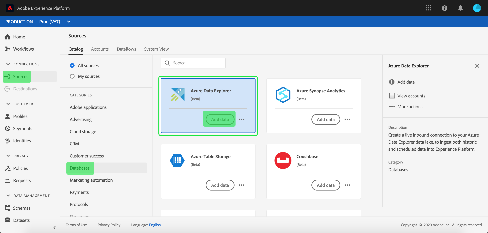

# Criar uma conexão de origem [!DNL Azure Data Explorer] na interface

Os conectores do Source no Adobe Experience Platform fornecem a capacidade de assimilar dados obtidos externamente de forma programada. Este tutorial fornece etapas para a criação de um conector de origem [!DNL Azure Data Explorer] (a seguir denominado &quot;[!DNL Data Explorer]&quot;) usando a interface do usuário [!DNL Experience Platform].

## Introdução

Este tutorial requer uma compreensão funcional dos seguintes componentes do Adobe Experience Platform:

* [[!DNL Experience Data Model (XDM)] Sistema](../../../../../xdm/home.md): a estrutura padronizada pela qual o [!DNL Experience Platform] organiza os dados de experiência do cliente.
   * [Noções básicas sobre a composição de esquema](../../../../../xdm/schema/composition.md): saiba mais sobre os blocos de construção básicos de esquemas XDM, incluindo princípios-chave e práticas recomendadas na composição de esquema.
   * [Tutorial do Editor de esquemas](../../../../../xdm/tutorials/create-schema-ui.md): saiba como criar esquemas personalizados usando a interface do Editor de esquemas.
* [[!DNL Real-Time Customer Profile]](../../../../../profile/home.md): Fornece um perfil de consumidor unificado em tempo real com base em dados agregados de várias fontes.

Se você já tiver uma conexão [!DNL Data Explorer] válida, ignore o restante deste documento e prossiga para o tutorial em [configurando um fluxo de dados](../../dataflow/databases.md).

### Coletar credenciais necessárias

Para acessar sua conta do [!DNL Data Explorer] em [!DNL Experience Platform], você deve fornecer os seguintes valores:

| Credencial | Descrição |
| ---------- | ----------- |
| `endpoint` | O ponto de extremidade do servidor [!DNL Data Explorer]. |
| `database` | O nome do banco de dados [!DNL Data Explorer]. |
| `tenant` | A ID de locatário exclusiva usada para conectar ao banco de dados [!DNL Data Explorer]. |
| `servicePrincipalId` | A ID exclusiva da entidade de serviço usada para se conectar ao banco de dados [!DNL Data Explorer]. |
| `servicePrincipalKey` | A chave da entidade de serviço exclusiva usada para se conectar ao banco de dados [!DNL Data Explorer]. |

Para obter mais informações sobre a introdução, consulte [este [!DNL Data Explorer] documento](https://docs.microsoft.com/en-us/azure/data-explorer/kusto/management/access-control/how-to-authenticate-with-aad).

## Conectar sua conta do [!DNL Azure Data Explorer]

Depois de obter as credenciais necessárias, siga as etapas abaixo para vincular sua conta do [!DNL Data Explorer] ao [!DNL Experience Platform].

Faça logon em [Adobe Experience Platform](https://platform.adobe.com) e selecione **[!UICONTROL Fontes]** na barra de navegação esquerda para acessar o espaço de trabalho **[!UICONTROL Fontes]**. A tela **[!UICONTROL Catálogo]** exibe uma variedade de fontes para as quais você pode criar uma conta.

Você pode selecionar a categoria apropriada no catálogo no lado esquerdo da tela. Como alternativa, você pode encontrar a fonte específica com a qual deseja trabalhar usando a opção de pesquisa.

Na categoria **[!UICONTROL Bancos de dados]**, selecione **[!UICONTROL Azure Data Explorer]**. Se esta for a primeira vez que você usa este conector, selecione **[!UICONTROL Configurar]**. Caso contrário, selecione **[!UICONTROL Adicionar dados]** para criar um novo conector do Data Explorer.

A página **[!UICONTROL Conectar-se ao Azure Data Explorer]** é exibida. Nesta página, você pode usar credenciais novas ou existentes.

### Nova conta

Se você estiver usando novas credenciais, selecione **[!UICONTROL Nova conta]**. No formulário de entrada que aparece, forneça um nome, uma descrição opcional e suas credenciais do [!DNL Data Explorer]. Quando terminar, selecione **[!UICONTROL Conectar]** e aguarde algum tempo para que a nova conexão seja estabelecida.

### Conta existente

Para conectar uma conta existente, selecione a conta [!DNL Data Explorer] com a qual deseja se conectar e clique em **[!UICONTROL Avançar]** para continuar.

## Próximas etapas

Seguindo este tutorial, você estabeleceu uma conexão com sua conta do [!DNL Data Explorer]. Agora você pode seguir para o próximo tutorial e [configurar um fluxo de dados para trazer dados para o  [!DNL Experience Platform]](../../dataflow/databases.md).
