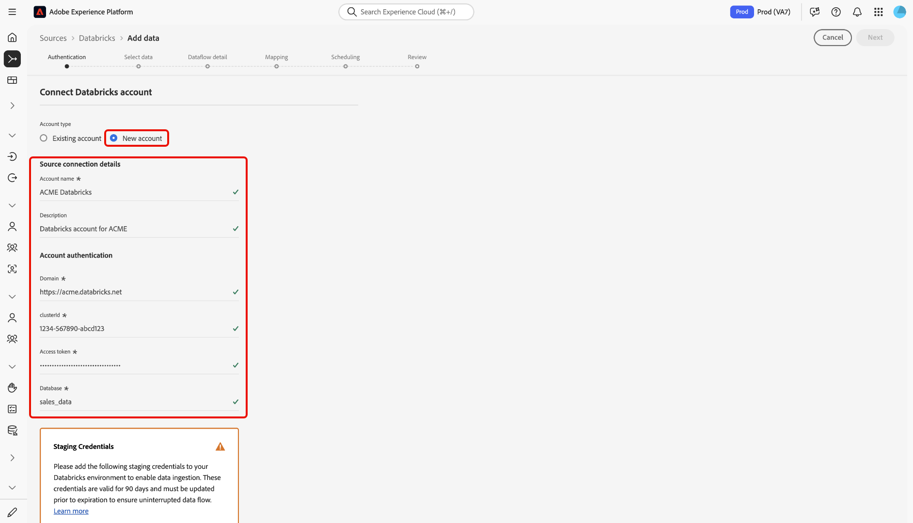

# Conectar o [!DNL Databricks] ao Experience Platform na interface

>[!AVAILABILITY]
>
>* A origem [!DNL Databricks] está disponível no catálogo de origens para usuários que compraram o Real-Time CDP Ultimate.
>
>* A origem [!DNL Databricks] está na versão beta. Leia os [termos e condições](../../../../home.md#terms-and-conditions) na visão geral das fontes para obter mais informações sobre como usar fontes com rótulo beta.

Leia este guia para saber como conectar sua conta do [!DNL Databricks] à Adobe Experience Platform usando o espaço de trabalho de fontes na interface do usuário.

## Introdução

Este guia requer uma compreensão funcional dos seguintes componentes do Experience Platform:

* [Fontes](../../../../home.md): o Experience Platform permite a assimilação de dados de várias fontes, ao mesmo tempo em que fornece a capacidade de estruturar, rotular e aprimorar os dados recebidos usando os serviços do Experience Platform.
* [Sandboxes](../../../../../sandboxes/home.md): a Experience Platform fornece sandboxes virtuais que particionam uma única instância do Experience Platform em ambientes virtuais separados para ajudar a desenvolver aplicativos de experiência digital.

### Coletar credenciais necessárias

Forneça valores para as credenciais a seguir para conectar [!DNL Databricks] ao Experience Platform.

| Credencial | Descrição |
| --- | --- |
| Domínio | A URL do espaço de trabalho [!DNL Databricks]. Por exemplo, `https://adb-1234567890123456.7.azuredatabricks.net`. |
| ID do cluster | A ID do cluster em [!DNL Databricks]. Este cluster já deve ser um cluster existente e deve ser um cluster interativo. |
| Token de acesso | O token de acesso que autentica a conta do [!DNL Databricks]. Você pode gerar seu token de acesso usando o espaço de trabalho [!DNL Databricks]. |
| Banco de dados | O nome do banco de dados no lago delta. |

Para obter mais informações, leia a visão geral[&#128279;](../../../../connectors/databases/databricks.md) do [!DNL Databricks] .

## Navegar pelo catálogo de origens

Na interface do Experience Platform, selecione **[!UICONTROL Fontes]** na navegação à esquerda para acessar o espaço de trabalho *[!UICONTROL Fontes]*. Escolha uma categoria ou use a barra de pesquisa para localizar sua fonte.

Para se conectar a [!DNL Databricks], vá para a categoria *[!UICONTROL Bancos de dados]*, selecione o cartão de origem **[!UICONTROL Blocos de dados do Azure]** e selecione **[!UICONTROL Configurar]**.

>[!TIP]
>
>As origens no catálogo de origens exibem a opção **[!UICONTROL Configurar]** quando uma determinada origem ainda não tem uma conta autenticada. Após a criação de uma conta autenticada, esta opção será alterada para **[!UICONTROL Adicionar dados]**.

### Usar uma conta existente

Para usar uma conta existente, selecione **[!UICONTROL Conta existente]** e depois selecione a conta [!DNL Azure Databricks] que deseja usar.

### Criar uma nova conta

Para criar uma nova conta, selecione **[!UICONTROL Nova conta]** e forneça um nome e, opcionalmente, adicione uma descrição para sua conta. Em seguida, forneça valores para as seguintes credenciais de autenticação:

* Domínio
* ID do cluster
* Token de acesso
* Banco de dados

Além disso, copie e cole suas credenciais do [!UICONTROL URI SAS de Preparo] no ambiente [!DNL Azure Databricks]. Quando terminar, selecione **[!UICONTROL Conectar à origem]** e aguarde alguns momentos para estabelecer a conexão.

## Criar um fluxo de dados para dados de [!DNL Azure Databricks]

Agora que a conta do [!DNL Azure Databricks] foi conectada com êxito, você pode [criar um fluxo de dados e assimilar dados do banco de dados na Experience Platform](../../dataflow/databases.md).
