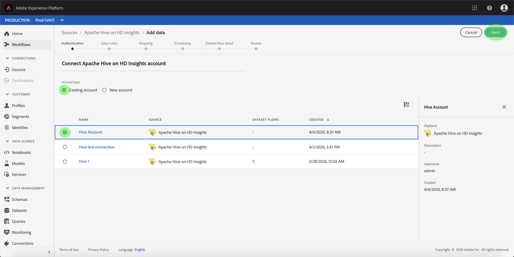

# Criar um conector [!DNL Apache Hive] on- [!DNL Azure HDInsights] source na interface do usuário

>[!NOTE]
> O conector [!DNL Apache Hive] ligado [!DNL Azure HDInsights] está em beta. Consulte a visão geral [das](../../../../home.md#terms-and-conditions) Fontes para obter mais informações sobre o uso de conectores com rótulo beta.

Os conectores de origem na Adobe Experience Platform fornecem a capacidade de assimilar dados de origem externa de forma programada. Este tutorial fornece etapas para a criação de um conector de origem [!DNL Apache Hive] on [!DNL Azure HDInsights] source usando a interface do [!DNL Platform] usuário.

## Introdução

Este tutorial requer uma compreensão funcional dos seguintes componentes do Adobe Experience Platform:

* [[!DNL Experience Data Model] (XDM) Sistema](../../../../../xdm/home.md): A estrutura padronizada pela qual [!DNL Experience Platform] organiza os dados de experiência do cliente.
   * [Noções básicas da composição](../../../../../xdm/schema/composition.md)do schema: Saiba mais sobre os elementos básicos dos schemas XDM, incluindo princípios-chave e práticas recomendadas na composição do schema.
   * [Tutorial](../../../../../xdm/tutorials/create-schema-ui.md)do Editor de schemas: Saiba como criar schemas personalizados usando a interface do editor de Schemas.
* [[!DNL Perfil do cliente em tempo real]](../../../../../profile/home.md): Fornece um perfil unificado e em tempo real para o consumidor, com base em dados agregados de várias fontes.

Se você já tiver uma [!DNL Hive] conexão válida, poderá ignorar o restante desse documento e prosseguir para o tutorial sobre como [configurar um fluxo de dados](../../dataflow/databases.md)

### Reunir credenciais obrigatórias

Para acessar sua [!DNL Hive] conta em [!DNL Platform], forneça os seguintes valores:

| Credencial | Descrição |
| ---------- | ----------- |
| `host` | O endereço IP ou o nome do host do [!DNL Hive] servidor. |
| `username` | O nome de usuário que você usa para acessar o [!DNL Hive] servidor. |
| `password` | A senha que corresponde ao usuário. |

Para obter mais informações sobre a introdução, consulte [ [!DNL Hive] este documento](https://cwiki.apache.org/confluence/display/Hive/Tutorial#Tutorial-GettingStarted).

## Conectar sua [!DNL Hive] conta

Depois de reunir as credenciais necessárias, siga as etapas abaixo para vincular sua [!DNL Hive] conta a [!DNL Platform].

Faça logon no [Adobe Experience Platform](https://platform.adobe.com) e selecione **[!UICONTROL Fontes]** na barra de navegação esquerda para acessar a área de trabalho **[!UICONTROL Fontes]** . A tela **[!UICONTROL Catálogo]** exibe várias fontes com as quais você pode criar uma conta.

Você pode selecionar a categoria apropriada no catálogo no lado esquerdo da tela. Como alternativa, você pode encontrar a fonte específica com a qual deseja trabalhar usando a opção de pesquisa.

Na categoria **[!UICONTROL Bancos]** de dados, selecione **[!UICONTROL Colar]**. Se esta for a sua primeira vez usando este conector, selecione **[!UICONTROL Configurar]**. Caso contrário, selecione **[!UICONTROL Adicionar dados]** para criar um novo [!DNL Hive] conector.

A página **[!UICONTROL Conectar-se à colmeia]** é exibida. Nesta página, você pode usar credenciais novas ou existentes.

### Nova conta

Se você estiver usando novas credenciais, selecione **[!UICONTROL Nova conta]**. No formulário de entrada exibido, forneça um nome, uma descrição opcional e suas [!DNL Hive] credenciais. Quando terminar, selecione **[!UICONTROL Connect]** e aguarde algum tempo para a nova conexão ser estabelecida.

### Conta existente

Para conectar uma conta existente, selecione a [!DNL Hive] conta à qual deseja se conectar e, em seguida, selecione **[!UICONTROL Avançar]** para continuar.

## Próximas etapas

Ao seguir este tutorial, você estabeleceu uma conexão com sua [!DNL Hive] conta. Agora você pode continuar para o próximo tutorial e [configurar um fluxo de dados para trazer [!DNL Platform]](../../dataflow/databases.md)os dados para o