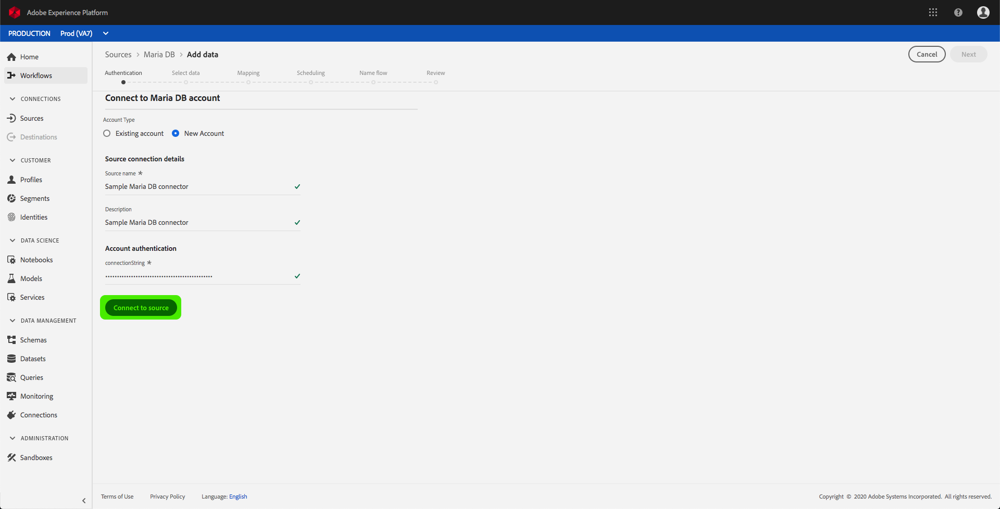

# Criar um conector de origem MariaDB na interface do usuário

> [!NOTE]
> O conector MariaDB está em beta. Os recursos e a documentação estão sujeitos a alterações.

Os conectores de origem na Adobe Experience Platform fornecem a capacidade de assimilar dados de origem externa de forma programada. Este tutorial fornece etapas para a criação de um conector de origem Maria DB usando a interface de usuário da plataforma.

## Introdução

Este tutorial requer uma compreensão prática dos seguintes componentes da Adobe Experience Platform:

* [Sistema](../../../../../xdm/home.md)do Experience Data Model (XDM): A estrutura padronizada pela qual a plataforma Experience organiza os dados da experiência do cliente.
   * [Noções básicas da composição](../../../../../xdm/schema/composition.md)do schema: Saiba mais sobre os elementos básicos dos schemas XDM, incluindo princípios-chave e práticas recomendadas na composição do schema.
   * [Tutorial](../../../../../xdm/tutorials/create-schema-ui.md)do Editor de Schemas: Saiba como criar schemas personalizados usando a interface do editor de Schemas.
* [Perfil](../../../../../profile/home.md)do cliente em tempo real: Fornece um perfil unificado e em tempo real para o consumidor, com base em dados agregados de várias fontes.

Se você já tiver uma conexão básica Maria DB, poderá ignorar o restante deste documento e prosseguir para o tutorial sobre como [configurar um fluxo de dados](../../dataflow/databases.md).

### Reunir credenciais obrigatórias

Para acessar sua conta Maria DB na Plataforma, forneça o seguinte valor:

| Credencial | Descrição |
| ---------- | ----------- |
| `connectionString` | A cadeia de conexão associada à autenticação MariaDB. O padrão da string de conexão MariaDB é: `Server={HOST};Port={PORT};Database={DATABASE};UID={USERNAME};PWD={PASSWORD}`. |

Consulte [este documento](https://mariadb.com/kb/en/about-mariadb-connector-odbc/) para obter mais informações sobre a introdução à MariaDB.

## Conectar sua conta Maria DB

Depois de reunir as credenciais necessárias, siga as etapas abaixo para criar uma nova conexão básica de entrada para vincular sua conta do Maria DB à Plataforma.

Faça logon na <a href="https://platform.adobe.com" target="_blank">Adobe Experience Platform</a> e selecione **Fontes** na barra de navegação esquerda para acessar a área de trabalho *Fontes* . A tela *Catálogo* exibe várias fontes com as quais você pode criar conexões base de entrada e cada fonte mostra o número de conexões base existentes associadas a elas.

Na categoria *Bancos* de dados, selecione **Maria DB** para expor uma barra de informações no lado direito da tela. A barra de informações fornece uma breve descrição para a fonte selecionada, bem como opções para se conectar à fonte ou à sua documentação de visualização. Para criar uma nova conexão básica de entrada, selecione Origem **do** Connect.

A página *Conectar-se a Maria DB* é exibida. Nesta página, você pode usar credenciais novas ou existentes.

### Nova conta

Se você estiver usando novas credenciais, selecione **Nova conta**. No formulário de entrada exibido, forneça um nome à conexão básica, uma descrição opcional e suas credenciais do Maria DB. Quando terminar, selecione **Connect** e aguarde algum tempo para a nova conexão básica ser estabelecida.

### Conta existente

Para conectar uma conta existente, selecione a conta Maria DB à qual deseja se conectar e, em seguida, selecione **Avançar** para continuar.

## Próximas etapas

Ao seguir este tutorial, você estabeleceu uma conexão básica para sua conta Maria DB. Agora você pode continuar com o próximo tutorial e [configurar um fluxo de dados para trazer dados para a Plataforma](../../dataflow/databases.md).