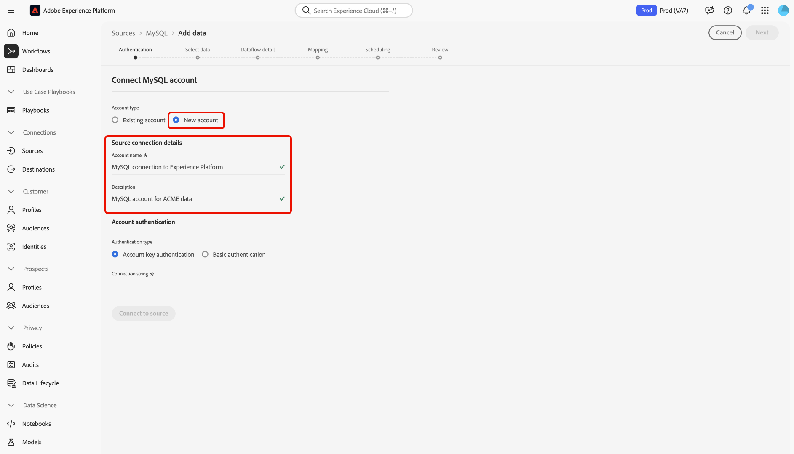

# Criar uma conexão de origem [!DNL MySQL] na interface do usuário

>[!NOTE]
>
> O conector [!DNL MySQL] está em beta. Consulte a [Visão geral das fontes](../../../../home.md#terms-and-conditions) para obter mais informações sobre o uso de conectores marcados com beta.

Os conectores de origem na Adobe Experience Platform fornecem a capacidade de assimilar dados de origem externa de forma programada. Este tutorial fornece etapas para criar uma conexão de origem [!DNL MySQL] usando a interface do usuário do Adobe Experience Platform.

## Introdução

Este tutorial requer uma compreensão funcional dos seguintes componentes do Adobe Experience Platform:

* [[!DNL Experience Data Model (XDM)] Sistema](../../../../../xdm/home.md): A estrutura padronizada pela qual o Experience Platform organiza os dados de experiência do cliente.
   * [Noções básicas da composição](../../../../../xdm/schema/composition.md) do schema: Saiba mais sobre os elementos básicos dos schemas XDM, incluindo princípios-chave e práticas recomendadas na composição do schema.
   * [Tutorial](../../../../../xdm/tutorials/create-schema-ui.md) do Editor de schemas: Saiba como criar schemas personalizados usando a interface do editor de Schemas.
* [[!DNL Real-time Customer Profile]](../../../../../profile/home.md): Fornece um perfil unificado e em tempo real para o consumidor, com base em dados agregados de várias fontes.

Se você já tiver uma conexão [!DNL MySQL], poderá ignorar o restante desse documento e prosseguir para o tutorial em [configurar um fluxo de dados](../../dataflow/databases.md).

### Reunir credenciais obrigatórias

Para acessar sua conta [!DNL MySQL] em [!DNL Platform], forneça o seguinte valor:

| Credencial | Descrição |
| ---------- | ----------- |
| `connectionString` | A cadeia de conexão [!DNL MySQL] associada à sua conta. O padrão da cadeia de conexão [!DNL MySQL] é: `Server={SERVER};Port={PORT};Database={DATABASE};UID={USERNAME};PWD={PASSWORD}`. Você pode saber mais sobre sequências de conexão e como obtê-las lendo o documento [[!DNL MySQL] a1/>.](https://dev.mysql.com/doc/connector-net/en/connector-net-connections-string.html) |

## Conectar sua conta [!DNL MySQL]

Depois de reunir as credenciais necessárias, siga as etapas abaixo para vincular sua conta [!DNL MySQL] a [!DNL Platform].

Faça logon em [Adobe Experience Platform](https://platform.adobe.com) e selecione **[!UICONTROL Fontes]** na barra de navegação esquerda para acessar a área de trabalho **[!UICONTROL Fontes]**. A tela **[!UICONTROL Catalog]** exibe várias fontes com as quais você pode criar uma conta.

Na categoria **[!UICONTROL Bancos de Dados]**, selecione **[!UICONTROL MySQL]**. Se esta for a sua primeira vez usando este conector, selecione **[!UICONTROL Configurar]**. Caso contrário, selecione **[!UICONTROL Adicionar dados]** para criar um novo conector [!DNL MySQL].

A página **[!UICONTROL Conectar-se ao MySQL]** é exibida. Nesta página, você pode usar credenciais novas ou existentes.

### Nova conta

Se você estiver usando novas credenciais, selecione **[!UICONTROL Nova conta]**. No formulário de entrada exibido, forneça um nome, uma descrição opcional e suas credenciais [!DNL MySQL]. Quando terminar, selecione **[!UICONTROL Connect]** e aguarde algum tempo para a nova conexão ser estabelecida.

### Conta existente

Para conectar uma conta existente, selecione a conta [!DNL MySQL] com a qual você deseja se conectar e selecione **[!UICONTROL Próximo]** para prosseguir.

## Próximas etapas

Ao seguir este tutorial, você estabeleceu uma conexão com sua conta MySQL. Agora você pode continuar para o próximo tutorial e [configurar um fluxo de dados para trazer dados para [!DNL Platform]](../../dataflow/databases.md).