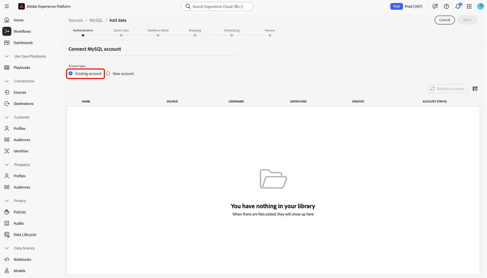

# Criar um [!DNL MySQL] conexão de origem na interface

Os conectores de origem no Adobe Experience Platform fornecem a capacidade de assimilar dados originados externamente de forma programada. Este tutorial fornece etapas para a criação de um [!DNL MySQL] conexão de origem usando a interface do Adobe Experience Platform.

## Introdução

Este tutorial requer uma compreensão funcional dos seguintes componentes do Adobe Experience Platform:

* [[!DNL Experience Data Model (XDM)] Sistema](../../../../../xdm/home.md): a estrutura padronizada pela qual o Experience Platform organiza os dados de experiência do cliente.
   * [Noções básicas da composição do esquema](../../../../../xdm/schema/composition.md): saiba mais sobre os componentes básicos dos esquemas XDM, incluindo princípios fundamentais e práticas recomendadas na composição do esquema.
   * [Tutorial do Editor de esquemas](../../../../../xdm/tutorials/create-schema-ui.md): saiba como criar esquemas personalizados usando a interface do Editor de esquemas.
* [[!DNL Real-Time Customer Profile]](../../../../../profile/home.md): fornece um perfil de consumidor unificado em tempo real com base em dados agregados de várias fontes.

Se você já tiver uma [!DNL MySQL] conexão, você pode ignorar o restante deste documento e prosseguir para o tutorial em [configuração de um fluxo de dados](../../dataflow/databases.md).

### Coletar credenciais necessárias

Para acessar seu [!DNL MySQL] conta em [!DNL Platform], você deve fornecer o seguinte valor:

| Credencial | Descrição |
| ---------- | ----------- |
| `connectionString` | A variável [!DNL MySQL] sequência de conexão associada à sua conta. A variável [!DNL MySQL] o padrão da cadeia de conexão é: `Server={SERVER};Port={PORT};Database={DATABASE};UID={USERNAME};PWD={PASSWORD}`. Você pode saber mais sobre cadeias de conexão e como obtê-las lendo o [[!DNL MySQL] documento](https://dev.mysql.com/doc/connector-net/en/connector-net-connections-string.html). |

## Conecte seu [!DNL MySQL] account

Depois de obter as credenciais necessárias, siga as etapas abaixo para vincular [!DNL MySQL] conta para [!DNL Platform].

Efetue logon no [Adobe Experience Platform](https://platform.adobe.com) e selecione **[!UICONTROL Origens]** na barra de navegação esquerda, para acessar a **[!UICONTROL Origens]** espaço de trabalho. A variável **[!UICONTROL Catálogo]** A tela exibe uma variedade de fontes com as quais você pode criar uma conta.

No **[!UICONTROL Bancos de dados]** categoria, selecione **[!UICONTROL MySQL]**. Se esta for a primeira vez que você usa este conector, selecione **[!UICONTROL Configurar]**. Caso contrário, selecione **[!UICONTROL Adicionar dados]** para criar um novo [!DNL MySQL] conector.

A variável **[!UICONTROL Conectar-se ao MySQL]** é exibida. Nesta página, você pode usar credenciais novas ou existentes.

### Nova conta

Se estiver usando novas credenciais, selecione **[!UICONTROL Nova conta]**. No formulário de entrada que aparece, forneça um nome, uma descrição opcional e [!DNL MySQL] credenciais. Quando terminar, selecione **[!UICONTROL Conectar]** e aguarde algum tempo para estabelecer a nova conexão.

### Conta existente

Para conectar uma conta existente, selecione a [!DNL MySQL] conta à qual deseja se conectar e selecione **[!UICONTROL Próxima]** para continuar.

## Próximas etapas

Seguindo este tutorial, você estabeleceu uma conexão com sua conta MySQL. Agora você pode seguir para o próximo tutorial e [configurar um fluxo de dados para trazer dados para o [!DNL Platform]](../../dataflow/databases.md).
