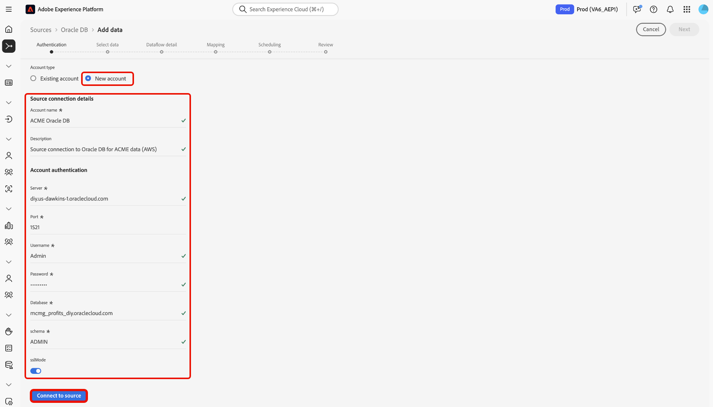

# Conectar o [!DNL Oracle DB] ao Experience Platform usando a interface

Leia este guia para saber como conectar sua instância do [!DNL Oracle DB] ao Adobe Experience Platform usando o espaço de trabalho de origens na interface do usuário do Experience Platform.

## Introdução

Este tutorial requer uma compreensão funcional dos seguintes componentes do Adobe Experience Platform:

* [[!DNL Experience Data Model (XDM)] Sistema](../../../../../xdm/home.md): a estrutura padronizada pela qual o Experience Platform organiza os dados de experiência do cliente.
   * [Noções básicas sobre a composição de esquema](../../../../../xdm/schema/composition.md): saiba mais sobre os blocos de construção básicos de esquemas XDM, incluindo princípios-chave e práticas recomendadas na composição de esquema.
   * [Tutorial do Editor de esquemas](../../../../../xdm/tutorials/create-schema-ui.md): saiba como criar esquemas personalizados usando a interface do Editor de esquemas.
* [[!DNL Real-Time Customer Profile]](../../../../../profile/home.md): Fornece um perfil de consumidor unificado em tempo real com base em dados agregados de várias fontes.

Se você já tiver uma conexão [!DNL Oracle DB], ignore o restante deste documento e prossiga para o tutorial em [configurando um fluxo de dados](../../dataflow/databases.md).

### Coletar credenciais necessárias

Leia a [[!DNL Oracle DB] visão geral](../../../../connectors/databases/oracle.md#prerequisites) para obter informações sobre autenticação.

## Navegar pelo catálogo de origens

Na interface do Experience Platform, selecione **[!UICONTROL Fontes]** na navegação à esquerda para acessar o espaço de trabalho *[!UICONTROL Fontes]*. Escolha uma categoria ou use a barra de pesquisa para localizar sua fonte.

Para se conectar a [!DNL Oracle DB], vá para a categoria *[!UICONTROL Bancos de Dados]*, selecione o cartão de origem **[!UICONTROL Oracle DB]** e selecione **[!UICONTROL Configurar]**.

>[!TIP]
>
>As fontes mostram **[!UICONTROL Configurar]** para novas conexões e **[!UICONTROL Adicionar dados]** se uma conta já existir.

## Usar uma conta existente {#existing}

Para usar uma conta existente, selecione **[!UICONTROL Conta existente]** e depois selecione a conta [!DNL Oracle DB] que deseja usar.

## Criar uma nova conta {#new}

Para criar uma nova conta, selecione **[!UICONTROL Nova conta]** e forneça um nome e, opcionalmente, adicione uma descrição para sua conta.

### Conectar-se ao Experience Platform no Azure {#azure}

Você pode conectar seu banco de dados do [!DNL Oracle DB] ao Experience Platform no Azure usando uma cadeia de conexão.

Para usar a autenticação da cadeia de conexão, forneça sua [cadeia de conexão](../../../../connectors/databases/oracle.md#azure) e selecione **[!UICONTROL Conectar à origem]**.

### Conectar-se ao Experience Platform no Amazon Web Services (AWS) {#aws}

>[!AVAILABILITY]
>
>Esta seção se aplica às implementações do Experience Platform em execução no Amazon Web Services (AWS). O Experience Platform em execução no AWS está disponível atualmente para um número limitado de clientes. Para saber mais sobre a infraestrutura do Experience Platform compatível, consulte a [visão geral da nuvem múltipla do Experience Platform](../../../../../landing/multi-cloud.md).

Para criar uma nova conta do [!DNL Oracle DB] e conectar-se ao Experience Platform no AWS, verifique se você está em uma sandbox VA6 e forneça as [credenciais necessárias para autenticação](../../../../connectors/databases/oracle.md#aws).

## Criar um fluxo de dados para dados de [!DNL Oracle DB]

Agora que você conectou com êxito o banco de dados [!DNL Oracle DB], agora é possível [criar um fluxo de dados e assimilar dados do banco de dados na Experience Platform](../../dataflow/databases.md).
