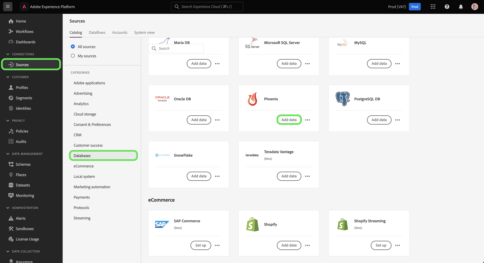

# Conecte sua conta do [!DNL Phoenix] ao Experience Platform usando a interface

>[!WARNING]
>
>A origem [!DNL Phoenix] será substituída no final de maio de 2025.

Este tutorial fornece etapas sobre como conectar sua conta do [!DNL Phoenix] e trazer dados do banco de dados do [!DNL Phoenix] para o Experience Platform.

## Introdução

Este tutorial requer uma compreensão funcional dos seguintes componentes do Adobe Experience Platform:

* [[!DNL Experience Data Model (XDM)] Sistema](../../../../../xdm/home.md): a estrutura padronizada pela qual o Experience Platform organiza os dados de experiência do cliente.
   * [Noções básicas sobre a composição de esquema](../../../../../xdm/schema/composition.md): saiba mais sobre os blocos de construção básicos de esquemas XDM, incluindo princípios-chave e práticas recomendadas na composição de esquema.
   * [Tutorial do Editor de esquemas](../../../../../xdm/tutorials/create-schema-ui.md): saiba como criar esquemas personalizados usando a interface do Editor de esquemas.
* [[!DNL Real-Time Customer Profile]](../../../../../profile/home.md): Fornece um perfil de consumidor unificado em tempo real com base em dados agregados de várias fontes.

Se você já tiver uma conta autenticada do [!DNL Phoenix], ignore o restante deste documento e prossiga para o tutorial em [configurando um fluxo de dados para um banco de dados](../../dataflow/databases.md).

### Coletar credenciais necessárias

Para acessar sua conta do [!DNL Phoenix] no Experience Platform, você deve fornecer os seguintes valores:

| Credencial | Descrição |
| --- | --- |
| Host | O endereço IP ou o nome de host do servidor [!DNL Phoenix]. |
| Porta | A porta TCP que o servidor [!DNL Phoenix] usa para escutar conexões de clientes. Se você estiver se conectando a [!DNL Azure HDInsights], especifique a porta como 443. Se esse parâmetro não for fornecido, o valor padrão será 8765. |
| Caminho HTTP | A URL parcial correspondente ao servidor [!DNL Phoenix]. Especifique /hbasephoenix0 se estiver usando o cluster [!DNL Azure HDInsights]. |
| Nome de usuário | O nome de usuário usado para acessar o servidor [!DNL Phoenix]. |
| Senha | A senha que corresponde ao usuário. |
| Enable SSL | Um botão que especifica se as conexões com o servidor são criptografadas usando SSL. |

Para obter mais informações sobre a introdução, consulte [este [!DNL Phoenix] documento](https://python-phoenixdb.readthedocs.io/en/latest/api.html).

Depois de obter as credenciais necessárias, você poderá seguir as etapas abaixo para conectar sua conta do [!DNL Phoenix] ao Experience Platform.

## Conectar sua conta do [!DNL Phoenix]

Na interface da Platform, selecione **[!UICONTROL Fontes]** na navegação à esquerda para acessar o espaço de trabalho de fontes. A tela *[!UICONTROL Catálogo]* exibe uma variedade de fontes disponíveis no catálogo de fontes do Experience Platform.

Você pode selecionar a categoria apropriada no catálogo no lado esquerdo da tela. Como alternativa, você pode encontrar uma fonte específica usando a opção de pesquisa.

Selecione **[!UICONTROL Bancos de dados]** na lista de categorias de fontes e selecione **[!UICONTROL Adicionar dados]** no cartão [!DNL Phoenix].

>[!TIP]
>
>As origens no catálogo de origens podem exibir prompts diferentes, dependendo do status da origem.
> 
>* **[!UICONTROL Adicionar dados]** significa que há contas autenticadas existentes associadas à origem selecionada.
>
>* **[!UICONTROL Configurar]** significa que você deve fornecer credenciais e autenticar uma nova conta para usar a fonte selecionada.

A página **[!UICONTROL Conectar-se a Phoenix]** é exibida. Nesta página, você pode usar credenciais novas ou existentes.

>[!BEGINTABS]

>[!TAB Usar uma conta existente do Phoenix]

Para usar uma conta existente, selecione [!UICONTROL Conta existente] e, em seguida, selecione a conta que deseja usar na lista exibida. Quando terminar, selecione [!UICONTROL Avançar] para continuar.

>[!TAB Criar uma nova conta Phoenix]

Para usar uma nova conta, selecione [!UICONTROL Nova conta] e forneça um nome, uma descrição e suas credenciais de autenticação do [!DNL Phoenix]. Quando terminar, selecione [!UICONTROL Conectar à origem] e aguarde alguns segundos para estabelecer a nova conexão.

>[!ENDTABS]

## Próximas etapas

Seguindo este tutorial, você estabeleceu uma conexão com sua conta do [!DNL Phoenix]. Agora você pode seguir para o próximo tutorial e [configurar um fluxo de dados para trazer dados para o Experience Platform](../../dataflow/databases.md).
