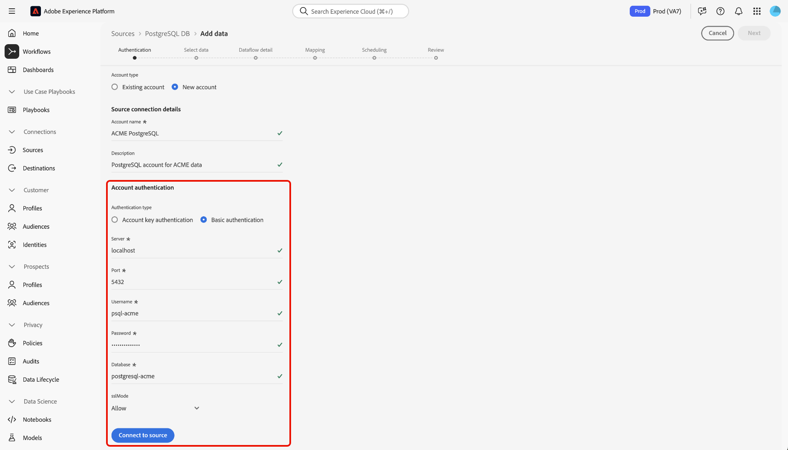

# Conectar o [!DNL PostgreSQL] ao Experience Platform usando a interface

Leia este guia para saber como conectar seu banco de dados do [!DNL PostgreSQL] ao Adobe Experience Platform usando o espaço de trabalho de origens na interface do usuário do Experience Platform.

## Introdução

Este tutorial requer uma compreensão funcional dos seguintes componentes do Adobe Experience Platform:

* [[!DNL Experience Data Model (XDM)] Sistema](../../../../../xdm/home.md): a estrutura padronizada pela qual o Experience Platform organiza os dados de experiência do cliente.
   * [Noções básicas sobre a composição de esquema](../../../../../xdm/schema/composition.md): saiba mais sobre os blocos de construção básicos de esquemas XDM, incluindo princípios-chave e práticas recomendadas na composição de esquema.
   * [Tutorial do Editor de esquemas](../../../../../xdm/tutorials/create-schema-ui.md): saiba como criar esquemas personalizados usando a interface do Editor de esquemas.
* [[!DNL Real-Time Customer Profile]](../../../../../profile/home.md): Fornece um perfil de consumidor unificado em tempo real com base em dados agregados de várias fontes.

Se você já tiver uma conexão [!DNL PostgreSQL] válida, ignore o restante deste documento e prossiga para o tutorial em [configurando um fluxo de dados](../../dataflow/databases.md).

### Coletar credenciais necessárias

Leia a [[!DNL PostgreSQL] visão geral](../../../../connectors/databases/postgres.md) para obter mais informações sobre autenticação.

### Habilitar criptografia SSL para sua cadeia de conexão

Você pode habilitar a criptografia SSL para a cadeia de conexão [!DNL PostgreSQL] anexando sua cadeia de conexão com as seguintes propriedades:

| Propriedade | Descrição | Exemplo |
| --- | --- | --- |
| `EncryptionMethod` | Permite habilitar a criptografia SSL nos dados do [!DNL PostgreSQL]. | <uL><li>`EncryptionMethod=0`(Desabilitado)</li><li>`EncryptionMethod=1`(Habilitado)</li><li>`EncryptionMethod=6`(RequestSSL)</li></ul> |
| `ValidateServerCertificate` | Valida o certificado enviado pelo banco de dados [!DNL PostgreSQL] quando `EncryptionMethod` é aplicado. | <uL><li>`ValidationServerCertificate=0`(Desabilitado)</li><li>`ValidationServerCertificate=1`(Habilitado)</li></ul> |

Este é um exemplo de uma cadeia de conexão [!DNL PostgreSQL] anexada com criptografia SSL: `Server={SERVER};Database={DATABASE};Port={PORT};UID={USERNAME};Password={PASSWORD};EncryptionMethod=1;ValidateServerCertificate=1`.

## Navegar pelo catálogo de origens {#navigate}

Na interface do Experience Platform, selecione **[!UICONTROL Fontes]** na navegação à esquerda para acessar o espaço de trabalho *[!UICONTROL Fontes]*. Selecione a categoria apropriada no painel *[!UICONTROL Categorias]* Como alternativa, use a barra de pesquisa para navegar até a fonte específica que deseja usar.

Para usar [!DNL PostgreSQL], selecione o cartão de origem **[!UICONTROL PostgreSQL]** em *[!UICONTROL Bancos de Dados]* e selecione **[!UICONTROL Configurar]**.

>[!TIP]
>
>As origens no catálogo de origens exibem a opção **[!UICONTROL Configurar]** quando uma determinada origem ainda não tem uma conta autenticada. Após a criação de uma conta autenticada, esta opção será alterada para **[!UICONTROL Adicionar dados]**.

## Usar uma conta existente {#existing}

Para usar uma conta existente, selecione **[!UICONTROL Conta existente]** e depois selecione a conta [!DNL PostgreSQL] que deseja usar.

## Criar uma nova conta {#create}

Se você não tiver uma conta existente, deverá criar uma nova conta fornecendo as credenciais de autenticação necessárias que correspondam à sua origem.

Para criar uma nova conta, selecione **[!UICONTROL Nova conta]** e forneça um nome e, opcionalmente, adicione uma descrição para sua conta.

### Conectar-se ao Experience Platform no Azure {#azure}

Você pode conectar sua conta do [!DNL PostgreSQL] ao Experience Platform no Azure usando a chave da conta ou a autenticação básica.

>[!BEGINTABS]

>[!TAB Autenticação da chave da conta]

Para usar a autenticação de chave de conta, selecione **[!UICONTROL Autenticação de chave de conta]**, forneça sua [cadeia de conexão](../../../../connectors/databases/postgres.md#azure) e selecione **[!UICONTROL Conectar à origem]**.

>[!TAB Autenticação básica]

Para usar a autenticação básica, selecione **[!UICONTROL Autenticação básica]**, forneça valores para suas [credenciais de autenticação](../../../../connectors/databases/postgres.md#azure) e selecione **[!UICONTROL Conectar à origem]**.

>[!ENDTABS]

### Conectar-se ao Experience Platform no Amazon Web Services (AWS) {#aws}

>[!AVAILABILITY]
>
>Esta seção se aplica às implementações do Experience Platform em execução no Amazon Web Services (AWS). O Experience Platform em execução no AWS está disponível atualmente para um número limitado de clientes. Para saber mais sobre a infraestrutura do Experience Platform compatível, consulte a [visão geral da nuvem múltipla do Experience Platform](../../../../../landing/multi-cloud.md).

Para criar uma nova conta do [!DNL PostgreSQL] e conectar-se ao Experience Platform no AWS, verifique se você está em uma sandbox VA6 e forneça as [credenciais necessárias para autenticação](../../../../connectors/databases/postgres.md#aws).

## Criar um fluxo de dados para seus dados do [!DNL PostgreSQL]

Seguindo este tutorial, você estabeleceu uma conexão com sua conta do [!DNL MariaDB]. Agora você pode seguir para o próximo tutorial e [configurar um fluxo de dados para trazer dados para a Experience Platform](../../dataflow/databases.md).
