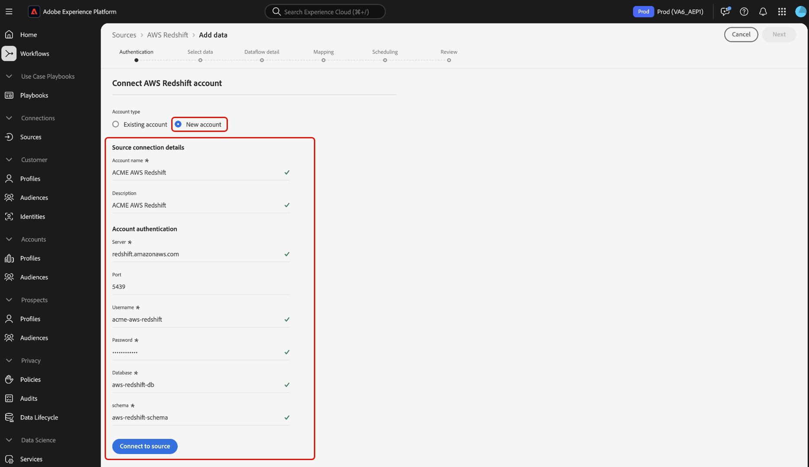

# Conectar o [!DNL AWS Redshift] ao Experience Platform usando a interface

>[!IMPORTANT]
>
>A origem [!DNL AWS Redshift] está disponível no catálogo de origens para usuários que compraram o Real-Time Customer Data Platform Ultimate.

Leia este guia para saber como conectar sua conta do [!DNL AWS Redshift] à Adobe Experience Platform usando o espaço de trabalho de fontes na interface do usuário.

## Introdução

Este tutorial requer uma compreensão funcional dos seguintes componentes do Experience Platform:

- [[!DNL Experience Data Model (XDM)] Sistema](../../../../../xdm/home.md): a estrutura padronizada pela qual o Experience Platform organiza os dados de experiência do cliente.
   - [Noções básicas sobre a composição de esquema](../../../../../xdm/schema/composition.md): saiba mais sobre os blocos de construção básicos de esquemas XDM, incluindo princípios-chave e práticas recomendadas na composição de esquema.
   - [Tutorial do Editor de esquemas](../../../../../xdm/tutorials/create-schema-ui.md): saiba como criar esquemas personalizados usando a interface do Editor de esquemas.
- [[!DNL Real-Time Customer Profile]](../../../../../profile/home.md): Fornece um perfil de consumidor unificado em tempo real com base em dados agregados de várias fontes.

Se você já tiver uma conexão [!DNL AWS Redshift] válida, ignore o restante deste documento e prossiga para o tutorial em [configurando um fluxo de dados](../../dataflow/databases.md).

## Navegar pelo catálogo de origens

Na interface da Platform, selecione **[!UICONTROL Fontes]** na navegação à esquerda para acessar o espaço de trabalho [!UICONTROL Fontes]. Você pode selecionar a categoria apropriada no catálogo no lado esquerdo da tela. Como alternativa, você pode encontrar a fonte específica com a qual deseja trabalhar usando a opção de pesquisa.

Selecione **[!DNL AWS Redshift]** na categoria *[!UICONTROL Bancos de dados]* e selecione **[!UICONTROL Configurar]**.

>[!TIP]
>
>As origens no catálogo de origens exibem a opção **[!UICONTROL Configurar]** quando uma determinada origem ainda não tem uma conta autenticada. Quando uma conta autenticada existir, esta opção será alterada para **[!UICONTROL Adicionar dados]**.

## Usar uma conta existente {#existing}

Em seguida, você é levado à etapa de autenticação do workflow de origens. Aqui, você pode usar uma conta existente ou criar uma nova conta.

Para usar uma conta existente, selecione a conta [!DNL AWS Redshift] no diretório de contas e selecione **[!UICONTROL Avançar]** para continuar.

## Criar uma nova conta {#create}

Se você não tiver uma conta existente, deverá criar uma nova conta fornecendo as credenciais de autenticação necessárias que correspondam à sua origem.

Para criar uma nova conta, selecione **[!UICONTROL Nova conta]** e forneça um nome e, opcionalmente, adicione uma descrição para sua conta.

### Conectar-se ao Experience Platform no Azure {#azure}

Para conectar sua conta do [!DNL AWS Redshift] ao Experience Platform no Azure, forneça suas credenciais de autenticação no formulário de entrada e selecione **([!UICONTROL Conectar à origem])**.

| Credencial | Descrição |
| --- | --- |
| Servidor | O nome do servidor da instância [!DNL AWS Redshift]. |
| Porta | A porta TCP que um servidor [!DNL AWS Redshift] usa para escutar conexões de clientes. |
| Nome de usuário | O nome de usuário da conta à qual você deseja conceder acesso. |
| Senha | A senha que corresponde à conta do usuário. |
| Banco de dados | O banco de dados [!DNL AWS Redshift] do qual os dados devem ser obtidos. |

Para obter mais informações sobre a introdução, consulte [este [!DNL AWS Redshift] documento](https://docs.aws.amazon.com/redshift/latest/gsg/new-user-serverless.html).

### Conectar-se ao Experience Platform no AWS {#aws}

>[!AVAILABILITY]
>
>Esta seção se aplica às implementações do Experience Platform executadas no AWS Web Services (AWS). O Experience Platform em execução no AWS está disponível atualmente para um número limitado de clientes. Para saber mais sobre a infraestrutura do Experience Platform compatível, consulte a [visão geral da nuvem múltipla do Experience Platform](../../../../../landing/multi-cloud.md).

Para criar uma nova conta do [!DNL AWS Redshift] e conectar-se ao Experience Platform no AWS, verifique se você está em uma sandbox VA6, forneça as credenciais necessárias para autenticação e selecione **[!UICONTROL Conectar à origem]**.

| Credencial | Descrição |
| --- | --- |
| Servidor | O nome do servidor da instância [!DNL AWS Redshift]. |
| Porta | A porta TCP que um servidor [!DNL AWS Redshift] usa para escutar conexões de clientes. |
| Nome de usuário | O nome de usuário da conta à qual você deseja conceder acesso. |
| Senha | A senha que corresponde à conta do usuário. |
| Banco de dados | O banco de dados [!DNL AWS Redshift] do qual os dados devem ser obtidos. |
| Esquema | O nome do esquema associado ao banco de dados [!DNL AWS Redshift]. Você deve garantir que o usuário ao qual deseja conceder acesso ao banco de dados também tenha acesso a esse esquema. |

Para obter mais informações sobre a introdução, consulte [este [!DNL AWS Redshift] documento](https://docs.aws.amazon.com/redshift/latest/gsg/new-user-serverless.html).

## Próximas etapas

Seguindo este tutorial, você estabeleceu uma conexão entre o banco de dados do [!DNL AWS Redshift] e o Experience Platform. Agora você pode seguir para o próximo tutorial e [criar um fluxo de dados para assimilar dados do seu banco de dados para o Experience Platform](../../dataflow/databases.md).