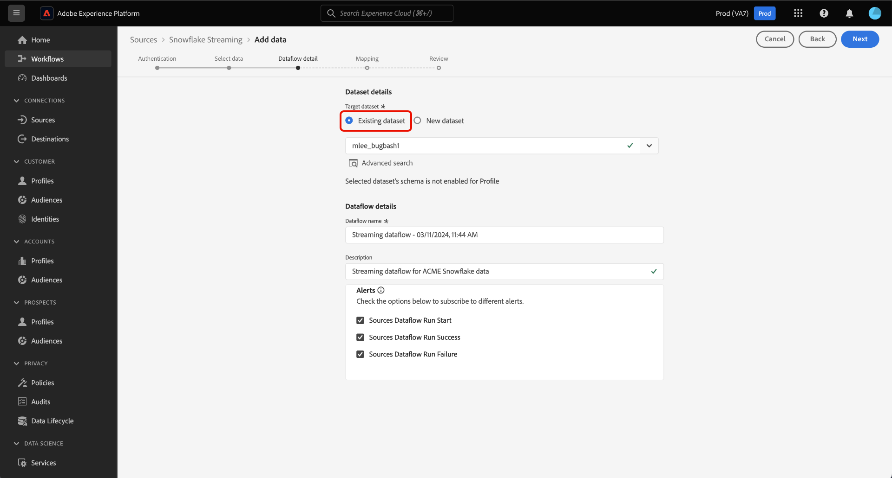

# Transmitir dados do banco de dados [!DNL Snowflake] para o Experience Platform usando a interface

Leia este guia para saber como transmitir dados do banco de dados [!DNL Snowflake] para a Experience Platform usando o espaço de trabalho de origens na interface do usuário.

## Introdução

Este tutorial requer uma compreensão funcional dos seguintes componentes do Experience Platform:

* [[!DNL Experience Data Model (XDM)] Sistema](../../../../../xdm/home.md): a estrutura padronizada pela qual o [!DNL Experience Platform] organiza os dados de experiência do cliente.
   * [Noções básicas sobre a composição de esquema](../../../../../xdm/schema/composition.md): saiba mais sobre os blocos de construção básicos de esquemas XDM, incluindo princípios-chave e práticas recomendadas na composição de esquema.
   * [Tutorial do Editor de esquemas](../../../../../xdm/tutorials/create-schema-ui.md): saiba como criar esquemas personalizados usando a interface do Editor de esquemas.
* [[!DNL Real-Time Customer Profile]](../../../../../profile/home.md): Fornece um perfil de consumidor unificado em tempo real com base em dados agregados de várias fontes.

### Autenticação

Leia o guia na [configuração de pré-requisito para [!DNL Snowflake] dados de streaming](../../../../connectors/databases/snowflake-streaming.md) para obter informações sobre as etapas que devem ser concluídas antes de assimilar dados de streaming do [!DNL Snowflake] para a Experience Platform.

## Usar a origem [!DNL Snowflake Streaming] para transmitir dados [!DNL Snowflake] para o Experience Platform

Na interface do Experience Platform, selecione **[!UICONTROL Fontes]** na navegação à esquerda para acessar o espaço de trabalho [!UICONTROL Fontes]. Você pode selecionar a categoria apropriada no catálogo no lado esquerdo da tela. Como alternativa, você pode encontrar a fonte específica com a qual deseja trabalhar usando a opção de pesquisa.

Na categoria *Bancos de dados*, selecione **[!DNL Snowflake Streaming]** e **[!UICONTROL Configurar]**.

>[!TIP]
>
>Fontes que não têm uma conta autenticada no catálogo de fontes exibem a opção **[!UICONTROL Configurar]**. Quando uma conta autenticada existir, esta opção será alterada para **[!UICONTROL Adicionar dados]**.

A página **[!UICONTROL Conectar conta de Streaming do Snowflake]** é exibida. Nesta página, você pode usar credenciais novas ou existentes.

### Criar uma nova conta

Para criar uma nova conta, selecione **[!UICONTROL Nova conta]** e forneça um nome e uma descrição opcional para sua conta.

>[!BEGINTABS]

>[!TAB Autenticação básica]

Para usar a [!UICONTROL Autenticação básica], selecione **[!UICONTROL Autenticação básica para o Snowflake]** e forneça credenciais para sua conta do [!DNL Snowflake]. Quando terminar, selecione **[!UICONTROL Conectar à origem]** e aguarde alguns momentos para estabelecer a conexão.

Leia a visão geral de [!DNL Snowflake Streaming] para obter mais informações sobre [coleta das credenciais necessárias](../../../../connectors/databases/snowflake-streaming.md#gather-required-credentials).

>[!TAB Autenticação de KeyPair]

Para usar a [!UICONTROL autenticação de KeyPair], selecione **[!UICONTROL Autenticação de KeyPair para Snowflake]** e forneça credenciais para sua conta [!DNL Snowflake]. Quando terminar, selecione **[!UICONTROL Conectar à origem]** e aguarde alguns momentos para estabelecer a conexão.

Leia a visão geral de [!DNL Snowflake Streaming] para obter mais informações sobre [coleta das credenciais necessárias](../../../../connectors/databases/snowflake-streaming.md#gather-required-credentials).

>[!ENDTABS]

Para usar uma conta existente, escolha **[!UICONTROL Conta existente]**, selecione sua conta na lista e selecione **[!UICONTROL Avançar]**.

## Selecionar dados {#select-data}

>[!IMPORTANT]
>
>* Uma coluna de carimbo de data e hora deve existir na tabela de origem para que um fluxo de dados de transmissão seja criado. O carimbo de data e hora é necessário para que o Experience Platform saiba quando os dados serão assimilados e quando os dados incrementais serão transmitidos. Você pode adicionar retroativamente uma coluna de carimbo de data e hora para uma conexão existente e criar um novo fluxo de dados.
>
>* Verifique se o uso de letras maiúsculas e minúsculas nos campos de dados do arquivo de dados de origem de amostra está de acordo com as orientações de [!DNL Snowflake] sobre resolução de casos para identificadores. Leia o [[!DNL Snowflake] documento sobre a capitalização do identificador](https://docs.snowflake.com/en/sql-reference/identifiers-syntax#label-identifier-casing) para obter mais informações.

A etapa [!UICONTROL Selecionar dados] é exibida. Nesta etapa, você deve selecionar os dados que deseja importar para o Experience Platform, configurar carimbos de data e hora e fusos horários, e fornecer um arquivo de dados de origem de amostra para a assimilação de dados brutos.

Use o diretório do banco de dados à esquerda da tela e selecione a tabela que deseja importar para o Experience Platform.

Em seguida, selecione o tipo de coluna de carimbo de data e hora da tabela. Você pode selecionar entre dois tipos de colunas de carimbo de data/hora: `TIMESTAMP_NTZ` ou `TIMESTAMP_LTZ`. Se você selecionar um tipo de coluna de `TIMESTAMP_NTZ`, também deverá fornecer um fuso horário. Suas colunas devem ter uma restrição não nula. Para obter mais informações, leia a seção sobre [limitações e perguntas frequentes](../../../../connectors/databases/snowflake-streaming.md#limitations-and-frequently-asked-questions).

Você também pode definir configurações de preenchimento retroativo durante essa etapa. O preenchimento retroativo determina quais dados são assimilados inicialmente. Se o preenchimento retroativo estiver ativado, todos os arquivos atuais no caminho especificado serão assimilados durante a primeira assimilação agendada. Caso contrário, então somente os arquivos carregados entre a primeira execução da assimilação e a hora de início serão assimilados. Os arquivos carregados antes da hora de início não serão assimilados.

Selecione o botão **[!UICONTROL Preenchimento retroativo]** para habilitar o preenchimento retroativo.

Finalmente, selecione **[!UICONTROL Escolher arquivo]** para carregar dados de origem de exemplo para ajudar a criar o conjunto de mapeamento, que será usado em uma etapa posterior para mapear seus dados originais para o Experience Data Model (XDM).

Quando terminar, selecione **[!UICONTROL Avançar]** para continuar.

## Fornecer detalhes do conjunto de dados e do fluxo de dados {#provide-dataset-and-dataflow-details}

Em seguida, você deve fornecer informações sobre seu conjunto de dados e seu fluxo de dados.

### Detalhes do conjunto de dados {#dataset-details}

Um conjunto de dados é uma construção de armazenamento e gerenciamento para uma coleção de dados, normalmente uma tabela, que contém um esquema (colunas) e campos (linhas). Os dados assimilados com sucesso na Experience Platform são mantidos no data lake como conjuntos de dados. Durante essa etapa, você pode criar um novo conjunto de dados ou usar um conjunto de dados existente.

Se você tiver um conjunto de dados existente, selecione **[!UICONTROL Conjunto de dados existente]** e use a opção **[!UICONTROL Pesquisa avançada]** para exibir uma janela de todos os conjuntos de dados em sua organização, incluindo seus respectivos detalhes, como se eles estão habilitados para assimilação no Perfil do cliente em tempo real.

Para usar um novo conjunto de dados, selecione **[!UICONTROL Novo conjunto de dados]** e forneça um nome e uma descrição opcional para seu conjunto de dados. Você também deve selecionar um esquema do Experience Data Model (XDM) ao qual seu conjunto de dados adere.

| Detalhes do novo conjunto de dados | Descrição |
| --- | --- |
| Nome do conjunto de dados de saída | O nome do novo conjunto de dados. |
| Descrição | (Opcional) Uma breve visão geral do novo conjunto de dados. |
| Esquema | Uma lista suspensa de esquemas que existem em sua organização. Você também pode criar seu próprio esquema antes do processo de configuração de origem. Para obter mais informações, leia o manual sobre [criação de um esquema XDM na interface](../../../../../xdm/tutorials/create-schema-ui.md). |

### Detalhes do fluxo de dados {#dataflow-details}

Depois que o conjunto de dados é configurado, você deve fornecer detalhes sobre o fluxo de dados, incluindo um nome, uma descrição opcional e configurações de alerta.

| Configurações de fluxo de dados | Descrição |
| --- | --- |
| Nome do fluxo de dados | O nome do fluxo de dados.  Por padrão, esse campo usará o nome do arquivo que está sendo importado. |
| Descrição | (Opcional) Uma breve descrição do fluxo de dados. |
| Alertas | O Experience Platform pode produzir alertas baseados em eventos que os usuários podem assinar. Essas opções exigem um fluxo de dados em execução para serem acionadas. Para obter mais informações, leia a [visão geral dos alertas](../../alerts.md) <ul><li>**Início da Execução do Fluxo de Dados de Fontes**: selecione este alerta para receber uma notificação quando a execução do fluxo de dados começar.</li><li>**Êxito na Execução do Fluxo de Dados de Fontes**: selecione este alerta para receber uma notificação se o fluxo de dados terminar sem erros.</li><li>**Falha na execução do fluxo de dados de fontes**: selecione este alerta para receber uma notificação se a execução do fluxo de dados terminar com erros.</li></ul> |

Quando terminar, selecione **[!UICONTROL Avançar]** para continuar.

## Mapear campos para um esquema XDM {#mapping}

A etapa [!UICONTROL Mapping] é exibida. Use a interface de mapeamento para mapear os dados de origem para os campos de esquema apropriados antes de assimilar esses dados na Experience Platform e selecione **[!UICONTROL Avançar]**. Para obter um guia abrangente sobre como usar a interface de mapeamento, leia o [guia da interface do usuário do Preparo de Dados](../../../../../data-prep/ui/mapping.md) para obter mais informações.

## Revisar seu fluxo de dados {#review}

A etapa final no processo de criação do fluxo de dados é revisar o fluxo de dados antes de executá-lo. Use a etapa **[!UICONTROL Revisão]** para revisar os detalhes do novo fluxo de dados antes de ele ser executado. Os detalhes estão agrupados nas seguintes categorias:

* **Conexão**: mostra o tipo de origem, o caminho relevante do arquivo de origem escolhido e o número de colunas nesse arquivo de origem.
* **Atribuir campos de conjunto de dados e mapa**: mostra em qual conjunto de dados os dados de origem estão sendo assimilados, incluindo o esquema ao qual o conjunto de dados pertence.

Depois de revisar o fluxo de dados, selecione **[!UICONTROL Concluir]** e aguarde algum tempo para que o fluxo de dados seja criado.

## Próximas etapas

Ao seguir este tutorial, você criou com êxito um fluxo de dados de transmissão para [!DNL Snowflake] dados. Para obter recursos adicionais, leia a documentação abaixo.

### Monitorar seu fluxo de dados

Depois que o fluxo de dados for criado, você poderá monitorar os dados que estão sendo assimilados por meio dele para exibir informações sobre taxas de assimilação, sucesso e erros. Para obter mais informações sobre como monitorar fluxos de dados de transmissão, visite o tutorial em [monitoramento de fluxos de dados de transmissão na interface](../../monitor-streaming.md).

### Atualizar seu fluxo de dados

Para atualizar as configurações do agendamento de fluxos de dados, mapeamento e informações gerais, visite o tutorial em [atualizando fluxos de dados de fontes na interface](../../update-dataflows.md).

### Excluir seu fluxo de dados

Você pode excluir fluxos de dados que não são mais necessários ou que foram criados incorretamente usando a função **[!UICONTROL Excluir]** disponível no espaço de trabalho **[!UICONTROL Fluxos de Dados]**. Para obter mais informações sobre como excluir fluxos de dados, visite o tutorial em [excluindo fluxos de dados na interface](../../delete.md).
