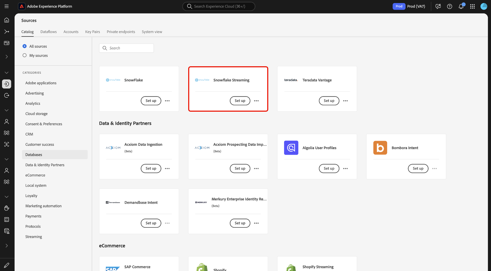
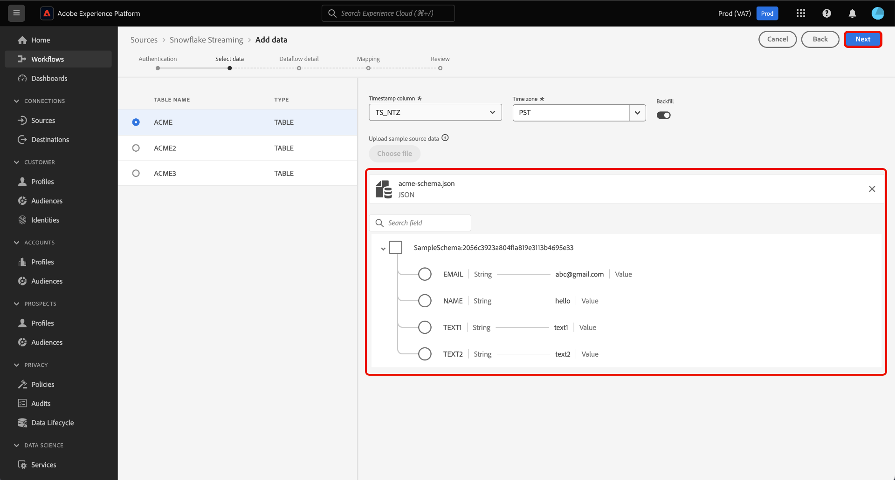

# Transmita dados do seu [!DNL Snowflake] banco de dados para Experience Platform usando o interface

Aprenda a usar a interface do usuário para transmitir dados do seu [!DNL Snowflake] banco de dados para Adobe Experience Platform seguindo este guia.

## Introdução

Este tutorial requer uma compreensão funcional dos seguintes componentes do Experience Platform:

* [[!DNL Experience Data Model (XDM)] Sistema](../../../../../xdm/home.md): a estrutura padronizada pela qual [!DNL Experience Platform] organiza experiência do cliente dados.
   * [Noções básicas de schema composição](../../../../../xdm/schema/composition.md): conheça os elementos básicos dos esquemas XDM, incluindo princípios fundamentais e práticas recomendadas em schema composição.
   * [Tutorial](../../../../../xdm/tutorials/create-schema-ui.md) de editor de esquema: saiba como criar esquemas personalizados usando o interface de editor de esquema.
* [[!DNL Real-Time Customer Profile]](../../../../../profile/home.md): fornece um perfil unificado do consumidor em tempo real com base em dados agregados de várias fontes.

### Autenticação

Leia o guia sobre [a configuração de pré-requisito para [!DNL Snowflake] transmitir dados](../../../../connectors/databases/snowflake-streaming.md) para informações sobre as etapas que você precisa concluir antes de poder assimilar dados de streaming de [!DNL Snowflake] até Experience Platform.

## Use a [!DNL Snowflake Streaming] fonte para transmitir [!DNL Snowflake] dados para Experience Platform

Na interface do Experience Platform, selecione **[!UICONTROL Fontes]** na navegação esquerda para acessar o espaço de trabalho das [!UICONTROL Fontes] . Você pode selecionar as categoria apropriadas no catálogo no lado esquerdo da tela. Como alternativa, você pode encontrar a fonte específica com a qual deseja trabalhar usando a opção pesquisa.

*Em Bancos* de dados categoria, selecione **[!DNL Snowflake Streaming]** e selecione **[!UICONTROL Adicionar dados]**.

>[!TIP]
>
>As fontes que não têm um conta autenticado no catálogo de fontes exibem a opção **[!UICONTROL Configurar]** . Quando uma conta autenticada existe, essa opção muda para **[!UICONTROL Adicionar dados]**.

A **[!UICONTROL página de conta]** de transmissão do Connect Snowflake é exibida. Nesse página, você pode usar credenciais novas ou existentes.

>[!BEGINTABS]

>[!TAB Criar uma nova conta]

Para criar uma nova conta, selecione **[!UICONTROL Nova conta]** e forneça um nome, uma descrição opcional e suas credenciais.

Quando terminar, selecione **[!UICONTROL Conectar à origem]** e aguarde algum tempo para que a nova conexão seja estabelecida.

| Credencial | Descrição |
| --- | --- |
| Conta | O nome da sua conta [!DNL Snowflake]. Para convenções sobre nomes de conta, leia o [[!DNL Snowflake Streaming] guia de autenticação](../../../../connectors/databases/snowflake-streaming.md#gather-required-credentials). |
| Warehouse | O nome do warehouse [!DNL Snowflake]. Os depósitos gerenciam a execução de consultas em [!DNL Snowflake]. Cada warehouse [!DNL Snowflake] é independente um do outro e deve ser acessado individualmente para trazer dados para a Experience Platform. |
| Banco de dados | O nome do banco de dados [!DNL Snowflake]. O banco de dados contém os dados que você deseja trazer para o Experience Platform. |
| Esquema | (Opcional) O esquema de banco de dados associado à sua conta do [!DNL Snowflake]. |
| Nome de usuário | O nome do usuário do seu [!DNL Snowflake] conta. |
| Senha | O senha ao seu [!DNL Snowflake] conta. |
| Função | (Opcional) Uma função definida personalizada que pode ser fornecida a um usuário para uma determinada conexão. Se não for comprovado, esse valor assumirá `public`. |

Para obter mais informações sobre conta criação, leia a seção sobre [como configurar função configurações](../../../../connectors/databases/snowflake-streaming.md#configure-role-settings) na [!DNL Snowflake Streaming] visão geral.

>[!TAB Usar um conta existente]

Para usar um conta existente, selecione **[!UICONTROL Conta]** existente e selecione os conta desejados no catálogo de conta existente.

Selecione **[!UICONTROL Próximo]** para continuar.

>[!ENDTABS]

## Selecionar dados {#select-data}

>[!IMPORTANT]
>
>* Uma coluna de carimbo de data e hora deve existir na tabela de origem para que um fluxo de dados de transmissão seja criado. O carimbo de data e hora é necessário para que o Experience Platform saiba quando os dados serão assimilados e quando os dados incrementais serão transmitidos. Você pode adicionar retroativamente uma coluna de carimbo de data e hora para uma conexão existente e criar um novo fluxo de dados.
>
>* Verifique se o uso de letras maiúsculas e minúsculas nos campos de dados do arquivo de dados de origem de amostra está de acordo com as orientações de [!DNL Snowflake] sobre resolução de casos para identificadores. Leia o [[!DNL Snowflake] documento sobre a capitalização do identificador](https://docs.snowflake.com/en/sql-reference/identifiers-syntax#label-identifier-casing) para obter mais informações.

A etapa [!UICONTROL Selecionar dados] é exibida. Nesta etapa, você deve selecionar os dados que deseja importar para o Experience Platform, configurar carimbos de data e hora e fusos horários, e fornecer um arquivo de dados de origem de amostra para a assimilação de dados brutos.

Use o diretório de banco de dados à esquerda da tela e selecione a tabela que deseja importar para Experience Platform.

Próximo, selecione o tipo de coluna do carimbo de data e hora da tabela. Você pode selecionar entre dois tipos de colunas de carimbo de data e hora: `TIMESTAMP_NTZ` ou  `TIMESTAMP_LTZ`. Se você selecionar um tipo de `TIMESTAMP_NTZ`coluna, você também deve fornecer um fuso horário. Suas colunas devem ter uma restrição não nula. Para obter mais informações, leia a seção sobre [limitações e perguntas](../../../../connectors/databases/snowflake-streaming.md#limitations-and-frequently-asked-questions) frequentes.

Você também pode definir preenchimento retroativo configurações durante essa etapa. O preenchimento retroativo determina quais dados são inicialmente assimilados. Se preenchimento retroativo estiver habilitada, todos os arquivos atuais no caminho especificado serão assimilados durante a primeira ingestão programada. Caso contrário, apenas os arquivos carregados entre a primeira execução de ingestão e o start tempo serão assimilados. arquivos carregadas antes do horário start não serão ingeridas.

Selecione a opção **[!UICONTROL Preenchimento retroativo]** para ativar o preenchimento retroativo.

Por fim, selecione **[!UICONTROL Escolher arquivo]** para upload um dado de origem de amostra para ajudar a criar o conjunto de mapeamento, que será usado em uma etapa posterior para mapear seus dados originais para o Experience Data Model (XDM).

Quando terminar, selecione **[!UICONTROL Avançar]** para continuar.

## Fornecer conjunto de dados e detalhes do fluxo de dados {#provide-dataset-and-dataflow-details}

Próximo, você deve fornecer informações sobre sua conjunto de dados e seu fluxo de dados.

### Detalhes do conjunto de dados {#dataset-details}

Um conjunto de dados é uma construção de armazenamento e gerenciamento para uma coleção de dados, normalmente uma tabela, que contém um esquema (colunas) e campos (linhas). Os dados ingeridos com êxito na Experience Platform são mantidos dentro do lago de dados como conjuntos de dados. Durante essa etapa, você pode criar uma nova conjunto de dados ou usar uma conjunto de dados existente.

>[!BEGINTABS]

>[!TAB Usar uma nova conjunto de dados]

Para usar uma nova conjunto de dados, selecione **[!UICONTROL Novo conjunto de dados]** e forneça um nome e uma descrição opcional para seu conjunto de dados. Você também deve selecionar um schema do Experience Data Model (XDM) ao qual seus conjunto de dados aderem.

| detalhes do conjunto de dados de Novo | Descrição |
| --- | --- |
| Nome do conjunto de dados de saída | O nome do seu novo conjunto de dados. |
| Descrição | (Opcional) Uma breve visão geral do novo conjunto de dados. |
| Esquema | Uma lista suspensa de esquemas que existem em sua organização. Você também pode criar sua própria schema antes do processo de configuração de origem. Para obter mais informações, leia o guia sobre [como criar um schema XDM no interface](../../../../../xdm/tutorials/create-schema-ui.md). |

>[!TAB Usar um conjunto de dados existente]

Se você já tiver um conjunto de dados existente, selecione **[!UICONTROL Conjunto de dados]** Existente e use a opção **[!UICONTROL Avançado pesquisa]** para visualização uma janela de todos os conjuntos de dados em sua organização, incluindo seus respectivos detalhes, como se estão habilitados para assimilação no Perfil do cliente em tempo real.

>[!ENDTABS]

+++Selecione para obter as etapas para habilitar a Assimilação de perfil, o diagnóstico de erros e a assimilação parcial.

Se o seu conjunto de dados estiver habilitado para o Perfil de cliente em tempo real, durante essa etapa você poderá alternar para **[!UICONTROL o conjunto de dados do perfil]** para habilitar seus dados para assimilação de perfil. Você também pode usar esta etapa para habilitar o **[!UICONTROL Diagnóstico de erro]** e a **[!UICONTROL Assimilação parcial]**.

* **[!UICONTROL Diagnóstico de erro]**: selecione **[!UICONTROL Diagnóstico de erro]** para instruir a origem a produzir o diagnóstico de erro que você poderá consultar posteriormente ao monitorar a atividade do conjunto de dados e o status do fluxo de dados.
* **[!UICONTROL Assimilação parcial]**: a assimilação parcial de lotes é a capacidade de assimilar dados que contêm erros, até um determinado limite configurável. Esse recurso permite assimilar com sucesso todos os seus dados precisos na Experience Platform, enquanto todos os seus dados incorretos são armazenados em lote separadamente com informações sobre por que são inválidos.

+++

### Detalhes do fluxo de dados {#dataflow-details}

Depois que o conjunto de dados é configurado, você deve fornecer detalhes sobre o fluxo de dados, incluindo um nome, uma descrição opcional e configurações de alerta.

| Configurações de fluxo de dados | Descrição |
| --- | --- |
| Nome do fluxo de dados | O nome do fluxo de dados.  Por padrão, esse campo usará o nome do arquivo que está sendo importado. |
| Descrição | (Opcional) Uma breve descrição do seu fluxo de dados. |
| Alertas | Experience Platform podem produzir alertas baseados em evento que os usuários podem subscrever. Essas opções exigem um fluxo de dados em execução para serem acionadas. Para obter mais informações, leia a [visão geral dos alertas](../../alerts.md) <ul><li>**Início da Execução do Fluxo de Dados de Fontes**: selecione este alerta para receber uma notificação quando a execução do fluxo de dados começar.</li><li>**Êxito na Execução do Fluxo de Dados de Fontes**: selecione este alerta para receber uma notificação se o fluxo de dados terminar sem erros.</li><li>**Falha na execução do fluxo de dados de fontes**: selecione este alerta para receber uma notificação se a execução do fluxo de dados terminar com erros.</li></ul> |

Quando terminar, selecione **[!UICONTROL Avançar]** para continuar.

## Mapear campos para um esquema XDM {#mapping}

A etapa [!UICONTROL Mapping] é exibida. Use a interface de mapeamento para mapear os dados de origem para os campos de esquema apropriados antes de assimilar esses dados na Experience Platform e selecione **[!UICONTROL Avançar]**. Para obter um guia abrangente sobre como usar a interface de mapeamento, leia o [guia da interface do usuário do Preparo de Dados](../../../../../data-prep/ui/mapping.md) para obter mais informações.

## Revisar seu fluxo de dados {#review}

A etapa final no processo de criação de dataflow é revisar seu fluxo de dados antes de executá-lo. Use a **[!UICONTROL etapa de revisão]** para analisar os detalhes do novo fluxo de dados antes de ser executado. Os detalhes estão agrupados nas seguintes categorias:

* **Conexão**: mostra o tipo de origem, o caminho relevante do arquivo de origem escolhido e o número de colunas nesse arquivo de origem.
* **Atribuir campos** de conjunto de dados > Mostra em qual conjunto de dados os dados de origem estão sendo assimilados, incluindo as schema às quais o conjunto de dados adere.

Depois de revisar seu fluxo de dados, selecione **[!UICONTROL Concluir]** e permita que algum tempo do fluxo de dados seja criado.

## Próximas etapas

Ao seguir esse tutorial, você criou com sucesso um fluxo de dados de transmissão para [!DNL Snowflake] dados. Para obter mais recursos, leia a documentação abaixo.

### Monitore seu fluxo de dados

Após criar seu dataflow, você pode monitor os dados que estão sendo assimilados por ele para visualização informações sobre taxas de ingestão, sucesso e erros. Para obter mais informações sobre como monitor fluxos de dados de streaming, visita o tutorial sobre [o monitoramento de dataflows de streaming no interface](../../monitor-streaming.md).

### Atualizar seu fluxo de dados

Para atualizar as configurações do agendamento de fluxos de dados, mapeamento e informações gerais, visite o tutorial em [atualizando fluxos de dados de fontes na interface](../../update-dataflows.md).

### Excluir seu fluxo de dados

Você pode excluir fluxos de dados que não são mais necessários ou que foram criados incorretamente usando a **[!UICONTROL função Excluir]** disponível nos **[!UICONTROL Dataflows]** espaço de trabalho. Para obter mais informações sobre como excluir fluxos de dados, visita o tutorial sobre [a exclusão de dataflows no interface](../../delete.md).
