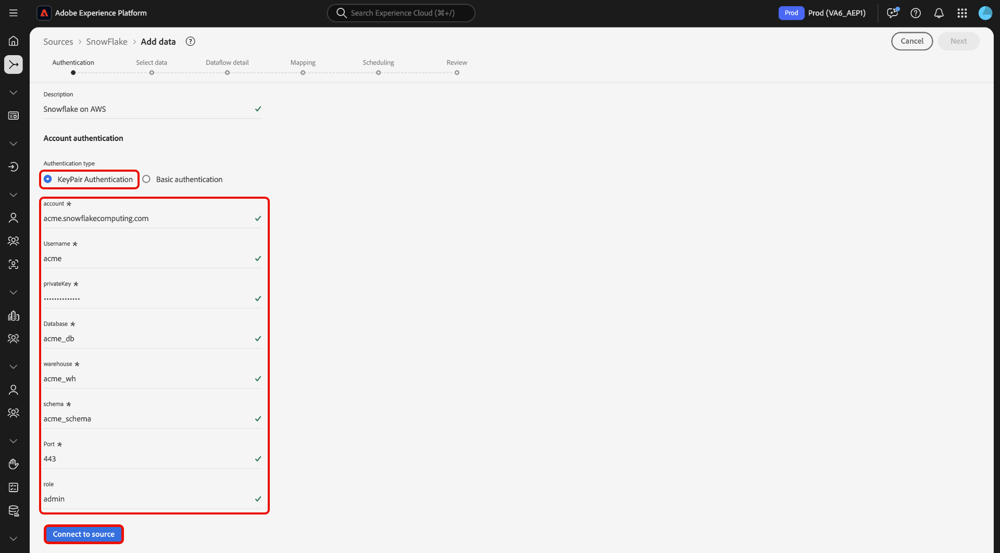

# Conectar o [!DNL Snowflake] ao Experience Platform usando a interface

>[!IMPORTANT]
>
>A origem [!DNL Snowflake] está disponível no catálogo de origens para usuários que compraram o Real-Time Customer Data Platform Ultimate.

Leia este guia para saber como conectar sua conta do [!DNL Snowflake] à Adobe Experience Platform usando a interface do usuário.

## Introdução

>[!WARNING]
>
>A autenticação básica (ou autenticação de chave de conta) para a origem [!DNL Snowflake] será substituída em novembro de 2025. Você deve migrar para a autenticação baseada em par de chaves para continuar usando a origem e assimilando dados do banco de dados para o Experience Platform. Para obter mais informações sobre a descontinuação, leia o [[!DNL Snowflake] manual de práticas recomendadas sobre como mitigar os riscos de comprometimento de credenciais](https://www.snowflake.com/en/resources/white-paper/best-practices-to-mitigate-the-risk-of-credential-compromise/).

Este tutorial requer uma compreensão funcional dos seguintes componentes do Experience Platform:

* [Fontes](../../../../home.md): o Experience Platform permite a assimilação de dados de várias fontes, ao mesmo tempo em que fornece a capacidade de estruturar, rotular e aprimorar os dados recebidos usando os serviços do [!DNL Experience Platform].
* [Sandboxes](../../../../../sandboxes/home.md): a Experience Platform fornece sandboxes virtuais que particionam uma única instância do Experience Platform em ambientes virtuais separados para ajudar a desenvolver aplicativos de experiência digital.

>[!NOTE]
>
>Você deve definir o sinalizador `PREVENT_UNLOAD_TO_INLINE_URL` como `FALSE` para permitir o descarregamento de dados do banco de dados [!DNL Snowflake] para o Experience Platform.

## Navegar pelo catálogo de origens {#navigate}

Na interface do Experience Platform, selecione **[!UICONTROL Fontes]** na navegação à esquerda para acessar o espaço de trabalho [!UICONTROL Fontes]. Você pode selecionar a categoria apropriada no catálogo no lado esquerdo da tela. Como alternativa, você pode encontrar a fonte específica com a qual deseja trabalhar usando a opção de pesquisa.

Selecione **[!DNL Snowflake]** na categoria *[!UICONTROL Bancos de dados]* e selecione **[!UICONTROL Configurar]**.

>[!TIP]
>
>As origens no catálogo de origens exibem a opção **[!UICONTROL Configurar]** quando uma determinada origem ainda não tem uma conta autenticada. Quando uma conta autenticada existir, esta opção será alterada para **[!UICONTROL Adicionar dados]**.

## Usar uma conta existente {#existing}

Em seguida, você é levado à etapa de autenticação do workflow de origens. Aqui, você pode usar uma conta existente ou criar uma nova conta.

Para usar uma conta existente, selecione a conta [!DNL Snowflake] à qual deseja se conectar e clique em **[!UICONTROL Avançar]** para continuar.

## Criar uma nova conta {#create}

Se você não tiver uma conta existente, deverá criar uma nova conta fornecendo as credenciais de autenticação necessárias que correspondam à sua origem.

Para criar uma nova conta, selecione **[!UICONTROL Nova conta]** e forneça um nome e, opcionalmente, adicione uma descrição para sua conta.

### Conectar-se ao Experience Platform no Azure {#azure}

Você pode conectar sua conta do [!DNL Snowflake] ao Experience Platform no Azure usando a autenticação de chave de conta ou a autenticação de par de chaves.

>[!BEGINTABS]

>[!TAB Autenticação da chave da conta]

Para usar a autenticação de chave de conta, selecione **[!UICONTROL Autenticação de chave de conta]**, forneça sua cadeia de conexão no formulário de entrada e selecione **[!UICONTROL Conectar à origem]**.

| Credencial | Descrição |
| --- | --- |
| Conta | Um nome de conta identifica exclusivamente uma conta na organização. Nesse caso, você deve identificar exclusivamente uma conta em diferentes organizações do [!DNL Snowflake]. Para fazer isso, você deve anexar o nome da organização ao nome da conta. Por exemplo: `orgname-account_name`. Leia o guia em [recuperando seu [!DNL Snowflake] identificador de conta](../../../../connectors/databases/snowflake.md#retrieve-your-account-identifier) para obter orientação adicional. Para obter mais informações, consulte a [[!DNL Snowflake] documentação](https://docs.snowflake.com/en/user-guide/admin-account-identifier#format-1-preferred-account-name-in-your-organization). |
| Warehouse | O warehouse [!DNL Snowflake] gerencia o processo de execução da consulta para o aplicativo. Cada warehouse [!DNL Snowflake] é independente um do outro e deve ser acessado individualmente ao trazer dados para a Experience Platform. |
| Banco de dados | O banco de dados [!DNL Snowflake] contém os dados que você deseja trazer para a Experience Platform. |
| Nome de usuário | O nome de usuário da conta [!DNL Snowflake]. |
| Senha | A senha da conta de usuário [!DNL Snowflake]. |
| Função | A função de controle de acesso padrão a ser usada na sessão [!DNL Snowflake]. A função deve ser uma função existente que já foi atribuída ao usuário especificado. A função padrão é `PUBLIC`. |
| String de conexão | A cadeia de conexão usada para se conectar à sua instância do [!DNL Snowflake]. O padrão da cadeia de conexão para [!DNL Snowflake] é `jdbc:snowflake://{ACCOUNT_NAME}.snowflakecomputing.com/?user={USERNAME}&password={PASSWORD}&db={DATABASE}&warehouse={WAREHOUSE}` |

>[!TAB Autenticação de par de chaves]

Para usar a autenticação de par de chaves, selecione **[!UICONTROL Autenticação de par de chaves]**, forneça valores para sua conta, nome de usuário, chave privada, senha de chave privada, banco de dados e warehouse e selecione **[!UICONTROL Conectar à origem]**.

Com a autenticação de par de chaves, você deve gerar um par de chaves RSA de 2048 bits e fornecer os seguintes valores ao criar uma conta para sua origem [!DNL Snowflake].

| Credencial | Descrição |
| --- | --- |
| Conta | Um nome de conta identifica exclusivamente uma conta na organização. Nesse caso, você deve identificar exclusivamente uma conta em diferentes organizações do [!DNL Snowflake]. Para fazer isso, você deve anexar o nome da organização ao nome da conta. Por exemplo: `orgname-account_name`. Leia o guia em [recuperando seu [!DNL Snowflake] identificador de conta](../../../../connectors/databases/snowflake.md#retrieve-your-account-identifier) para obter orientação adicional. Para obter mais informações, consulte a [[!DNL Snowflake] documentação](https://docs.snowflake.com/en/user-guide/admin-account-identifier#format-1-preferred-account-name-in-your-organization). |
| Nome de usuário | O nome de usuário da sua conta [!DNL Snowflake]. |
| Chave privada | A chave privada [!DNL Base64-]codificada da sua conta [!DNL Snowflake]. Você pode gerar chaves privadas criptografadas ou não. Se você estiver usando uma chave privada criptografada, também deverá fornecer uma senha de chave privada ao autenticar no Experience Platform. Leia o guia em [recuperando sua [!DNL Snowflake] chave privada](../../../../connectors/databases/snowflake.md) para obter mais informações. |
| Senha da chave privada | A senha da chave privada é uma camada adicional de segurança que deve ser usada ao autenticar com uma chave privada criptografada. Não é necessário fornecer a senha se você estiver usando uma chave privada não criptografada. |
| Banco de dados | O banco de dados [!DNL Snowflake] que contém os dados que você deseja assimilar na Experience Platform. |
| Warehouse | O warehouse [!DNL Snowflake] gerencia o processo de execução da consulta para o aplicativo. Cada warehouse [!DNL Snowflake] é independente um do outro e deve ser acessado individualmente ao trazer dados para a Experience Platform. |

Para obter mais informações sobre esses valores, consulte [este documento do Snowflake](https://docs.snowflake.com/en/user-guide/key-pair-auth.html).

>[!ENDTABS]

### Conectar-se ao Experience Platform no AWS {#aws}

>[!AVAILABILITY]
>
>Esta seção se aplica às implementações do Experience Platform em execução no Amazon Web Services (AWS). O Experience Platform em execução no AWS está disponível atualmente para um número limitado de clientes. Para saber mais sobre a infraestrutura do Experience Platform compatível, consulte a [visão geral da nuvem múltipla do Experience Platform](../../../../../landing/multi-cloud.md).

Para criar uma nova conta do [!DNL Snowflake] e conectar-se ao Experience Platform no AWS, verifique se você está em uma sandbox VA6 e forneça as credenciais necessárias para autenticação.

>[!BEGINTABS]

>[!TAB Autenticação de par de chaves]

Para se conectar usando pares de chaves, selecione **[!UICONTROL Autenticação de Par de Chaves]**, forneça suas credenciais de autenticação e selecione **[!UICONTROL Conectar à origem]**. Para obter mais informações sobre essas credenciais, leia a [[!DNL Snowflake] visão geral do lote](../../../../connectors/databases/snowflake.md#gather-required-credentials).

>[!TAB Autenticação básica]

>[!WARNING]
>
>A autenticação básica (ou autenticação de chave de conta) para a origem [!DNL Snowflake] será substituída em novembro de 2025. Você deve migrar para a autenticação baseada em par de chaves para continuar usando a origem e assimilando dados do banco de dados para o Experience Platform. Para obter mais informações sobre a descontinuação, leia o [[!DNL Snowflake] manual de práticas recomendadas sobre como mitigar os riscos de comprometimento de credenciais](https://www.snowflake.com/en/resources/white-paper/best-practices-to-mitigate-the-risk-of-credential-compromise/).

Para se conectar usando uma combinação de nome de usuário e senha, selecione **[!UICONTROL Autenticação básica]**, forneça suas credenciais de autenticação e selecione **[!UICONTROL Conectar à origem]**. Para obter mais informações sobre essas credenciais, leia a [[!DNL Snowflake] visão geral do lote](../../../../connectors/databases/snowflake.md#gather-required-credentials).

>[!ENDTABS]

### Ignorar pré-visualização de dados de amostra {#skip-preview-of-sample-data}

Durante a etapa de seleção de dados, você pode encontrar um tempo limite ao assimilar tabelas ou arquivos de dados grandes. Você pode ignorar a visualização de dados para contornar o tempo limite e ainda visualizar o esquema, embora sem dados de amostra. Para ignorar a visualização de dados, habilite a opção **[!UICONTROL Ignorar visualização de dados de amostra]**.

O restante do workflow permanecerá o mesmo. O único problema é que ignorar a pré-visualização de dados pode impedir que campos calculados e obrigatórios sejam validados automaticamente durante a etapa de mapeamento e, em seguida, será necessário validar manualmente esses campos durante o mapeamento.

## Próximas etapas

Ao seguir este tutorial, você estabeleceu uma conexão com sua conta da Snowflake. Agora você pode seguir para o próximo tutorial e [configurar um fluxo de dados para trazer dados para o  [!DNL Experience Platform]](../../dataflow/databases.md).
