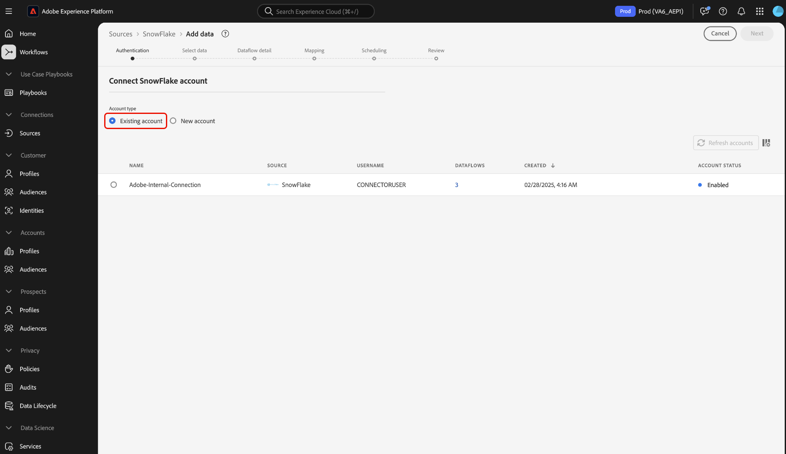

# Criar uma conexão de origem [!DNL Snowflake] na interface do usuário

>[!NOTE]
>
> O conector [!DNL Snowflake] está em beta. Consulte a [Visão geral das Fontes](../../../../home.md#terms-and-conditions) para obter mais informações sobre o uso de conectores com marca beta.

Este tutorial fornece etapas para criar um conector de origem [!DNL Snowflake] usando a interface do usuário do Adobe Experience Platform.

## Introdução

Este tutorial requer uma compreensão funcional dos seguintes componentes da Platform:

* [Fontes](../../../../home.md):  [!DNL Experience Platform] O permite que os dados sejam assimilados de várias fontes, além de fornecer a você a capacidade de estruturar, rotular e aprimorar os dados recebidos usando  [!DNL Platform] serviços.
* [Sandboxes](../../../../../sandboxes/home.md):  [!DNL Experience Platform] O fornece sandboxes virtuais que particionam uma única  [!DNL Platform] instância em ambientes virtuais separados para ajudar a desenvolver aplicativos de experiência digital.

### Obter credenciais necessárias

Para acessar sua conta do Snowflake em [!DNL Platform], você deve fornecer o seguinte valor de autenticação:

| Credencial | Descrição |
| ---------- | ----------- |
| Conta | A conta [!DNL Snowflake] que você deseja conectar à Platform. |
| Depósito | O depósito [!DNL Snowflake] gerencia o processo de execução da consulta do aplicativo. Cada [!DNL Snowflake] depósito é independente um do outro e deve ser acessado individualmente ao trazer os dados para a Platform. |
| Banco de dados | O [!DNL Snowflake] contém os dados que você deseja trazer para a Plataforma. |
| Nome do usuário | O nome de usuário da conta [!DNL Snowflake]. |
| Senha | A senha da conta de usuário [!DNL Snowflake]. |
| Cadeia de conexão | A string de conexão usada para se conectar à instância [!DNL Snowflake]. O padrão da string de conexão para [!DNL Snowflake] é `jdbc:snowflake://{ACCOUNT_NAME}.snowflakecomputing.com/?user={USERNAME}&password={PASSWORD}&db={DATABASE}&warehouse={WAREHOUSE}`. |

Para obter mais informações sobre esses valores, consulte [este documento Snowflake](https://docs.snowflake.com/en/user-guide/oauth-custom.html).

## Conecte sua conta do Snowflake

Na interface do usuário da plataforma, selecione **[!UICONTROL Fontes]** no painel de navegação esquerdo para acessar o espaço de trabalho [!UICONTROL Fontes]. A tela [!UICONTROL Catálogo] exibe uma variedade de fontes com as quais você pode criar uma conta.

Você pode selecionar a categoria apropriada no catálogo no lado esquerdo da tela. Como alternativa, você pode encontrar a fonte específica com a qual deseja trabalhar usando a barra de pesquisa.

Na categoria [!UICONTROL Bancos de Dados], selecione **[!UICONTROL Snowflake]** e selecione **[!UICONTROL Adicionar dados]**.

A página **[!UICONTROL Connect to Snowflake]** é exibida. Nesta página, você pode usar novas credenciais ou credenciais existentes.

### Conta existente

Para conectar uma conta existente, selecione a conta do Snowflake com a qual deseja se conectar e selecione **[!UICONTROL Next]** para prosseguir.

### Nova conta

Se estiver usando novas credenciais, selecione **[!UICONTROL New account]**. No formulário de entrada exibido, forneça um nome, uma descrição opcional e suas credenciais de Snowflake. Quando terminar, selecione **[!UICONTROL Connect]** e deixe algum tempo para que a nova conexão seja estabelecida.

## Próximas etapas

Ao seguir este tutorial, você estabeleceu uma conexão com sua conta do Snowflake. Agora você pode continuar para o próximo tutorial e [configurar um fluxo de dados para trazer dados para [!DNL Platform]](../../dataflow/databases.md).
