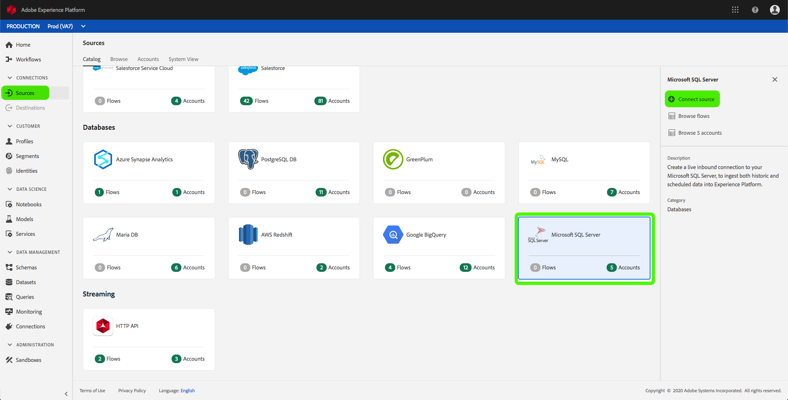
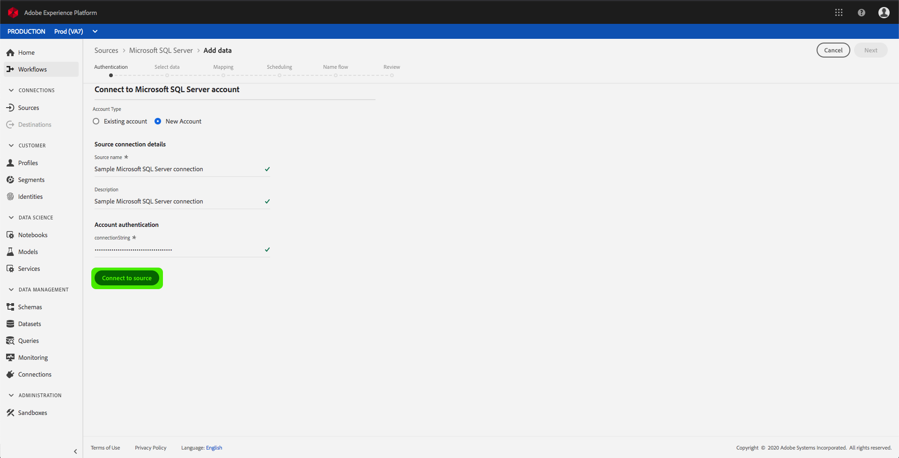
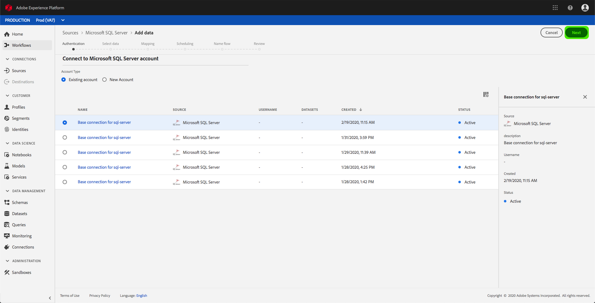

# Criar um conector de origem do Microsoft SQL Server na interface do usuário

> [!NOTE]
> O conector do Microsoft SQL Server está em beta. Os recursos e a documentação estão sujeitos a alterações.

Os conectores de origem na Adobe Experience Platform fornecem a capacidade de assimilar dados de origem externa de forma programada. Este tutorial fornece etapas para a criação de um conector de origem do Microsoft SQL Server (a seguir denominado &quot;SQL Server&quot;) usando a interface do usuário da plataforma.

## Introdução

Este tutorial requer uma compreensão prática dos seguintes componentes da Adobe Experience Platform:

* [Sistema](../../../../../xdm/home.md)do Experience Data Model (XDM): A estrutura padronizada pela qual a plataforma Experience organiza os dados da experiência do cliente.
   * [Noções básicas da composição](../../../../../xdm/schema/composition.md)do schema: Saiba mais sobre os elementos básicos dos schemas XDM, incluindo princípios-chave e práticas recomendadas na composição do schema.
   * [Tutorial](../../../../../xdm/tutorials/create-schema-ui.md)do Editor de Schemas: Saiba como criar schemas personalizados usando a interface do editor de Schemas.
* [Perfil](../../../../../profile/home.md)do cliente em tempo real: Fornece um perfil unificado e em tempo real para o consumidor, com base em dados agregados de várias fontes.

Se você já tiver uma conexão básica com o SQL Server, poderá ignorar o restante desse documento e prosseguir para o tutorial sobre como [configurar um fluxo de dados](../../dataflow/databases.md).

### Reunir credenciais obrigatórias

Para se conectar ao SQL Server on Platform, é necessário fornecer a seguinte propriedade de conexão:

| Credencial | Descrição |
| ---------- | ----------- |
| `connectionString` | A cadeia de conexão associada à sua conta do SQL Server. |

Consulte [este documento](https://docs.microsoft.com/en-us/dotnet/framework/data/adonet/sql/authentication-in-sql-server) para obter mais informações sobre como iniciar o SQL Server.

## Conectar sua conta do SQL Server

Depois de coletar as credenciais necessárias, você pode seguir as etapas abaixo para criar uma nova conexão básica de entrada para vincular sua conta do SQL Server à Plataforma.

Faça logon na <a href="https://platform.adobe.com" target="_blank">Adobe Experience Platform</a> e selecione **Fontes** na barra de navegação esquerda para acessar a área de trabalho *Fontes* . A tela *Catálogo* exibe várias fontes com as quais você pode criar conexões base de entrada e cada fonte mostra o número de conexões base existentes associadas a elas.

Na categoria *Bancos* de Dados, selecione **Microsoft SQL Server** para exibir uma barra de informações no lado direito da tela. A barra de informações fornece uma breve descrição para a fonte selecionada, bem como opções para se conectar à fonte ou à sua documentação de visualização. Para criar uma nova conexão básica de entrada, selecione Origem **do** Connect.

A página *Conectar-se ao Microsoft SQL Server* é exibida. Nesta página, você pode usar credenciais novas ou existentes.

### Nova conta

Se você estiver usando novas credenciais, selecione **Nova conta**. No formulário de entrada exibido, forneça um nome, uma descrição opcional e suas credenciais do SQL Server à conexão básica. Quando terminar, selecione **Connect** e aguarde algum tempo para a nova conexão básica ser estabelecida.

### Conta existente

Para conectar uma conta existente, selecione a conta do SQL Server à qual deseja se conectar e, em seguida, selecione **Próximo** para prosseguir.

## Próximas etapas

Ao seguir este tutorial, você estabeleceu uma conexão básica com sua conta do SQL Server. Agora você pode continuar com o próximo tutorial e [configurar um fluxo de dados para trazer dados para a Plataforma](../../dataflow/databases.md).