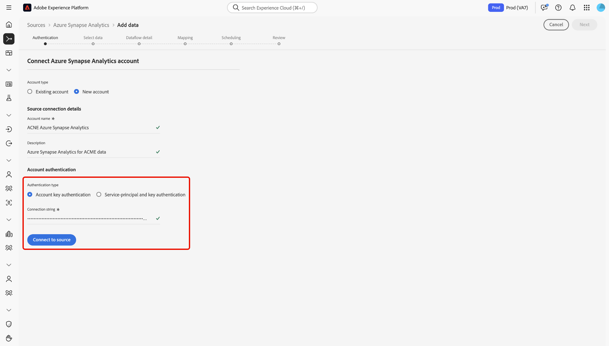

# Criar uma conexão de origem [!DNL Azure Synapse Analytics] na interface

>[!IMPORTANT]
>
>A origem [!DNL Azure Synapse Analytics] está disponível no catálogo de origens para usuários que compraram o Real-Time Customer Data Platform Ultimate.

Leia este guia para saber como conectar sua conta do [!DNL Azure Synapse Analytics] à Adobe Experience Platform usando o espaço de trabalho de fontes na interface do usuário.

## Introdução

Este tutorial requer uma compreensão funcional dos seguintes componentes do Experience Platform:

* [[!DNL Experience Data Model (XDM)] Sistema](../../../../../xdm/home.md): a estrutura padronizada pela qual o [!DNL Experience Platform] organiza os dados de experiência do cliente.
   * [Noções básicas sobre a composição de esquema](../../../../../xdm/schema/composition.md): saiba mais sobre os blocos de construção básicos de esquemas XDM, incluindo princípios-chave e práticas recomendadas na composição de esquema.
   * [Tutorial do Editor de esquemas](../../../../../xdm/tutorials/create-schema-ui.md): saiba como criar esquemas personalizados usando a interface do Editor de esquemas.
* [[!DNL Real-Time Customer Profile]](../../../../../profile/home.md): Fornece um perfil de consumidor unificado em tempo real com base em dados agregados de várias fontes.

Se você já tiver uma conexão [!DNL Azure Synapse Analytics] válida, ignore o restante deste documento e prossiga para o tutorial em [configurando um fluxo de dados](../../dataflow/databases.md).

### Coletar credenciais necessárias

Leia a [[!DNL Azure Synapse Analytics] visão geral](../../../../connectors/databases/synapse-analytics.md#prerequisites) para obter informações sobre autenticação.

## Navegar pelo catálogo de origens

Na interface do Experience Platform, selecione **[!UICONTROL Fontes]** na navegação à esquerda para acessar o espaço de trabalho *[!UICONTROL Fontes]*. Escolha uma categoria ou use a barra de pesquisa para localizar sua fonte.

Para se conectar a [!DNL Azure Synapse Analytics], vá para a categoria *[!UICONTROL Bancos de dados]*, selecione o cartão de origem do **[!UICONTROL Azure Synapse analytics]** e selecione **[!UICONTROL Configurar]**.

>[!TIP]
>
>As origens no catálogo de origens exibem a opção **[!UICONTROL Configurar]** quando uma determinada origem ainda não tem uma conta autenticada. Após a criação de uma conta autenticada, esta opção será alterada para **[!UICONTROL Adicionar dados]**.

## Usar uma conta existente {#existing}

Para usar uma conta existente, selecione **[!UICONTROL Conta existente]** e depois selecione a conta [!DNL Azure Synapse Analytics] que deseja usar.

## Criar uma nova conta {#new}

Para criar uma nova conta, selecione **[!UICONTROL Nova conta]** e forneça um nome e, opcionalmente, adicione uma descrição para sua conta.

### Conectar-se ao Experience Platform

Você pode conectar sua conta do [!DNL Azure Synapse Analytics] à Experience Platform usando a autenticação de chave de conta ou a autenticação de entidade de serviço e chave.

>[!BEGINTABS]

>[!TAB Autenticação da chave da conta]

Para usar a autenticação de chave de conta, selecione **[!UICONTROL Autenticação de chave de conta]**, forneça sua [cadeia de conexão](../../../../connectors/databases/synapse-analytics.md#prerequisites) e selecione **[!UICONTROL Conectar à origem]**.

>[!TAB Autenticação da entidade de serviço e da chave]

Como alternativa, selecione **[!UICONTROL Autenticação da entidade de serviço e da chave]**, forneça valores para suas [credenciais de autenticação](../../../../connectors/databases/synapse-analytics.md#prerequisites) e selecione **[!UICONTROL Conectar à origem]**.

>[!ENDTABS]

## Criar um fluxo de dados para dados de [!DNL Azure Synapse Analytics]

Agora que você conectou com êxito o banco de dados [!DNL Azure Synapse Analytics], agora é possível [criar um fluxo de dados e assimilar dados do banco de dados na Experience Platform](../../dataflow/databases.md).
