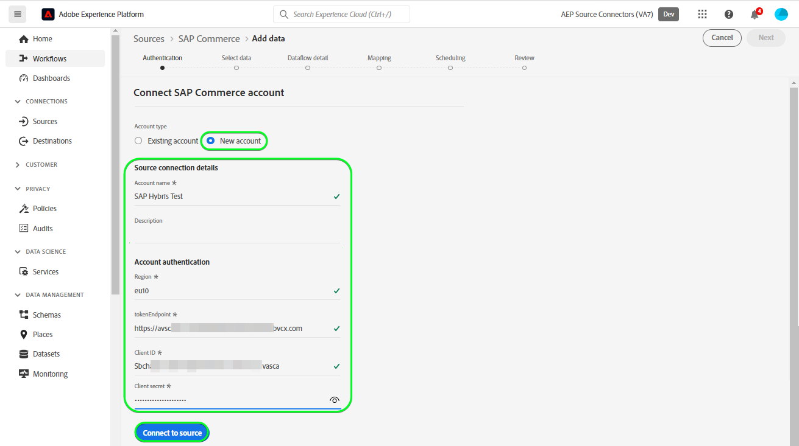

# Criar um [!DNL SAP Commerce] conexão de origem na interface

>[!NOTE]
>
>A variável [!DNL SAP Commerce] a fonte está na versão beta. Consulte a [visão geral das origens](../../../../home.md#terms-and-conditions) para obter mais informações sobre o uso de fontes rotuladas como beta.

O tutorial a seguir guiará você pelas etapas para criar um [!DNL SAP Commerce] conexão de origem para trazer [[!DNL SAP] Cobrança da assinatura](https://www.sap.com/products/financial-management/subscription-billing.html) contatos e dados do cliente usando a interface da Adobe Experience Platform.

## Introdução {#getting-started}

Este tutorial requer um entendimento prático dos seguintes componentes do Experience Platform:

* [[!DNL Experience Data Model (XDM)] Sistema](../../../../../xdm/home.md): o quadro normalizado pelo qual [!DNL Experience Platform] organiza os dados de experiência do cliente.
   * [Noções básicas da composição do esquema](../../../../../xdm/schema/composition.md): saiba mais sobre os componentes básicos dos esquemas XDM, incluindo princípios fundamentais e práticas recomendadas na composição do esquema.
   * [Tutorial do Editor de esquemas](../../../../../xdm/tutorials/create-schema-ui.md): saiba como criar esquemas personalizados usando a interface do Editor de esquemas.
* [[!DNL Real-Time Customer Profile]](../../../../../profile/home.md): fornece um perfil de consumidor unificado em tempo real com base em dados agregados de várias fontes.

Se você já tiver um [!DNL SAP Commerce] conta, você pode ignorar o restante deste documento e prosseguir para o tutorial em [configuração de um fluxo de dados](../../dataflow/ecommerce.md).

### Coletar credenciais necessárias {#gather-credentials}

Para se conectar [!DNL SAP Commerce] para Experience Platform, você deve fornecer valores para as seguintes propriedades de conexão:

| Credencial | Descrição |
| --- | --- |
| ID do cliente | O valor de `clientId` da chave de serviço. |
| Segredo do cliente | O valor de `clientSecret` da chave de serviço. |
| Endpoint do token | O valor de `url` na chave de serviço, será semelhante a `https://subscriptionbilling.authentication.eu10.hana.ondemand.com`. |
| Região | O local do data center. A região está presente no `url` e tem um valor semelhante a `eu10` ou `us10`. Por exemplo, se a variável `url` é `https://eu10.revenue.cloud.sap/api` você precisará `eu10`. |

Para obter mais informações, consulte o [[!DNL SAP Commerce] documentação](https://help.sap.com/docs/CLOUD_TO_CASH_OD/987aec876092428f88162e438acf80d6/c5fcaf96daff4c7a8520188e4d8a1843.html).

### Criar um esquema da Platform {#create-platform-schema}

Antes de criar uma [!DNL SAP Commerce] conexão de origem, você também deve garantir que primeiro crie um esquema Experience Platform para usar na origem. Veja o tutorial sobre [criação de um schema do Platform](../../../../../xdm/schema/composition.md) para obter etapas abrangentes sobre como criar um schema.

Expanda a seção a seguir para exibir um schema de exemplo.

+++ Exibir exemplo de esquema

```
{
  "_extconndev": {
    "addresses": [
      {
        "addressUUID": "{ADDRESS_UUID}",
        "city": "Burnaby",
        "country": "Canada",
        "email": "chandni@acme.com",
        "houseNumber": "27",
        "isDefault": false,
        "phone": "123-456-7890",
        "postalCode": "V3J 1X9",
        "state": "British Columbia",
        "street": "Beresford"
      }
    ],
    "changedAt": "1687204041",
    "changedBy": "vero@acme.com",
    "contactNumber": "123-456-7980",
    "corporateInfo": {
      "company": "acme"
    },
    "createAt": "1687204041",
    "createdBy": "vero@acme.com",
    "customReferences": [
      {
        "id": "Sample value",
        "typeCode": "Sample value"
      }
    ],
    "customerNumber": "Sample value",
    "customerType": "Sample value",
    "defaultAddress": {
      "addressUUID": "Sample value",
      "city": "North Vancouver",
      "country": "Canada",
      "email": "chandni@acme.come",
      "houseNumber": "34",
      "isDefault": false,
      "phone": "123-456-7890",
      "postalCode": "V7H 2P1",
      "state": "British Columbia",
      "street": "Maple"
    },
    "externalObjectReferences": [
      {
        "externalId": "{EXTERNAL_ID}",
        "externalIdTypeCode": "{EXTERNAL_ID_TYPE_CODE}",
        "externalSystemId": "{EXTERNAL_SYSTEM_ID}"
      }
    ],
    "markets": [
      {
        "active": false,
        "country": "USA",
        "currency": "USD",
        "marketId": "Sample value",
        "priceinfo": {
          "incoterms": "{INCO_TERMS}",
          "incotermsLocation": "{INCO_TERMS_LOCATION}",
          "priceGroup": "{PRICE_GROUP}",
          "priceListType": "{PRICE_LIST_TYPE}"
        },
        "salesArea": {
          "distributionChannel": "{DISTRIBUTION_CHANNEL}",
          "division": "{DIVISION}",
          "salesOrganization": "{SALES_ORGANIZATION}"
        }
      }
    ],
    "personalInfo": {
      "firstName": "Chandni",
      "lastName": "Kaur"
    }
  },
  "_id": "/uri-reference",
  "_repo": {
    "createDate": "2004-10-23T12:00:00-06:00",
    "modifyDate": "2004-10-23T12:00:00-06:00"
  },
  "createdByBatchID": "/uri-reference",
  "modifiedByBatchID": "/uri-reference",
  "personID": "{PERSON_ID}",
  "repositoryCreatedBy": "kevin@acme.com",
  "repositoryLastModifiedBy": "kevin@acme.com"
}
```

+++

## Conecte seu [!DNL SAP Commerce] account {#connect-account}

Na interface do usuário da Platform, selecione **[!UICONTROL Origens]** na barra de navegação esquerda, para acessar a [!UICONTROL Origens] espaço de trabalho. A variável [!UICONTROL Catálogo] exibe uma variedade de fontes com as quais você pode criar uma conta.

Você pode selecionar a categoria apropriada no catálogo no lado esquerdo da tela. Como alternativa, você pode encontrar a fonte específica com a qual deseja trabalhar usando a opção de pesquisa.

No *comércio eletrônico* categoria, selecione **[!UICONTROL SAP Commerce]** e selecione **[!UICONTROL Adicionar dados]**.


A variável **[!UICONTROL Conectar a conta do SAP Commerce]** é exibida. Nesta página, você pode usar credenciais novas ou existentes.

### Conta existente {#existing-account}

Para usar uma conta existente, selecione a variável [!DNL SAP Commerce] conta com a qual deseja criar um novo fluxo de dados e selecione **[!UICONTROL Próxima]** para continuar.


### Nova conta {#new-account}

Se estiver criando uma nova conta, selecione **[!UICONTROL Nova conta]** e forneça um nome, uma descrição opcional e suas credenciais. Quando terminar, selecione **[!UICONTROL Conectar à origem]** e aguarde algum tempo para estabelecer a nova conexão.



### Selecionar dados {#select-data}

Finalmente, você deve selecionar o tipo de objeto que deseja assimilar na Platform.

| Tipo de objeto | Descrição |
| --- | --- |
| `Customers` | As entidades que têm assinaturas. |
| `Contacts` | Os detalhes de contato dos clientes. |

>[!BEGINTABS]

>[!TAB Clientes]

Para assimilar dados do cliente, selecione **[!UICONTROL Clientes]** como seu tipo de objeto e selecione **[!UICONTROL Próxima]**.


>[!TAB Contatos]

Para assimilar dados de contato, selecione **[!UICONTROL Contatos]** como seu tipo de objeto e selecione **[!UICONTROL Próxima]**.


>[!ENDTABS]

## Próximas etapas {#next-steps}

Ao seguir este tutorial, você estabeleceu uma conexão com o seu [!DNL SAP Commerce] conta. Agora você pode seguir para o próximo tutorial e [configurar um fluxo de dados para trazer dados para a Platform](../../dataflow/ecommerce.md).

## Recursos adicionais {#additional-resources}

As seções abaixo fornecem recursos adicionais que você pode consultar ao usar o [!DNL SAP Commerce] origem.

### Mapeamento {#mapping}

A Platform fornece recomendações inteligentes para campos mapeados automaticamente com base no esquema ou conjunto de dados de destino selecionado. Você pode ajustar manualmente as regras de mapeamento para atender aos seus casos de uso. Com base nas suas necessidades, você pode optar por mapear campos diretamente ou usar funções de preparação de dados para transformar dados de origem para derivar valores calculados ou calculados. Para obter etapas abrangentes sobre como usar a interface do mapeador e campos calculados, consulte [Guia da interface de preparação de dados](../../../../../data-prep/ui/mapping.md).

As configurações de mapeamento para o fluxo de dados serão diferentes dependendo do esquema e do tipo de objeto que você seleciona para assimilar.

>[!BEGINTABS]

>[!TAB Clientes]

Para dados do cliente, [!DNL SAP Commerce] usa o [clientes](https://api.sap.com/api/BusinessPartner_APIs/path/GET_customers) e a variável [relacionamentos entre cliente e contatos](https://api.sap.com/api/BusinessPartner_APIs/path/GET_relationships-customer-contacts) endpoints do [!DNL SAP Business Partners] API para recuperar os dados

Veja a seguir um exemplo de configurações de mapeamento para [!DNL SAP Commerce] fluxo de dados para dados do cliente:

| Campo de destino | Descrição |
| --- | --- |
| `customerNumber` | O número do cliente. |
| `corporateInfo` | O número do cliente. |
| `customerType` | O tipo de cliente. |
| `createdAt` | Um carimbo de data e hora indicando quando o cliente foi criado. |
| `changedAt` | Um carimbo de data e hora indicando quando o cliente foi atualizado pela última vez. |
| `markets[*].country` | Os clientes comercializam, recuperados como um objeto de matriz. |
| `addresses[*].email` | Emails associados aos vários endereços do cliente, recuperados como um objeto de matriz. |
| `addresses[*].city` | Cidades associadas aos vários endereços do cliente, recuperadas como um objeto de matriz. |
| `addresses[*].addressUUID` | IDs associadas aos vários endereços do cliente, recuperadas como um objeto de matriz. |
| `externalObjectReferences[*].externalSystemId` | Dados adicionais, recuperados como um objeto de matriz. |
| `externalObjectReferences[*].externalId` | Dados adicionais, recuperados como um objeto de matriz. |
| `customReferences[*].id` | Dados adicionais, recuperados como um objeto de matriz. |
| `customReferences[*].typeCode` | Dados adicionais, recuperados como um objeto de matriz. |


>[!TAB Contatos]

Para dados de contato, [!DNL SAP Commerce] usa o [contatos](https://api.sap.com/api/BusinessPartner_APIs/path/GET_contacts) endpoint do [!DNL SAP Business Partners] API para recuperar os dados.

Veja a seguir um exemplo de configurações de mapeamento para [!DNL SAP Commerce] fluxo de dados para dados de contato:

| Campo de destino | Descrição |
| --- | --- |
| `contactNumber` | O número do contato. |
| `createdAt` | Um carimbo de data e hora indicando quando o contato foi criado. |
| `changedAt` | Um carimbo de data e hora indicando quando o contato foi atualizado pela última vez. |
| `personalInfo.lastName` | O Sobrenome do contato. |
| `personalInfo.firstName` | O Nome do contato. |
| `externalObjectReferences[*].externalSystemId` | Dados adicionais, recuperados como um objeto de matriz. |
| `externalObjectReferences[*].externalId` | Dados adicionais, recuperados como um objeto de matriz. |
| `externalObjectReferences[*].externalIdTypeCode` | Dados adicionais, recuperados como um objeto de matriz. |


>[!ENDTABS]

