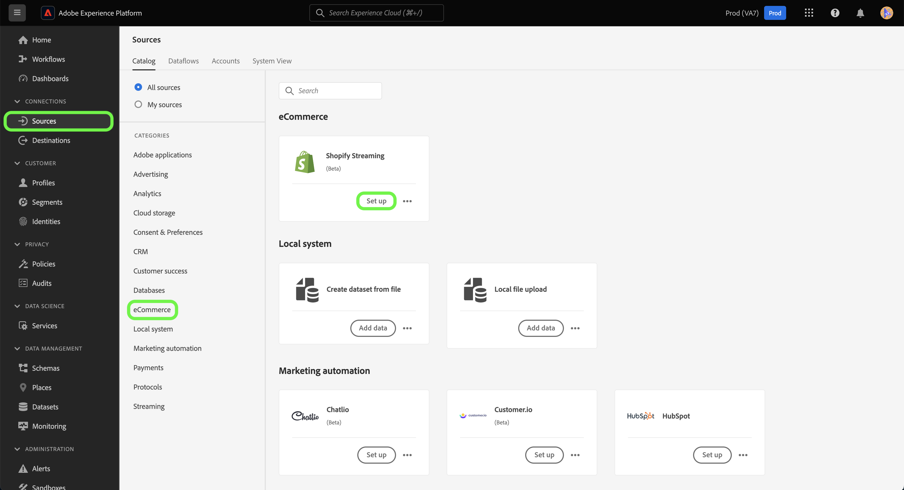

# Criar uma conexão de origem e um fluxo de dados para [!DNL Shopify Streaming] dados usando a interface

Este tutorial fornece etapas para a criação de um [!DNL Shopify Streaming] conexão de origem e fluxo de dados usando a interface do usuário da Platform.

## Introdução {#getting-started}

Este tutorial requer um entendimento prático dos seguintes componentes do Experience Platform:

* [[!DNL Experience Data Model (XDM)] Sistema](../../../../../xdm/home.md): o quadro normalizado pelo qual [!DNL Experience Platform] organiza os dados de experiência do cliente.
   * [Noções básicas da composição do esquema](../../../../../xdm/schema/composition.md): saiba mais sobre os componentes básicos dos esquemas XDM, incluindo princípios fundamentais e práticas recomendadas na composição do esquema.
   * [Tutorial do Editor de esquemas](../../../../../xdm/tutorials/create-schema-ui.md): saiba como criar esquemas personalizados usando a interface do Editor de esquemas.
* [[!DNL Real-Time Customer Profile]](../../../../../profile/home.md): fornece um perfil de consumidor unificado em tempo real com base em dados agregados de várias fontes.

>[!IMPORTANT]
>
>Este tutorial requer que você tenha concluído a configuração de pré-requisito para o seu [!DNL Shopify Streaming] conta. Para obter as etapas de configuração da sua conta, leia a [[!DNL Shopify Streaming] visão geral](../../../../connectors/ecommerce/shopify-streaming.md).

## Conecte seu [!DNL Shopify Streaming] account

Na interface do usuário da Platform, selecione **[!UICONTROL Origens]** na barra de navegação esquerda, para acessar a [!UICONTROL Origens] espaço de trabalho. A variável [!UICONTROL Catálogo] exibe uma variedade de fontes com as quais você pode criar uma conta.

Você pode selecionar a categoria apropriada no catálogo no lado esquerdo da tela. Como alternativa, você pode encontrar a fonte específica com a qual deseja trabalhar usando a opção de pesquisa.

No **comércio eletrônico** categoria, selecione [!DNL Shopify Streaming]e selecione **[!UICONTROL Adicionar dados]**.

## Selecionar dados

A variável **[!UICONTROL Selecionar dados]** será exibida, fornecendo uma interface para você selecionar os dados que trará para a Platform.

* A parte esquerda da interface é um navegador que permite visualizar os fluxos de dados disponíveis em sua conta;
* A parte direita da interface permite visualizar até 100 linhas de dados de um arquivo JSON.

Selecionar **[!UICONTROL Fazer upload de arquivos]** para carregar um arquivo JSON do seu sistema local. Como alternativa, você pode arrastar e soltar o arquivo JSON que deseja fazer upload na [!UICONTROL Arrastar e soltar arquivos] painel.

Depois que o arquivo for carregado, a interface de visualização será atualizada para exibir uma visualização do esquema carregado. A interface de visualização permite inspecionar o conteúdo e a estrutura de um arquivo. Você também pode usar a variável [!UICONTROL Campo de pesquisa] para acessar itens específicos no esquema.

Quando terminar, selecione **[!UICONTROL Próxima]**.

## Detalhes do fluxo de dados

A variável **Detalhes do fluxo de dados** A etapa é exibida, fornecendo opções para usar um conjunto de dados existente ou estabelecer um novo para o fluxo de dados, bem como uma oportunidade de fornecer um nome e uma descrição para o fluxo de dados. Durante essa etapa, você também pode definir configurações para Assimilação de perfil, diagnóstico de erro, assimilação parcial e alertas.

Quando terminar, selecione **[!UICONTROL Próxima]**.

## Mapeamento

A variável [!UICONTROL Mapeamento] é exibida, fornecendo uma interface para mapear os campos de origem do esquema de origem para os campos XDM de destino apropriados no esquema de destino.

A Platform fornece recomendações inteligentes para campos mapeados automaticamente com base no esquema ou conjunto de dados de destino selecionado. Você pode ajustar manualmente as regras de mapeamento para atender aos seus casos de uso. Com base nas suas necessidades, você pode optar por mapear campos diretamente ou usar funções de preparação de dados para transformar dados de origem para derivar valores calculados ou calculados. Para obter etapas abrangentes sobre o uso da interface do mapeador e campos calculados, consulte o [Guia da interface de preparação de dados](https://experienceleague.adobe.com/docs/experience-platform/data-prep/ui/mapping.html).

Depois que os dados de origem forem mapeados com sucesso, selecione **[!UICONTROL Próxima]**.

## Consulte a seção

A variável **[!UICONTROL Revisão]** é exibida, permitindo que você revise seu novo fluxo de dados antes de ele ser criado. Os detalhes são agrupados nas seguintes categorias:

* **[!UICONTROL Conexão]**: mostra o tipo de origem, o caminho relevante do arquivo de origem escolhido e o número de colunas nesse arquivo de origem.
* **[!UICONTROL Atribuir conjunto de dados e mapear campos]**: mostra em qual conjunto de dados os dados de origem estão sendo assimilados, incluindo o esquema ao qual o conjunto de dados adere.

Depois de revisar o fluxo de dados, selecione **[!UICONTROL Concluir]** e aguarde algum tempo para criar o fluxo de dados.

## Obter o URL do ponto de extremidade de streaming

Com o fluxo de dados de transmissão criado, agora é possível recuperar o URL do ponto de extremidade de transmissão. Esse endpoint será usado para assinar seu webhook, permitindo que a fonte de streaming se comunique com o Experience Platform.

Para recuperar o ponto de extremidade de transmissão, acesse o [!UICONTROL Atividade de fluxo de dados] página do fluxo de dados que você acabou de criar e copie o ponto de extremidade da parte inferior do [!UICONTROL Propriedades] painel.

## Próximas etapas

Ao seguir este tutorial, você estabeleceu uma conexão de origem e um fluxo de dados para o seu [!DNL Shopify Streaming] conta. Para obter instruções sobre como conectar seu [!DNL Shopify Streaming] usando a API, leia o tutorial em [criação de uma conexão de origem e de um fluxo de dados para transmissão [!DNL Shopify] dados usando a API do Serviço de fluxo](../../../api/create/ecommerce/shopify-streaming.md).
