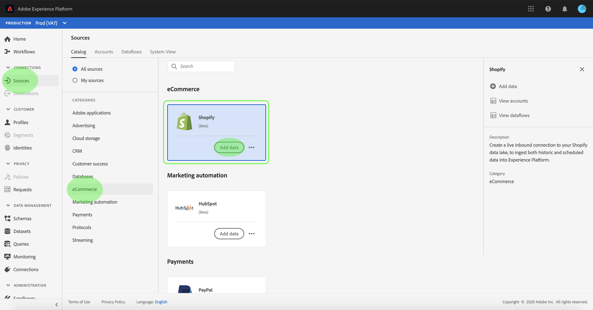

# Crie um [!DNL Shopify] conexão de origem na interface do usuário

Os conectores de origem no Adobe Experience Platform oferecem a capacidade de assimilar dados de origem externa de acordo com a programação. Este tutorial fornece etapas para criar um [!DNL Shopify] conector de origem usando o [!DNL Platform] interface do usuário.

## Introdução

Este tutorial requer uma compreensão funcional dos seguintes componentes do Adobe Experience Platform:

* [Sistema do Experience Data Model (XDM)](../../../../../xdm/home.md): O quadro normalizado pelo qual [!DNL Experience Platform] organiza os dados de experiência do cliente.
   * [Noções básicas da composição do schema](../../../../../xdm/schema/composition.md): Saiba mais sobre os elementos básicos dos esquemas XDM, incluindo princípios-chave e práticas recomendadas na composição do schema.
   * [Tutorial do Editor de esquemas](../../../../../xdm/tutorials/create-schema-ui.md): Saiba como criar esquemas personalizados usando a interface do Editor de esquemas.
* [[!DNL Real-Time Customer Profile]](../../../../../profile/home.md): Fornece um perfil de consumidor unificado e em tempo real com base em dados agregados de várias fontes.

Se você já tiver uma [!DNL Shopify] , você pode ignorar o restante deste documento e prosseguir para o tutorial em [configuração de um fluxo de dados para um conector do eCommerce](../../dataflow/ecommerce.md).

### Obter credenciais necessárias

Para acessar o [!DNL Shopify] conta em [!DNL Platform], você deve fornecer os seguintes valores:

| Credencial | Descrição |
| ---------- | ----------- |
| `host` | O ponto final de seu [!DNL Shopify] servidor. |
| `accessToken` | O token de acesso para sua [!DNL Shopify] conta do usuário. |

Para obter mais informações sobre a introdução, consulte esta seção [[!DNL Shopify] documento](https://shopify.dev/concepts/about-apis/authentication).

## Conecte seu [!DNL Shopify] account

Depois de reunir suas credenciais necessárias, siga as etapas abaixo para vincular seus [!DNL Shopify] para [!DNL Platform].

Faça logon em [Adobe Experience Platform](https://platform.adobe.com) e depois selecione **[!UICONTROL Fontes]** na barra de navegação esquerda para acessar o **[!UICONTROL Fontes]** espaço de trabalho. O **[!UICONTROL Catálogo]** exibe uma variedade de fontes com as quais você pode criar uma conta.

Você pode selecionar a categoria apropriada no catálogo no lado esquerdo da tela. Como alternativa, você pode encontrar a fonte específica com a qual deseja trabalhar usando a opção de pesquisa.

Em **[!UICONTROL comércio eletrônico]** categoria , selecione **[!UICONTROL Shopify]**. Se esta for a primeira vez que você usa esse conector, selecione **[!UICONTROL Configurar]**. Caso contrário, selecione **[!UICONTROL Adicionar dados]** para criar um novo [!DNL Shopify] conector.

O **[!UICONTROL Conectar-se ao Shopify]** será exibida. Nesta página, você pode usar novas credenciais ou credenciais existentes.

### Nova conta

Se estiver usando novas credenciais, selecione **[!UICONTROL Nova conta]**. No formulário de entrada exibido, forneça um nome, uma descrição opcional e [!DNL Shopify] credenciais. Quando terminar, selecione **[!UICONTROL Connect]** e, em seguida, permitir que a nova conexão seja estabelecida.

### Conta existente

Para conectar uma conta existente, selecione a [!DNL Shopify] conta com a qual deseja se conectar e selecione **[!UICONTROL Próximo]** para continuar.

## Próximas etapas

Ao seguir este tutorial, você estabeleceu uma conexão com seu [!DNL Shopify] conta. Agora você pode continuar para o próximo tutorial e [configurar um fluxo de dados para trazer os dados do eCommerce para o [!DNL Platform]](../../dataflow/ecommerce.md).
