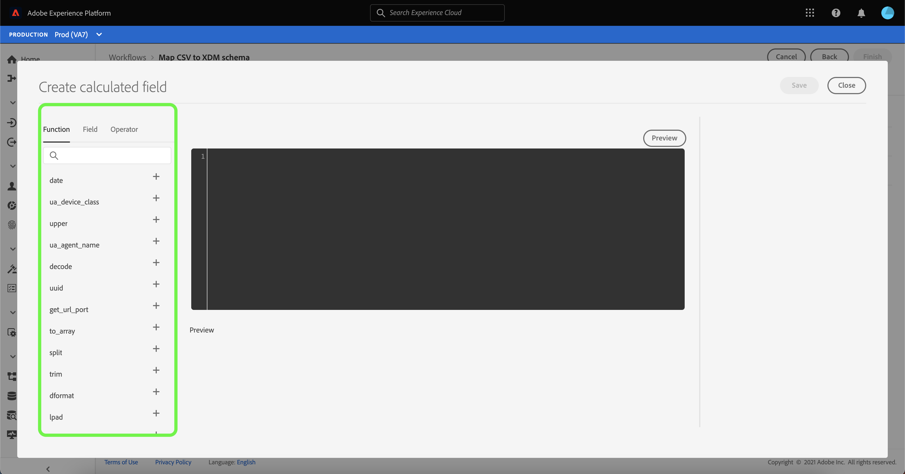
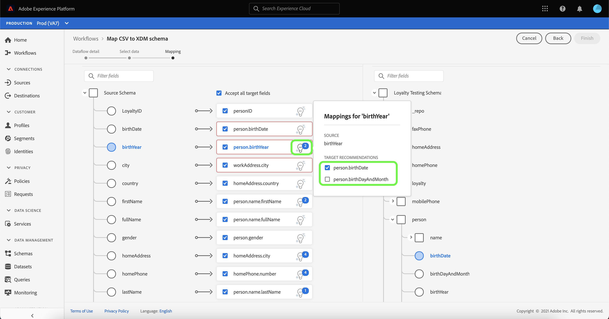
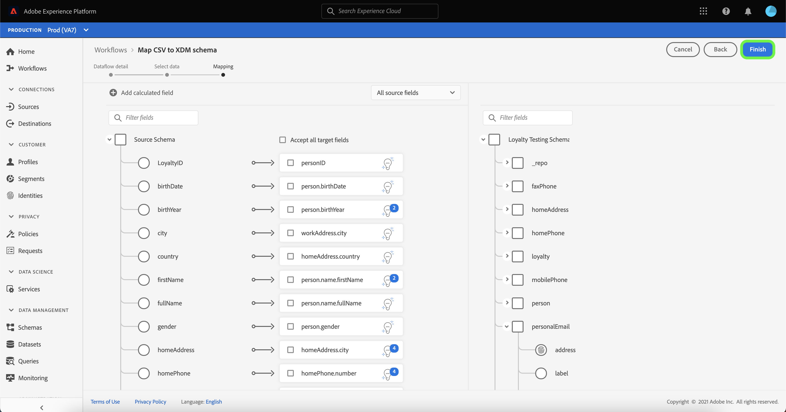

# Crie um conector de origem de upload de arquivo local na interface do usuário

Este tutorial fornece etapas para criar um conector de origem de upload de arquivo local para assimilar arquivos locais na plataforma usando a interface do usuário do .

## Introdução

Este tutorial requer uma compreensão funcional dos seguintes componentes da Platform:

* [[!DNL Experience Data Model (XDM)] Sistema](../../../../../xdm/home.md): A estrutura padronizada pela qual a Platform organiza os dados de experiência do cliente.
   * [Noções básicas da composição](../../../../../xdm/schema/composition.md) do schema: Saiba mais sobre os elementos básicos dos esquemas XDM, incluindo princípios-chave e práticas recomendadas na composição do schema.
   * [Tutorial](../../../../../xdm/tutorials/create-schema-ui.md) do Editor de esquema: Saiba como criar esquemas personalizados usando a interface do Editor de esquemas.
* [[!DNL Real-time Customer Profile]](../../../../../profile/home.md): Fornece um perfil de consumidor unificado e em tempo real com base em dados agregados de várias fontes.

## Fazer upload de arquivos locais para a plataforma

Na interface do usuário da plataforma, selecione **[!UICONTROL Fontes]** na barra de navegação esquerda para acessar o espaço de trabalho [!UICONTROL Fontes]. A tela [!UICONTROL Catálogo] exibe uma variedade de fontes para as quais você pode criar uma conta.

Você pode selecionar a categoria apropriada no catálogo no lado esquerdo da tela. Como alternativa, você pode encontrar a fonte específica com a qual deseja trabalhar usando a opção de pesquisa.

Na categoria [!UICONTROL Local system], selecione **[!UICONTROL Local file upload]** e selecione **[!UICONTROL Configurar]**.

### Usar um conjunto de dados existente

A página [!UICONTROL Dataflow detail] permite selecionar se você deseja assimilar seus dados CSV em um conjunto de dados existente ou em um novo conjunto de dados.

Para assimilar seus dados CSV em um conjunto de dados existente, selecione **[!UICONTROL Conjunto de dados existente]**. Você pode recuperar um conjunto de dados existente usando a opção [!UICONTROL Advanced search] ou rolando pela lista de conjuntos de dados existentes no menu suspenso.

Com um conjunto de dados selecionado, forneça um nome para o seu fluxo de dados e uma descrição opcional.

Durante esse processo, você também pode ativar [!UICONTROL Error diagnostics] e [!UICONTROL Inclusão parcial]. [!UICONTROL O ] diagnóstico de erro permite a geração detalhada de mensagens de erro para qualquer registro incorreto que ocorra no fluxo de dados, enquanto o  [!UICONTROL questionário ] parcial permite a assimilação de dados contendo erros, até um determinado limite definido manualmente. Consulte a [visão geral da assimilação de lote parcial](../../../../../ingestion/batch-ingestion/partial.md) para obter mais informações.

### Usar um novo conjunto de dados

Para assimilar seus dados CSV em um novo conjunto de dados, selecione **[!UICONTROL New dataset]** e forneça um nome de conjunto de dados de saída e uma descrição opcional. Em seguida, selecione um esquema a ser mapeado usando a opção [!UICONTROL Pesquisa avançada] ou rolando pela lista de esquemas existentes no menu suspenso.

Com um esquema selecionado, forneça um nome para o seu fluxo de dados e uma descrição opcional e, em seguida, aplique as configurações de [!UICONTROL Diagnóstico de erro] e [!UICONTROL Assimilação parcial] que deseja para o seu fluxo de dados. Quando terminar, selecione **[!UICONTROL Next]**.

### Selecionar dados

A etapa [!UICONTROL Selecionar dados] é exibida, fornecendo uma interface para carregar os arquivos locais e visualizar sua estrutura e conteúdo. Selecione **[!UICONTROL Escolha os arquivos]** para carregar um arquivo CSV do sistema local. Como alternativa, você pode arrastar e soltar o arquivo CSV que deseja fazer upload no painel [!UICONTROL Arrastar e soltar arquivos].

>[!TIP]
>
>Atualmente, apenas os arquivos CSV são compatíveis com o upload de arquivo local. O tamanho máximo de arquivo para cada arquivo é de 1 GB.

Depois que o arquivo é carregado, a interface de visualização é atualizada para exibir o conteúdo e a estrutura do arquivo.

Dependendo do arquivo, é possível selecionar um delimitador de coluna, como guias, vírgulas, barra vertical ou um delimitador de coluna personalizado para os dados de origem. Selecione a seta suspensa **[!UICONTROL Delimitador]** e selecione o delimitador apropriado no menu.

Quando terminar, selecione **[!UICONTROL Next]**.

### Mapeamento

A etapa [!UICONTROL Mapping] é exibida, fornecendo uma interface para mapear os campos de origem do esquema de origem para os campos XDM de destino apropriados no esquema de destino.

#### Visualizar dados

Selecione **[!UICONTROL Preview data]** para ver os resultados de mapeamento de até 100 linhas de dados de amostra do conjunto de dados selecionado.

Durante a visualização, a coluna de identidade é priorizada como o primeiro campo, pois são as informações principais necessárias ao validar resultados de mapeamento. Quando terminar, selecione **[!UICONTROL Fechar]**.

#### Adicionar campo calculado

Os campos calculados permitem que os valores sejam criados com base nos atributos no schema de entrada. Esses valores podem ser atribuídos aos atributos no schema de destino e receber um nome e uma descrição para permitir uma referência mais fácil.

Selecione o botão **[!UICONTROL Add calculated field]** para continuar.

O painel [!UICONTROL Criar campo calculado] é exibido. A caixa de diálogo à esquerda contém os campos, as funções e os operadores suportados nos campos calculados. Selecione uma das guias para começar a adicionar funções, campos ou operadores ao editor de expressão.

| Tabulação | Descrição |
| --------- | ----------- |
| Função | A guia funções lista as funções disponíveis para transformar os dados. Para saber mais sobre as funções que você pode usar nos campos calculados, leia o guia em [usando as funções de Preparação de Dados (Mapeador)](../../../../../data-prep/functions.md). |
| Campo | A guia fields lista campos e atributos disponíveis no schema de origem. |
| Operador | A guia operadores lista os operadores disponíveis para transformar os dados. |

Selecione o editor de expressão para adicionar manualmente campos, funções e operadores. Depois de criar um campo calculado, selecione **[!UICONTROL Save]** para continuar.

#### Filtrar árvore de mapeamento do esquema de origem

Para filtrar pelo esquema de origem, selecione **[!UICONTROL All source fields]** e selecione o campo específico que deseja mapear no menu suspenso.

A tabela a seguir exibe as opções de classificação da árvore do schema de origem:

| Campos de origem | Descrição |
| --- | --- |
| [!UICONTROL Todos os campos de origem] | Essa opção exibe todos os campos de origem do esquema de origem. Essa opção é exibida por padrão. |
| [!UICONTROL Campos obrigatórios] | Essa opção filtra o schema de origem para exibir apenas os campos necessários para concluir o mapeamento. |
| [!UICONTROL Campos de identidade] | Essa opção filtra o schema de origem para exibir somente os campos marcados para Identidade. |
| [!UICONTROL Campos mapeados] | Essa opção filtra o schema de origem para exibir apenas os campos que já foram mapeados. |
| [!UICONTROL Campos não mapeados] | Essa opção filtra o schema de origem para exibir apenas os campos que ainda precisam ser mapeados. |
| [!UICONTROL Campos com recomendação] | Essa opção filtra o schema de origem para exibir apenas os campos que contêm recomendações de mapeamento. |

#### Recomendações inteligentes

A Platform fornece automaticamente recomendações inteligentes para campos mapeados automaticamente com base no esquema de destino ou conjunto de dados selecionado. Você pode ajustar manualmente as regras de mapeamento de acordo com seus casos de uso.

Para aceitar todos os valores de mapeamento de geração automática, selecione **[!UICONTROL Accept all target fields]**.

Às vezes, mais de uma recomendação está disponível para o schema de origem. Quando isso acontece, o cartão de mapeamento exibe a recomendação mais importante, seguida por um círculo azul que contém o número de recomendações adicionais disponíveis. Selecionar o ícone da lâmpada mostrará uma lista das recomendações adicionais. Você pode escolher uma das recomendações alternativas marcando a caixa de seleção ao lado da recomendação para a qual deseja mapear.

Como alternativa, você pode optar por mapear manualmente o esquema de origem para o esquema de destino. Para fazer isso, passe o mouse sobre o schema de origem que deseja mapear e selecione o ícone de adição (`+`).

O provedor **[!UICONTROL Mapear origem para campo de destino]** é exibido. Aqui, você pode selecionar qual campo deseja mapear, seguido por **[!UICONTROL Save]** para adicionar seu novo mapeamento.

Quando terminar, selecione **[!UICONTROL Finished]**.

## Monitorar assimilação de dados

Depois que o arquivo CSV for mapeado e criado, você poderá monitorar os dados que estão sendo assimilados por meio dele usando o painel de monitoramento. Para obter mais informações, consulte o tutorial em [fluxos de dados de fontes de monitoramento na interface do usuário](../../../../../dataflows/ui/monitor-sources.md).

## Próximas etapas

Ao seguir este tutorial, você mapeou com sucesso um arquivo CSV simples para um esquema XDM e o assimilou na Platform. Esses dados agora podem ser usados por serviços [!DNL Platform] downstream, como [!DNL Real-time Customer Profile]. Consulte a visão geral de [[!DNL Real-time Customer Profile]](../../../../../profile/home.md) para obter mais informações.
