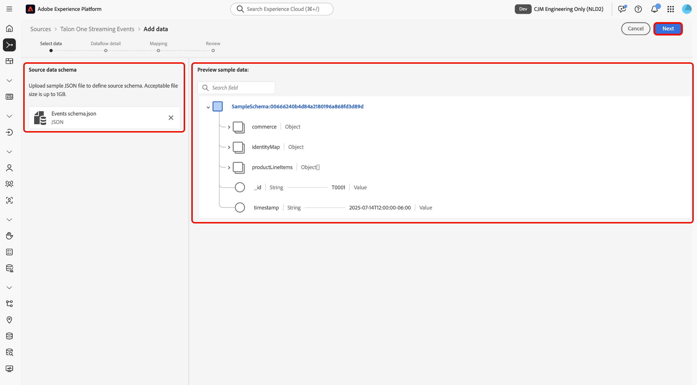

# Transmitir dados do [!DNL Talon.One] para o Experience Platform usando a interface

>[!AVAILABILITY]
>
>A origem [!DNL Talon.One] está na versão beta. Leia os [termos e condições](../../../../home.md#terms-and-conditions) na visão geral das fontes para obter mais informações sobre como usar fontes com rótulo beta.

Leia este guia para saber como se conectar e transmitir seus dados do [!DNL Talon.One] para a Adobe Experience Platform usando o espaço de trabalho de fontes na interface do usuário.

## Introdução

Este tutorial requer uma compreensão funcional dos seguintes componentes do Experience Platform:

* [[!DNL Experience Data Model (XDM)] Sistema](../../../../../xdm/home.md): a estrutura padronizada pela qual o Experience Platform organiza os dados de experiência do cliente.
   * [Noções básicas sobre a composição de esquema](../../../../../xdm/schema/composition.md): saiba mais sobre os blocos de construção básicos de esquemas XDM, incluindo princípios-chave e práticas recomendadas na composição de esquema.
   * [Tutorial do Editor de esquemas](../../../../../xdm/tutorials/create-schema-ui.md): saiba como criar esquemas personalizados usando a interface do Editor de esquemas.
* [[!DNL Real-Time Customer Profile]](../../../../../profile/home.md): Fornece um perfil de consumidor unificado em tempo real com base em dados agregados de várias fontes.

>[!IMPORTANT]
>
>Leia a [[!DNL Talon.One] visão geral](../../../../connectors/loyalty/talon-one.md) para saber mais sobre as etapas de pré-requisito que você precisa concluir antes de conectar sua conta à Experience Platform.

## Navegar pelo catálogo de origens

Na interface do Experience Platform, selecione **[!UICONTROL Sources]** na navegação à esquerda para acessar o espaço de trabalho *[!UICONTROL Sources]*. Selecione a categoria apropriada no painel *[!UICONTROL Categories]*. Como alternativa, use a barra de pesquisa para navegar até a fonte específica que deseja usar.

Para transmitir dados de [!DNL Talon.One], selecione o cartão de origem **[!UICONTROL Talon.One Streaming Events]** em *[!UICONTROL Loyalty]* e selecione **[!UICONTROL Add data]**.

>[!TIP]
>
>As origens no catálogo de origens exibem a opção **[!UICONTROL Set up]** quando uma determinada origem ainda não tem uma conta autenticada. Depois que uma conta autenticada é criada, esta opção muda para **[!UICONTROL Add data]**.

## Selecionar dados

Em seguida, use a interface *[!UICONTROL Select data]* para carregar um arquivo JSON de amostra para definir seu esquema de origem. Durante essa etapa, é possível usar a interface de pré-visualização para exibir a estrutura de arquivo do payload. Quando terminar, selecione **[!UICONTROL Next]**.

## Detalhes do fluxo de dados

Em seguida, você deve fornecer informações sobre o conjunto de dados e o fluxo de dados.

### Detalhes do conjunto de dados

Um conjunto de dados é uma construção de armazenamento e gerenciamento para uma coleção de dados, normalmente uma tabela, que contém um esquema (colunas/campos) e registros (linhas). Os dados assimilados com sucesso na Experience Platform são mantidos no data lake como conjuntos de dados.

Durante essa etapa, é possível usar um conjunto de dados existente ou criar um novo.

>[!NOTE]
>
>Independentemente de você usar um conjunto de dados existente ou criar um novo, você deve garantir que seu conjunto de dados esteja **habilitado para assimilação do Perfil**.

+++Selecione para obter as etapas para ativar a Assimilação de perfil, Diagnóstico de erro e Assimilação parcial.

Se o conjunto de dados estiver habilitado para o Perfil de Cliente em Tempo Real, durante essa etapa você poderá alternar entre **[!UICONTROL Profile dataset]** e habilitar os dados para assimilação de Perfil. Você também pode usar esta etapa para habilitar **[!UICONTROL Error diagnostics]** e **[!UICONTROL Partial ingestion]**.

* **[!UICONTROL Error diagnostics]**: Selecione **[!UICONTROL Error diagnostics]** para instruir a origem a produzir diagnósticos de erro que você poderá consultar posteriormente ao monitorar a atividade do conjunto de dados e o status do fluxo de dados.
* **[!UICONTROL Partial ingestion]**: Assimilação parcial em lote é a capacidade de assimilar dados que contêm erros, até um determinado limite configurável. Esse recurso permite assimilar com sucesso todos os seus dados precisos na Experience Platform, enquanto todos os seus dados incorretos são armazenados em lote separadamente com informações sobre por que são inválidos.

+++

### Detalhes do fluxo de dados

Depois que o conjunto de dados é configurado, você deve fornecer detalhes sobre o fluxo de dados, incluindo um nome, uma descrição opcional e configurações de alerta.

| Configurações de fluxo de dados | Descrição |
| --- | --- |
| Nome do fluxo de dados | O nome do fluxo de dados. Por padrão, esse campo usará o nome do arquivo que está sendo importado. |
| Descrição | (Opcional) Uma breve descrição do fluxo de dados. |
| Alertas | O Experience Platform pode produzir alertas baseados em eventos, nos quais os usuários podem assinar. Essas opções permitem que um fluxo de dados em execução acione esses alertas.  Para obter mais informações, leia a [visão geral dos alertas](../../alerts.md) <ul><li>**Início da Execução do Fluxo de Dados de Fontes**: selecione este alerta para receber uma notificação quando a execução do fluxo de dados começar.</li><li>**Êxito na Execução do Fluxo de Dados de Fontes**: selecione este alerta para receber uma notificação se o fluxo de dados terminar sem erros.</li><li>**Falha na execução do fluxo de dados de fontes**: selecione este alerta para receber uma notificação se a execução do fluxo de dados terminar com erros.</li></ul> |

{style="table-layout:auto"}

## Mapeamento

Use a interface de mapeamento para mapear os dados de origem para os campos de esquema apropriados antes de assimilar dados na Experience Platform. Para obter mais informações, leia o [guia de mapeamento na interface](../../../../../data-prep/ui/mapping.md).

<!--
>[!TIP]
>
>You can download the [Events and Profile mappings](../../../../images/tutorials/create/capillary/mappings.zip) for [!DNL Capillary] and [import the files to Data Prep](../../../../../data-prep/ui/mapping.md#import-mapping) when you are ready to map your data.
-->

## Revisar

A etapa *[!UICONTROL Review]* é exibida, permitindo que você revise os detalhes do fluxo de dados antes que ele seja criado. Os detalhes são agrupados nas seguintes categorias:

* **[!UICONTROL Connection]**: mostra o nome da conta, a plataforma de origem e o nome de origem.
* **[!UICONTROL Assign dataset and map fields]**: mostra o conjunto de dados de destino e o esquema ao qual o conjunto de dados pertence.

Depois de confirmar que os detalhes estão corretos, selecione **[!UICONTROL Finish]**.

## Recuperar o URL do ponto de extremidade de streaming

Com a conexão criada, a página de detalhes das origens é exibida. Esta página mostra detalhes da conexão recém-criada, incluindo fluxos de dados executados anteriormente, ID e URL do ponto de extremidade de streaming.

## Monitorar seu fluxo de dados

Depois que o fluxo de dados for criado, você poderá monitorar os dados que estão sendo assimilados por meio dele para ver informações sobre taxas de assimilação, sucesso e erros. Para obter mais informações sobre como monitorar o fluxo de dados, consulte o tutorial sobre [monitoramento de contas e fluxos de dados na interface](../../monitor-streaming.md).

## Limitações conhecidas

Para garantir uma assimilação de dados precisa, você deve enviar ao conector os dados dos pontos de fidelidade alterados do [!DNL Talon.One], da atualização de camada e das notificações de downgrade de camada. Como a notificação de alteração dos pontos de fidelidade não inclui informações de camada, você deve enviar essas notificações para um conjunto de dados de perfil separado. Se você combinar dados alterados de pontos com notificações de atualização ou downgrade de camada no mesmo conjunto de dados, as informações de camada serão perdidas ou substituídas por valores nulos. As notificações de atualização e downgrade de nível podem usar o mesmo conjunto de dados, já que ambas incluem detalhes de nível. Após a assimilação, as regras de mesclagem de perfis atualizarão automaticamente o perfil mesclado para refletir os pontos e as informações de camada mais recentes.