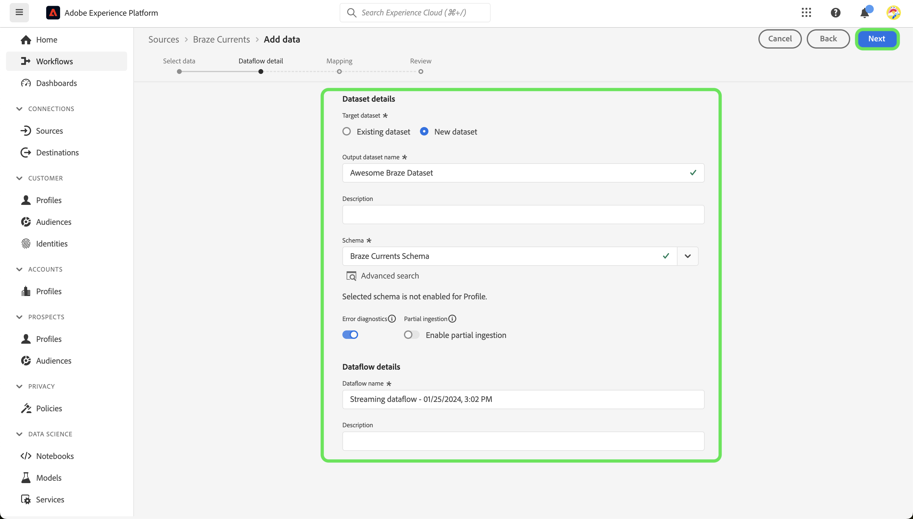

# Criar uma conexão de origem [!DNL Braze Currents] na interface

>[!NOTE]
>
>A origem [!DNL Braze Currents] está na versão beta. Leia a [visão geral das fontes](../../../../home.md#terms-and-conditions) para obter mais informações sobre o uso de fontes com rótulo beta.

O [!DNL Braze] possibilita interações centradas no cliente entre consumidores e marcas em tempo real. [!DNL Braze Currents] é um fluxo de dados em tempo real de eventos de envolvimento da plataforma Braze que é a exportação mais robusta, mas granular, da plataforma [!DNL Braze].

Leia o tutorial a seguir para saber como trazer dados de eventos de envolvimento da sua conta do [!DNL Braze] para a Adobe Experience Platform na interface do usuário.

## Pré-requisitos

Para concluir as etapas deste guia, será necessário:

* Um logon no [Adobe Experience Platform](https://platform.adobe.com) e permissão para criar uma nova conexão de origem de streaming.
* Um logon no [[!DNL Braze] painel](https://dashboard.braze.com/sign_in), uma [licença do Conector atual](https://www.braze.com/docs/user_guide/data_and_analytics/braze_currents) não usada e permissões para criar um conector. Para obter mais informações, leia os [requisitos para configurar [!DNL Currents]](https://www.braze.com/docs/user_guide/data_and_analytics/braze_currents/setting_up_currents/#requirements).

## Introdução

Este tutorial requer uma compreensão funcional dos seguintes componentes do Adobe Experience Platform:

* [[!DNL Experience Data Model (XDM)] Sistema](../../../../../xdm/home.md): a estrutura padronizada pela qual o [!DNL Experience Platform] organiza os dados de experiência do cliente.
   * [Noções básicas sobre a composição de esquema](../../../../../xdm/schema/composition.md): saiba mais sobre os blocos de construção básicos de esquemas XDM, incluindo princípios-chave e práticas recomendadas na composição de esquema.
   * [Tutorial do Editor de esquemas](../../../../../xdm/tutorials/create-schema-ui.md): saiba como criar esquemas personalizados usando a interface do Editor de esquemas.
* [[!DNL Real-Time Customer Profile]](../../../../../profile/home.md): Fornece um perfil de consumidor unificado em tempo real com base em dados agregados de várias fontes.

Este tutorial também requer uma compreensão funcional de [[!DNL Braze] Atuais](https://www.braze.com/docs/user_guide/data_and_analytics/braze_currents).

Se você já tiver uma conexão [!DNL Braze], ignore o restante deste documento e prossiga para o tutorial em [configurando um fluxo de dados](../../dataflow/marketing-automation.md).

## Criar um esquema do XDM

>[!TIP]
>
>Você deve criar um esquema do Experience Data Model (XDM) se esta for a primeira vez que você cria uma conexão [!DNL Braze Currents]. Se você já criou um esquema para [!DNL Braze Currents], ignore esta etapa e prossiga para [conectando sua conta ao Experience Platform](#connect).

Na interface do usuário do Experience Platform, use a navegação à esquerda e selecione **[!UICONTROL Esquemas]** para acessar o espaço de trabalho [!UICONTROL Esquemas]. Em seguida, selecione **[!UICONTROL Criar esquema]** e **[!UICONTROL Evento de experiência]**. Para continuar, selecione **[!UICONTROL Avançar]**.

Forneça um nome e uma descrição para o esquema. Em seguida, use o painel [!UICONTROL Composição] para configurar os atributos do esquema. Em [!UICONTROL Grupos de campos], selecione **[!UICONTROL Adicionar]** e adicione o grupo de campos [!UICONTROL Braço Evento do Usuário Atual]. Quando terminar, selecione **[!UICONTROL Salvar]**.

Para obter mais informações sobre esquemas, leia o guia para [criar esquemas na interface](../../../../../xdm/tutorials/create-schema-ui.md).

## Conectar sua conta do [!DNL Braze] à Experience Platform {#connect}

Na interface do Experience Platform, selecione **[!UICONTROL Fontes]** na navegação à esquerda para acessar o espaço de trabalho [!UICONTROL Fontes]. Você pode selecionar a categoria apropriada no catálogo no lado esquerdo da tela. Como alternativa, você pode encontrar a fonte específica com a qual deseja trabalhar usando a opção de pesquisa.

Na categoria *Automação de Marketing*, selecione **[!UICONTROL Correntes brasileiras]** e **[!UICONTROL Adicionar dados]**.

Em seguida, carregue o [arquivo de amostra Braze Currents](https://github.com/Appboy/currents-examples/blob/master/sample-data/Adobe/adobe_examples.json) fornecido. Esse arquivo contém todos os campos possíveis que o Braze pode enviar como parte de um evento.

Depois que o arquivo for carregado, você deverá fornecer os detalhes do fluxo de dados, incluindo informações sobre o conjunto de dados e o esquema para o qual está mapeando.  Se esta for a primeira vez que você se conecta a uma origem Braze Currents, crie um novo conjunto de dados.  Caso contrário, você pode usar qualquer conjunto de dados existente que faça referência ao esquema do Brasil.  Se estiver criando um novo conjunto de dados, use o esquema criado na seção anterior.

Em seguida, configure o mapeamento para os dados usando a interface de mapeamento.

O mapeamento terá os seguintes problemas que precisam ser resolvidos.

Nos dados de origem, *id* será mapeada incorretamente para *_braze.appID*. Você deve alterar o campo de target mapping para *_id* no nível raiz do esquema. Em seguida, verifique se *properties.is_amp* está mapeado para *_braze.messaging.email.isAMP*.

Em seguida, exclua o mapeamento de *hora* para *carimbo de data/hora*, selecione o ícone adicionar (`+`) e selecione **[!UICONTROL Adicionar campo calculado]**. Na caixa fornecida, insira *hora \* 1000* e selecione **[!UICONTROL Salvar]**.

Depois que o novo campo calculado for adicionado, selecione **[!UICONTROL Mapear campo de destino]** ao lado do novo campo de origem e mapeie-o para *carimbo de data/hora* no nível raiz do esquema. Você deve selecionar **[!UICONTROL Validar]** para garantir que não haja mais erros.

>[!IMPORTANT]
>
>Os carimbos de data e hora brasileiros não são expressos em milissegundos, mas em segundos. Para que os carimbos de data e hora no Experience Platform sejam refletidos com precisão, é necessário criar campos calculados em milissegundos. Um cálculo de &quot;tempo * 1000&quot; será convertido corretamente em milissegundos, adequado para mapear para um campo de carimbo de data e hora no Experience Platform.
>
>

Quando terminar, selecione **[!UICONTROL Próximo]**. Use a página de revisão para confirmar os detalhes do fluxo de dados e selecione **[!UICONTROL Concluir]**.

### Coletar credenciais necessárias

Depois que a conexão for criada, é necessário coletar os seguintes valores de credencial, que você fornecerá no Painel brasileiro para enviar dados para o Experience Platform. Para obter mais informações, leia o [!DNL Braze] [guia sobre como navegar até Atualizações](https://www.braze.com/docs/user_guide/data_and_analytics/braze_currents/setting_up_currents/#step-2-navigate-to-currents).

| Campo | Descrição |
| --- | --- |
| ID de cliente | A ID do cliente associada à origem do Experience Platform. |
| Segredo do cliente | O segredo do cliente associado à origem do Experience Platform. |
| ID do locatário | A ID do locatário associada à origem do Experience Platform. |
| Nome da sandbox | A sandbox associada à origem do Experience Platform. |
| ID do fluxo de dados | A ID de fluxo de dados associada à origem do Experience Platform. |
| Endpoint de transmissão | O terminal de transmissão associado à origem do Experience Platform. **Observação**: [!DNL Braze] converte automaticamente isso no ponto de extremidade de streaming em lote. |

### Configurar o [!DNL Braze Currents] para transmitir dados para sua fonte de dados

No [!DNL Braze Dashboard], navegue até Exportação de dados das Integrações de parceiros **->** e selecione **[!DNL Create New Current]**. Você será solicitado a fornecer um nome para o conector, informações de contato para notificações sobre o conector e as credenciais listadas acima. Selecione os eventos que deseja receber, configure opcionalmente quaisquer exclusões/transformações de campo desejadas e selecione **[!DNL Launch Current]**.

## Próximas etapas

Seguindo este tutorial, você estabeleceu uma conexão com sua conta do [!DNL Braze]. Agora você pode seguir para o próximo tutorial e [configurar um fluxo de dados para trazer os dados do sistema de automação de marketing para  [!DNL Experience Platform]](../../dataflow/marketing-automation.md).
