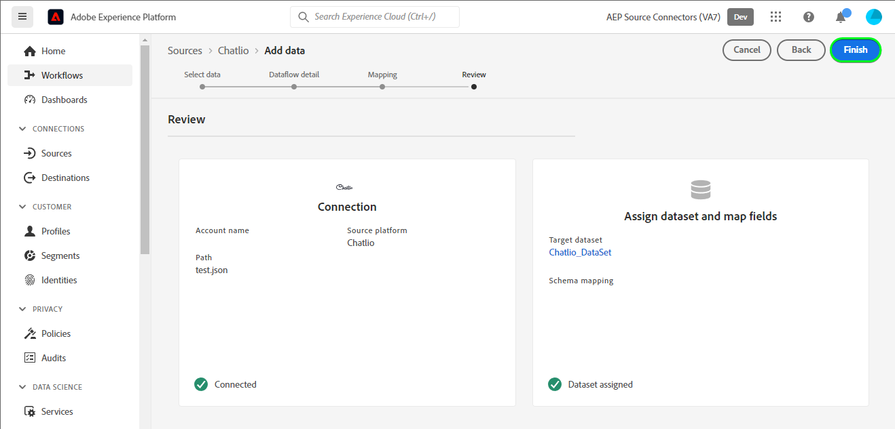

# Crie um [!DNL Chatlio] conexão de origem na interface do usuário

>[!NOTE]
>
>O [!DNL Chatlio] A fonte está em beta. Leia o [visão geral das fontes](../../../../home.md#terms-and-conditions) para obter mais informações sobre o uso de fontes com rótulo beta.

Este tutorial fornece etapas para criar um [!DNL Chatlio] conexão de origem usando a interface do usuário do Adobe Experience Platform.

## Introdução {#getting-started}

Este tutorial requer uma compreensão funcional dos seguintes componentes do Experience Platform:

* [[!DNL Experience Data Model (XDM)] Sistema](../../../../../xdm/home.md): O quadro normalizado pelo qual [!DNL Experience Platform] organiza os dados de experiência do cliente.
   * [Noções básicas da composição do schema](../../../../../xdm/schema/composition.md): Saiba mais sobre os elementos básicos dos esquemas XDM, incluindo princípios-chave e práticas recomendadas na composição do schema.
   * [Tutorial do Editor de esquemas](../../../../../xdm/tutorials/create-schema-ui.md): Saiba como criar esquemas personalizados usando a interface do Editor de esquemas.
* [[!DNL Real-Time Customer Profile]](../../../../../profile/home.md): Fornece um perfil de consumidor unificado e em tempo real com base em dados agregados de várias fontes.

## Pré-requisitos {#prerequisites}

A seção a seguir fornece informações sobre pré-requisitos a serem concluídos antes de criar um [!DNL Chatlio] conexão de origem.

### Amostra do JSON para definir o schema de origem para [!DNL Chatlio] {#prerequisites-json-schema}

Antes de criar um [!DNL Chatlio] conexão de origem, será necessário fornecer um schema de origem. Você pode usar o JSON abaixo.

```
{
  "visitor": {
    "email": "test@example.com",
    "UUID": "2d3f4260-2235-903b-0a82-a23d326cc257"
  },
   "message": "Hi",
  "channelId": "C04J7M7LCMQ",
  "slackChannelName": "aep",
  "slackChannelId": "C04JVR71WKS"
}
```

### Criar um esquema da Platform para [!DNL Chatlio] {#create-platform-schema}

Você também deve garantir que crie um esquema da plataforma para usar na origem. Leia o tutorial em [criação de um schema da plataforma](../../../../../xdm/schema/composition.md) para obter etapas abrangentes sobre como criar um schema.


## Conecte seu [!DNL Chatlio] account {#connect-account}

Na interface do usuário da plataforma, selecione **[!UICONTROL Fontes]** na navegação à esquerda para acessar o [!UICONTROL Fontes] e veja um catálogo de fontes disponível no Experience Platform.

Use o *[!UICONTROL Categorias]* para filtrar fontes por categoria. Como alternativa, insira um nome de origem na barra de pesquisa para localizar uma origem específica no catálogo.

Vá para o [!UICONTROL Automação de marketing] para ver a [!DNL Chatlio] cartão de origem. Para começar, selecione **[!UICONTROL Adicionar dados]**.


## Selecionar dados {#select-data}

O **[!UICONTROL Selecionar dados]** será exibida, fornecendo uma interface para selecionar os dados que deseja trazer para a plataforma.

* A parte esquerda da interface é um navegador que permite visualizar os fluxos de dados disponíveis em sua conta;
* A parte direita da interface permite visualizar até 100 linhas de dados de um arquivo JSON.

Selecionar **[!UICONTROL Upload de arquivos]** para carregar um arquivo JSON do sistema local. Como alternativa, você pode arrastar e soltar o arquivo JSON que deseja fazer upload no [!UICONTROL Arrastar e soltar arquivos] painel.


Depois que o arquivo é carregado, a interface de visualização é atualizada para exibir uma pré-visualização do esquema carregado. A interface de visualização permite inspecionar o conteúdo e a estrutura de um arquivo. Também é possível usar a variável [!UICONTROL Campo de pesquisa] para acessar itens específicos dentro do esquema.

Quando terminar, selecione **[!UICONTROL Próximo]**.


## Detalhes do fluxo de dados {#dataflow-detail}

O **Detalhes do fluxo de dados** é exibida, fornecendo opções para usar um conjunto de dados existente ou estabelecer um novo conjunto de dados para o fluxo de dados, bem como uma oportunidade de fornecer um nome e uma descrição para o fluxo de dados. Durante essa etapa, você também pode definir as configurações para assimilação de perfil, diagnóstico de erro, assimilação parcial e alertas.

Quando terminar, selecione **[!UICONTROL Próximo]**.


## Mapeamento {#mapping}

O [!UICONTROL Mapeamento] é exibida, fornecendo uma interface para mapear os campos de origem do esquema de origem para os campos XDM de destino apropriados no esquema de destino.

A Platform fornece recomendações inteligentes para campos mapeados automaticamente com base no esquema de destino ou conjunto de dados selecionado. Você pode ajustar manualmente as regras de mapeamento de acordo com seus casos de uso. Com base em suas necessidades, você pode optar por mapear campos diretamente ou usar funções de preparação de dados para transformar dados de origem em valores calculados ou calculados. Para obter etapas abrangentes sobre o uso da interface do mapeador e dos campos calculados, consulte o [Guia da interface do usuário de preparação de dados](../../../../../data-prep/ui/mapping.md).

Os mapeamentos listados abaixo são obrigatórios e devem ser configurados antes de prosseguir para o [!UICONTROL Revisão] palco.

| Campo de destino | Descrição |
| --- | --- |
| `UUID` | O [!DNL Chatlio] identificador do evento. |

Depois que os dados de origem forem mapeados com êxito, selecione **[!UICONTROL Próximo]**.


## Consulte a seção {#review}

O **[!UICONTROL Revisão]** é exibida, permitindo que você revise o novo fluxo de dados antes de criá-lo. Os detalhes são agrupados nas seguintes categorias:

* **[!UICONTROL Conexão]**: Mostra o tipo de origem, o caminho relevante do arquivo de origem escolhido e a quantidade de colunas dentro desse arquivo de origem.
* **[!UICONTROL Atribuir conjunto de dados e mapear campos]**: Mostra em qual conjunto de dados os dados de origem estão sendo assimilados, incluindo o esquema ao qual o conjunto de dados adere.

Depois de revisar o fluxo de dados, selecione **[!UICONTROL Concluir]** e permitir que o fluxo de dados seja criado.



## Obter o URL do terminal de transmissão {#get-streaming-endpoint-url}

Com o fluxo de dados criado, agora é possível recuperar o URL do terminal de transmissão. Esse terminal será usado para se inscrever no webhook, permitindo que sua fonte de transmissão se comunique com o Experience Platform.

Para criar o URL usado para configurar o webhook em [!DNL Chatlio] você deve recuperar o seguinte:

* **[!UICONTROL ID do fluxo de dados]**
* **[!UICONTROL Ponto de extremidade de transmissão]**

Para recuperar o **[!UICONTROL ID do fluxo de dados]** e **[!UICONTROL Ponto de extremidade de transmissão]**, acesse o [!UICONTROL Atividade do fluxo de dados] página do fluxo de dados que você acabou de criar e copiar os detalhes da parte inferior da [!UICONTROL Propriedades] painel.


Depois de recuperar o terminal de transmissão e a ID do fluxo de dados, crie um URL com base no seguinte padrão: ```{STREAMING_ENDPOINT}?x-adobe-flow-id={DATAFLOW_ID}```. Por exemplo, um URL de webhook construído pode ter a seguinte aparência: ``https://dcs.adobedc.net/collection/d56b47ee3985104beaf724efcd78a3e1a863d720471a482bebac0acc1ab95983``

## Configurar webhook em [!DNL Chatlio] {#set-up-webhook}

Com o URL do seu webhook criado, você pode configurar seu webhook usando o [!DNL Chatlio] interface do usuário.

Faça logon no [[!DNL Chatlio]](https://chatlio.com/) conta e siga [o guia sobre instalação](https://chatlio.com/docs/setup/) para criar um widget.

Depois que um widget é criado, navegue até a página de configurações do widget para adicionar o URL do webhook ao widget.


Em seguida, selecione o **[!DNL Behavior]** e adicione seu URL do webhook ao *[!DNL Webhook when a new conversation starts]* e quaisquer outros campos de eventos do webhook que você deseja assinar.


>[!TIP]
>
>Você pode assinar uma variedade de eventos diferentes para o seu [!DNL Chatlio] webhook. Para obter mais informações sobre os diferentes eventos, consulte o [[!DNL Chatlio] documentação de eventos](https://chatlio.com/docs/webhooks/).

## Próximas etapas {#next-steps}

Ao seguir este tutorial, você configurou com sucesso um fluxo de dados para trazer seu [!DNL Chatlio] dados para o Experience Platform. Para monitorar os dados que estão sendo assimilados, consulte o guia em [monitoramento de fluxos de dados de transmissão usando a interface do usuário da plataforma](../../monitor-streaming.md).

## Recursos adicionais {#additional-resources}

As seções abaixo fornecem recursos adicionais que você pode consultar ao usar o [!DNL Chatlio] fonte.

### Validação {#validation}

Para validar se você configurou a origem corretamente e [!DNL Chatlio] As mensagens estão sendo assimiladas, siga as etapas abaixo:

* Você pode verificar o [!DNL Chatlio] **[!UICONTROL Relatórios]** > **[!UICONTROL Histórico de bate-papo]** para identificar os eventos capturados por [!DNL Chatlio].


* Na interface do usuário da plataforma, selecione **[!UICONTROL Exibir Fluxos de Dados]** ao lado do [!DNL Chatlio] menu cartão no catálogo de fontes. Em seguida, selecione **[!UICONTROL Visualizar conjunto de dados]** para verificar os dados assimilados para os webhooks que você configurou em [!DNL Chatlio].


Para obter informações adicionais sobre [!DNL Chatlio], visite o [[!DNL Chatlio] documentação](https://chatlio.com/docs/) e [Perguntas frequentes](https://chatlio.com/pricing/#FAQ).