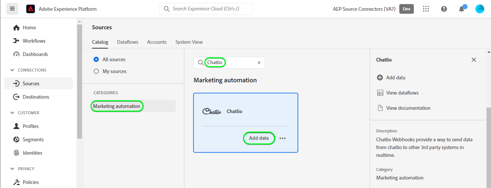

# Criar uma conexão de origem [!DNL Chatlio] na interface

>[!NOTE]
>
>A origem [!DNL Chatlio] está na versão beta. Leia a [visão geral das fontes](../../../../home.md#terms-and-conditions) para obter mais informações sobre o uso de fontes com rótulo beta.

Este tutorial fornece etapas para criar uma conexão de origem [!DNL Chatlio] usando a interface do usuário do Adobe Experience Platform.

## Introdução {#getting-started}

Este tutorial requer uma compreensão funcional dos seguintes componentes do Experience Platform:

* [[!DNL Experience Data Model (XDM)] Sistema](../../../../../xdm/home.md): a estrutura padronizada pela qual o [!DNL Experience Platform] organiza os dados de experiência do cliente.
   * [Noções básicas sobre a composição de esquema](../../../../../xdm/schema/composition.md): saiba mais sobre os blocos de construção básicos de esquemas XDM, incluindo princípios-chave e práticas recomendadas na composição de esquema.
   * [Tutorial do Editor de esquemas](../../../../../xdm/tutorials/create-schema-ui.md): saiba como criar esquemas personalizados usando a interface do Editor de esquemas.
* [[!DNL Real-Time Customer Profile]](../../../../../profile/home.md): Fornece um perfil de consumidor unificado em tempo real com base em dados agregados de várias fontes.

## Pré-requisitos {#prerequisites}

A seção a seguir fornece informações sobre os pré-requisitos a serem concluídos antes da criação de uma conexão de origem do [!DNL Chatlio].

### Amostra de JSON para definir o esquema de origem para [!DNL Chatlio] {#prerequisites-json-schema}

Antes de criar uma conexão de origem [!DNL Chatlio], você precisará de um esquema de origem a ser fornecido. Você pode usar o JSON abaixo.

```
{
  "visitor": {
    "email": "test@example.com",
    "UUID": "2d3f4260-2235-903b-0a82-a23d326cc257"
  },
   "message": "Hi",
  "channelId": "C04J7M7LCMQ",
  "slackChannelName": "aep",
  "slackChannelId": "C04JVR71WKS"
}
```

### Criar um esquema do Experience Platform para [!DNL Chatlio] {#create-platform-schema}

Você também deve garantir a criação de um esquema do Experience Platform para usar na origem. Leia o tutorial sobre [criação de um esquema do Experience Platform](../../../../../xdm/schema/composition.md) para obter etapas abrangentes sobre como criar um esquema.


## Conectar sua conta do [!DNL Chatlio] {#connect-account}

Na interface do usuário do Experience Platform, selecione **[!UICONTROL Fontes]** na navegação à esquerda para acessar o espaço de trabalho [!UICONTROL Fontes] e ver um catálogo de fontes disponíveis no Experience Platform.

Use o menu *[!UICONTROL Categorias]* para filtrar fontes por categoria. Como alternativa, insira um nome de origem na barra de pesquisa para localizar uma origem específica do catálogo.

Vá para a categoria [!UICONTROL Automação de marketing] para ver o cartão de origem [!DNL Chatlio]. Para começar, selecione **[!UICONTROL Adicionar dados]**.



## Selecionar dados {#select-data}

A etapa **[!UICONTROL Selecionar dados]** é exibida, fornecendo uma interface para que você selecione os dados que deseja trazer para a Experience Platform.

* A parte esquerda da interface é um navegador que permite visualizar os fluxos de dados disponíveis em sua conta;
* A parte direita da interface permite visualizar até 100 linhas de dados de um arquivo JSON.

Selecione **[!UICONTROL Carregar arquivos]** para carregar um arquivo JSON do sistema local. Como alternativa, você pode arrastar e soltar o arquivo JSON que deseja carregar no painel [!UICONTROL Arrastar e soltar arquivos].


Depois que o arquivo for carregado, a interface de visualização será atualizada para exibir uma visualização do esquema carregado. A interface de visualização permite inspecionar o conteúdo e a estrutura de um arquivo. Você também pode usar o utilitário [!UICONTROL Campo de pesquisa] para acessar itens específicos de dentro do esquema.

Quando terminar, selecione **[!UICONTROL Próximo]**.


## Detalhes do fluxo de dados {#dataflow-detail}

A etapa **Detalhes do fluxo de dados** é exibida, fornecendo opções para usar um conjunto de dados existente ou estabelecer um novo para o fluxo de dados, bem como uma oportunidade de fornecer um nome e uma descrição para o fluxo de dados. Durante essa etapa, você também pode definir configurações para Assimilação de perfil, diagnóstico de erro, assimilação parcial e alertas.

Quando terminar, selecione **[!UICONTROL Próximo]**.


## Mapeamento {#mapping}

A etapa [!UICONTROL Mapeamento] é exibida, fornecendo uma interface para mapear os campos de origem do esquema de origem para os campos XDM de destino apropriados no esquema de destino.

O Experience Platform fornece recomendações inteligentes para campos mapeados automaticamente com base no esquema ou conjunto de dados de destino selecionado. Você pode ajustar manualmente as regras de mapeamento para atender aos seus casos de uso. Com base nas suas necessidades, você pode optar por mapear campos diretamente ou usar funções de preparação de dados para transformar dados de origem para derivar valores calculados ou calculados. Para obter etapas abrangentes sobre como usar a interface do mapeador e campos calculados, consulte o [Guia da Interface do Preparo de Dados](../../../../../data-prep/ui/mapping.md).

Os mapeamentos listados abaixo são obrigatórios e devem ser configurados antes de prosseguir para o estágio [!UICONTROL Revisão].

| Campo de público alvo | Descrição |
| --- | --- |
| `UUID` | O identificador [!DNL Chatlio] do evento. |

Depois que os dados de origem forem mapeados com êxito, selecione **[!UICONTROL Próximo]**.


## Revisar {#review}

A etapa **[!UICONTROL Revisão]** é exibida, permitindo que você revise seu novo fluxo de dados antes de ele ser criado. Os detalhes são agrupados nas seguintes categorias:

* **[!UICONTROL Conexão]**: mostra o tipo de origem, o caminho relevante do arquivo de origem escolhido e a quantidade de colunas nesse arquivo de origem.
* **[!UICONTROL Atribuir campos de conjunto de dados e mapa]**: mostra em qual conjunto de dados os dados de origem estão sendo assimilados, incluindo o esquema ao qual o conjunto de dados pertence.

Depois de revisar o fluxo de dados, selecione **[!UICONTROL Concluir]** e aguarde algum tempo para que o fluxo de dados seja criado.


## Obter o URL do ponto de extremidade de streaming {#get-streaming-endpoint-url}

Com o fluxo de dados de transmissão criado, agora é possível recuperar o URL do ponto de extremidade de transmissão. Esse endpoint será usado para assinar seu webhook, permitindo que a fonte de streaming se comunique com o Experience Platform.

Para construir a URL usada para configurar o webhook em [!DNL Chatlio], você deve recuperar o seguinte:

* **[!UICONTROL ID do Fluxo de Dados]**
* **[!UICONTROL Ponto de extremidade de streaming]**

Para recuperar sua **[!UICONTROL ID de Fluxo de Dados]** e o **[!UICONTROL Ponto de extremidade de streaming]**, vá para a página [!UICONTROL Atividade de Fluxo de Dados] do fluxo de dados que você acabou de criar e copie os detalhes da parte inferior do painel [!UICONTROL Propriedades].


Depois de recuperar o ponto de extremidade de streaming e a ID de fluxo de dados, crie uma URL com base no seguinte padrão: ```{STREAMING_ENDPOINT}?x-adobe-flow-id={DATAFLOW_ID}```. Por exemplo, uma URL de webhook construída pode ser semelhante a: ``https://dcs.adobedc.net/collection/d56b47ee3985104beaf724efcd78a3e1a863d720471a482bebac0acc1ab95983``

## Configurar webhook em [!DNL Chatlio] {#set-up-webhook}

Com a URL do webhook criada, agora você pode configurar o webhook usando a interface do usuário [!DNL Chatlio].

Faça logon na sua conta do [[!DNL Chatlio]](https://chatlio.com/) e siga [o guia sobre instalação](https://chatlio.com/docs/setup/) para criar um widget.

Depois que um widget é criado, navegue até a página de configurações do widget para adicionar o URL do webhook a esse widget.


Em seguida, selecione a guia **[!DNL Behavior]** e adicione a URL do webhook ao campo *[!DNL Webhook when a new conversation starts]* e a quaisquer outros campos de eventos do webhook nos quais você deseja se inscrever.


>[!TIP]
>
>Você pode assinar uma variedade de eventos diferentes para o seu webhook [!DNL Chatlio]. Para obter mais informações sobre os diferentes eventos, consulte a [[!DNL Chatlio] documentação sobre eventos](https://chatlio.com/docs/webhooks/).

## Próximas etapas {#next-steps}

Ao seguir este tutorial, você configurou com êxito um fluxo de dados de transmissão para trazer seus dados do [!DNL Chatlio] para a Experience Platform. Para monitorar os dados que estão sendo assimilados, consulte o manual sobre [monitoramento de fluxos de dados de transmissão usando a interface do Experience Platform](../../monitor-streaming.md).

## Recursos adicionais {#additional-resources}

As seções abaixo fornecem recursos adicionais que você pode consultar ao usar a origem [!DNL Chatlio].

### Validação {#validation}

Para validar se você configurou corretamente a origem e se [!DNL Chatlio] mensagens estão sendo assimiladas, siga as etapas abaixo:

* Você pode verificar a página [!DNL Chatlio] **[!UICONTROL Relatórios]** > **[!UICONTROL Histórico do Chat]** para identificar os eventos que estão sendo capturados por [!DNL Chatlio].


* Na interface do usuário do Experience Platform, selecione **[!UICONTROL Exibir Fluxos de Dados]** ao lado do menu de cartão [!DNL Chatlio] no catálogo de fontes. Em seguida, selecione **[!UICONTROL Visualizar conjunto de dados]** para verificar os dados assimilados pelos webhooks configurados no [!DNL Chatlio].


Para obter informações adicionais sobre [!DNL Chatlio], visite a [[!DNL Chatlio] documentação](https://chatlio.com/docs/) e as [Perguntas frequentes](https://chatlio.com/pricing/#FAQ).
