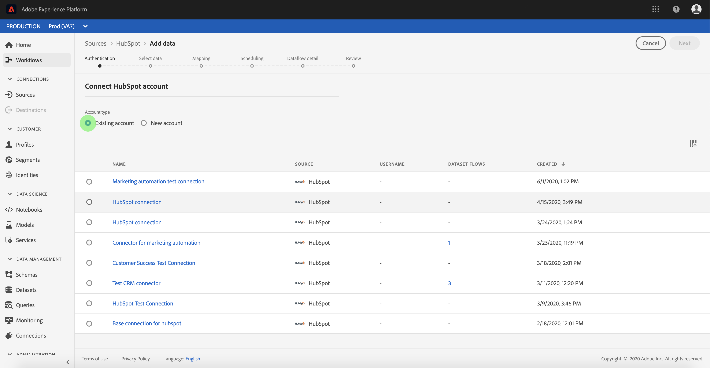

# Criar uma conexão de origem [!DNL HubSpot] na interface do usuário

Os conectores de origem no Adobe Experience Platform oferecem a capacidade de assimilar dados de origem externa de acordo com a programação. Este tutorial fornece etapas para criar um conector de origem [!DNL HubSpot] usando a interface do usuário [!DNL Platform].

## Introdução

Este tutorial requer uma compreensão funcional dos seguintes componentes do Adobe Experience Platform:

* [[!DNL Experience Data Model (XDM)] Sistema](../../../../../xdm/home.md): A estrutura padronizada pela qual  [!DNL Experience Platform] organiza os dados de experiência do cliente.
   * [Noções básicas da composição](../../../../../xdm/schema/composition.md) do schema: Saiba mais sobre os elementos básicos dos esquemas XDM, incluindo princípios-chave e práticas recomendadas na composição do schema.
   * [Tutorial](../../../../../xdm/tutorials/create-schema-ui.md) do Editor de esquema: Saiba como criar esquemas personalizados usando a interface do Editor de esquemas.
* [[!DNL Real-time Customer Profile]](../../../../../profile/home.md): Fornece um perfil de consumidor unificado e em tempo real com base em dados agregados de várias fontes.

Se você já tiver uma conexão [!DNL HubSpot], poderá ignorar o restante deste documento e prosseguir para o tutorial em [configurar um fluxo de dados](../../dataflow/marketing-automation.md).

### Obter credenciais necessárias

Para acessar sua conta [!DNL HubSpot] em [!DNL Platform], você deve fornecer os seguintes valores:

| Credencial | Descrição |
| ---------- | ----------- |
| `clientId` | A ID do cliente associada ao aplicativo [!DNL HubSpot]. |
| `clientSecret` | O segredo do cliente associado ao seu aplicativo [!DNL HubSpot]. |
| `accessToken` | O token de acesso obtido ao autenticar inicialmente sua integração OAuth. |
| `refreshToken` | O token de atualização obtido ao autenticar inicialmente sua integração OAuth. |

Para obter mais informações sobre a introdução, consulte este [[!DNL HubSpot] documento](https://developers.hubspot.com/docs/methods/oauth2/oauth2-overview).

## Conecte sua conta [!DNL HubSpot]

Depois de coletar suas credenciais necessárias, siga as etapas abaixo para vincular sua conta [!DNL HubSpot] a [!DNL Platform].

Faça logon em [Adobe Experience Platform](https://platform.adobe.com) e selecione **[!UICONTROL Fontes]** na barra de navegação esquerda para acessar o espaço de trabalho **[!UICONTROL Fontes]**. A tela **[!UICONTROL Catálogo]** exibe uma variedade de fontes com as quais você pode criar uma conta.

Você pode selecionar a categoria apropriada no catálogo no lado esquerdo da tela. Como alternativa, você pode encontrar a fonte específica com a qual deseja trabalhar usando a opção de pesquisa.

Na categoria **[!UICONTROL Marketing automation]**, selecione **[!UICONTROL HubSpot]**. Se esta for a primeira vez que você usa esse conector, selecione **[!UICONTROL Configurar]**. Caso contrário, selecione **[!UICONTROL Add data]** para criar um novo conector [!DNL HubSpot].

A página **[!UICONTROL Connect to HubSpot]** é exibida. Nesta página, você pode usar novas credenciais ou credenciais existentes.

### Nova conta

Se estiver usando novas credenciais, selecione **[!UICONTROL New account]**. No formulário de entrada exibido, forneça um nome, uma descrição opcional e suas credenciais [!DNL HubSpot]. Quando terminar, selecione **[!UICONTROL Connect]** e deixe algum tempo para que a nova conexão seja estabelecida.

### Conta existente

Para conectar uma conta existente, selecione a conta [!DNL HubSpot] com a qual deseja se conectar e selecione **[!UICONTROL Próximo]** para prosseguir.

## Próximas etapas

Ao seguir este tutorial, você estabeleceu uma conexão com sua conta [!DNL HubSpot]. Agora você pode continuar para o próximo tutorial e [configurar um fluxo de dados para trazer os dados do sistema de automação de marketing para [!DNL Platform]](../../dataflow/marketing-automation.md).
