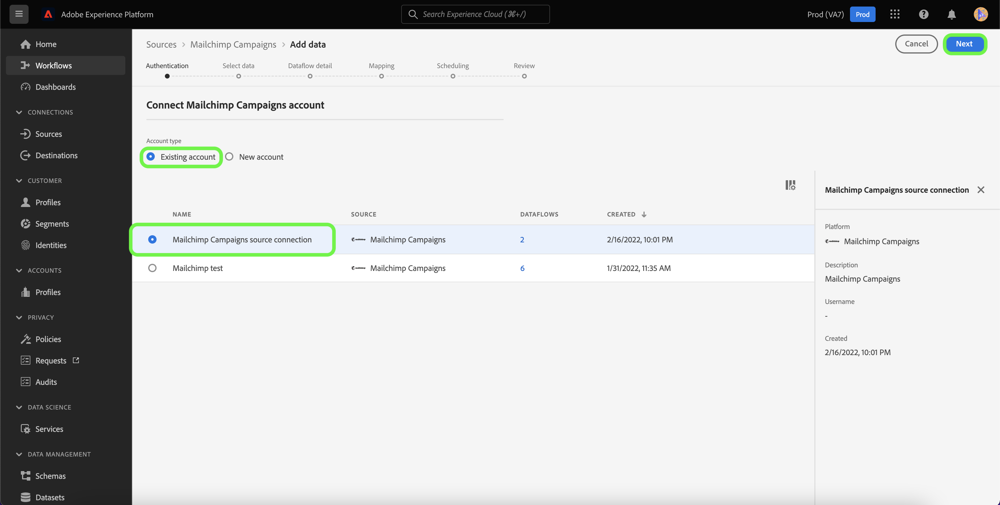

# Criar uma conexão de origem do [!DNL Mailchimp Campaigns] usando a interface do Experience Platform

Este tutorial fornece etapas para a criação de um conector de origem [!DNL Mailchimp] para assimilar dados de [!DNL Mailchimp Campaigns] na Adobe Experience Platform usando a interface do usuário.

## Introdução

Este manual necessita de uma compreensão funcional dos seguintes componentes da Adobe Experience Platform:

* [Fontes](../../../../home.md): o Experience Platform permite a assimilação de dados de várias fontes, ao mesmo tempo em que fornece a capacidade de estruturar, rotular e aprimorar os dados recebidos usando os serviços do [!DNL Experience Platform].
* [Sandboxes](../../../../../sandboxes/home.md): a Experience Platform fornece sandboxes virtuais que particionam uma única instância do Experience Platform em ambientes virtuais separados para ajudar a desenvolver aplicativos de experiência digital.

## Coletar credenciais necessárias

Para trazer seus dados do [!DNL Mailchimp Campaigns] para a Experience Platform, você deve primeiro fornecer as credenciais de autenticação apropriadas que correspondam à sua conta do [!DNL Mailchimp].

A origem [!DNL Mailchimp Campaigns] oferece suporte ao Código de Atualização OAuth 2 e à autenticação básica. Consulte as tabelas abaixo para obter mais informações sobre esses tipos de autenticação.

### Código de atualização do OAuth 2

| Credenciais | Descrição |
| --- | --- |
| Domínio | O URL raiz usado para se conectar à API do MailChimp. O formato da URL raiz é `https://{DC}.api.mailchimp.com`, onde `{DC}` representa o data center que corresponde à sua conta. |
| URL de teste de autorização | A URL de teste de autorização é usada para validar credenciais ao conectar [!DNL Mailchimp] ao Experience Platform. Se isso não for fornecido, as credenciais serão automaticamente verificadas durante a etapa de criação da conexão de origem. |
| Token de acesso | O token de acesso correspondente usado para autenticar sua origem. Isso é necessário para a autenticação baseada em OAuth. |

Para obter mais informações sobre como usar o OAuth 2 para autenticar sua conta do [!DNL Mailchimp] na Experience Platform, consulte este [[!DNL Mailchimp] documento sobre como usar o OAuth 2](https://mailchimp.com/developer/marketing/guides/access-user-data-oauth-2/).

### Autenticação básica

| Credenciais | Descrição |
| --- | --- |
| Domínio | O URL raiz usado para se conectar à API do MailChimp. O formato da URL raiz é `https://{DC}.api.mailchimp.com`, onde `{DC}` representa o data center que corresponde à sua conta. |
| Nome de usuário | O nome de usuário que corresponde à sua conta do MailChimp. Isso é necessário para a autenticação básica. |
| Senha | A senha que corresponde à sua conta do MailChimp. Isso é necessário para a autenticação básica. |

## Conectar sua conta do [!DNL Mailchimp Campaigns] à Experience Platform

Na interface do usuário do Experience Platform, selecione **[!UICONTROL Fontes]** na barra de navegação esquerda para acessar o espaço de trabalho [!UICONTROL Fontes]. A tela [!UICONTROL Catálogo] exibe uma variedade de fontes com as quais você pode criar uma conta.

Você pode selecionar a categoria apropriada no catálogo no lado esquerdo da tela. Como alternativa, você pode encontrar a fonte específica com a qual deseja trabalhar usando a opção de pesquisa.

Na categoria [!UICONTROL Automação de marketing], selecione **[!UICONTROL Campanha do Mailchimp]** e **[!UICONTROL Adicionar dados]**.

A página **[!UICONTROL Conectar a conta de Campanhas do Mailchimp]** é exibida. Nesta página, você pode selecionar se está acessando uma conta existente ou optando por criar uma nova conta.

### Conta existente

Para usar uma conta existente, selecione a conta [!DNL Mailchimp Campaigns] com a qual deseja criar um novo fluxo de dados e clique em **[!UICONTROL Avançar]** para continuar.

### Nova conta

Se você estiver criando uma nova conta, selecione **[!UICONTROL Nova conta]** e forneça um nome e uma descrição para os detalhes da conexão de origem do [!DNL Mailchimp Campaigns].

#### Autenticar usando OAuth 2

Para usar o OAuth 2, selecione [!UICONTROL Código de Atualização do OAuth 2], forneça valores para seu domínio, URL de teste de autorização e token de acesso e selecione **[!UICONTROL Conectar-se à origem]**. Aguarde alguns instantes para que suas credenciais sejam validadas e selecione **[!UICONTROL Avançar]** para continuar.

#### Autenticar usando autenticação básica

Para usar a autenticação básica, selecione [!UICONTROL Autenticação básica], forneça valores para seu domínio, nome de usuário e senha e selecione **[!UICONTROL Conectar à origem]**. Aguarde alguns instantes para que suas credenciais sejam validadas e selecione **[!UICONTROL Avançar]** para continuar.

### Selecionar dados de [!DNL Mailchimp Campaigns]

Depois que a origem for autenticada, você deverá fornecer o `campaignId` que corresponde à sua conta do [!DNL Mailchimp Campaigns].

Na página [!UICONTROL Selecionar dados], digite o `campaignId` e selecione **[!UICONTROL Explorar]**.

A página é atualizada em uma árvore de esquema interativa que permite explorar e inspecionar a hierarquia de seus dados. Selecione **[!UICONTROL Avançar]** para continuar.

## Próximas etapas

Com sua conta do [!DNL Mailchimp] autenticada e seus dados do [!DNL Mailchimp Campaigns] selecionados, você pode começar a criar um fluxo de dados para trazer seus dados para a Experience Platform. Para obter etapas detalhadas sobre como criar um fluxo de dados, consulte a documentação sobre [criação de um fluxo de dados para trazer dados de automação de marketing para o Experience Platform](../../dataflow/marketing-automation.md).
