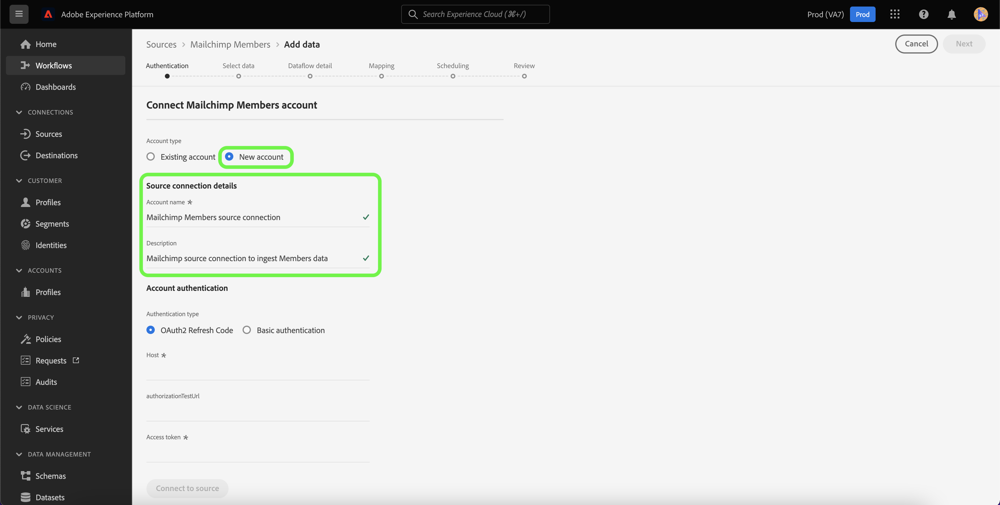
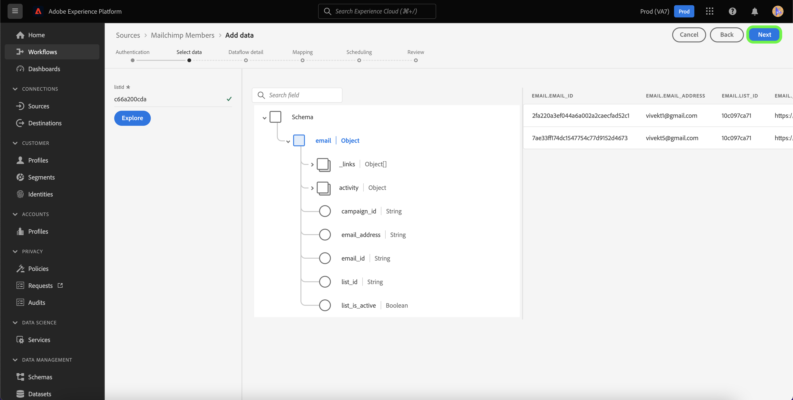

# Criar um [!DNL Mailchimp Members] conexão de origem usando a interface do usuário da Platform

Este tutorial fornece etapas para a criação de um [!DNL Mailchimp] conector de origem para assimilação [!DNL Mailchimp Members] dados para o Adobe Experience Platform usando a interface do usuário.

## Introdução

Este guia requer uma compreensão funcional dos seguintes componentes do Adobe Experience Platform:

* [Origens](../../../../home.md): a Platform permite que os dados sejam assimilados de várias fontes e fornece a capacidade de estruturar, rotular e aprimorar os dados recebidos usando o [!DNL Platform] serviços.
* [Sandboxes](../../../../../sandboxes/home.md): a Platform fornece sandboxes virtuais que particionam uma única instância da Platform em ambientes virtuais separados para ajudar a desenvolver aplicativos de experiência digital.

## Coletar credenciais necessárias

Para trazer o seu [!DNL Mailchimp Members] dados para a Platform, você deve primeiro fornecer as credenciais de autenticação apropriadas que correspondam aos seus [!DNL Mailchimp] conta.

A variável [!DNL Mailchimp Members] A origem oferece suporte ao Código de atualização do OAuth 2 e à autenticação básica. Consulte as tabelas abaixo para obter mais informações sobre esses tipos de autenticação.

### Código de atualização do OAuth 2

| Credenciais | Descrição |
| --- | --- |
| Domain | O URL raiz usado para se conectar à API do MailChimp. O formato do URL raiz é `https://{DC}.api.mailchimp.com`, onde `{DC}` representa o data center que corresponde à sua conta. |
| URL de teste de autorização | O URL de teste de autorização é usado para validar credenciais ao conectar [!DNL Mailchimp] para a Platform. Se isso não for fornecido, as credenciais serão automaticamente verificadas durante a etapa de criação da conexão de origem. |
| Token de acesso | O token de acesso correspondente usado para autenticar sua origem. Isso é necessário para a autenticação baseada em OAuth. |

Para obter mais informações sobre como usar o OAuth 2 para autenticar seu [!DNL Mailchimp] para a Platform, consulte esta [[!DNL Mailchimp] documento sobre o uso do OAuth 2](https://mailchimp.com/developer/marketing/guides/access-user-data-oauth-2/).

### Autenticação básica

| Credenciais | Descrição |
| --- | --- |
| Domain | O URL raiz usado para se conectar à API do MailChimp. O formato do URL raiz é `https://{DC}.api.mailchimp.com`, onde `{DC}` representa o data center que corresponde à sua conta. |
| Nome de usuário | O nome de usuário que corresponde à sua conta do MailChimp. Isso é necessário para a autenticação básica. |
| Senha | A senha que corresponde à sua conta do MailChimp. Isso é necessário para a autenticação básica. |

## Conecte seu [!DNL Mailchimp Members] conta para a plataforma

Na interface do usuário da Platform, selecione **[!UICONTROL Origens]** na barra de navegação esquerda, para acessar a [!UICONTROL Origens] espaço de trabalho. A variável [!UICONTROL Catálogo] exibe uma variedade de fontes com as quais você pode criar uma conta.

Você pode selecionar a categoria apropriada no catálogo no lado esquerdo da tela. Como alternativa, você pode encontrar a fonte específica com a qual deseja trabalhar usando a opção de pesquisa.

No [!UICONTROL Automação de marketing] categoria, selecione **[!UICONTROL Campanha do Mailchimp]** e selecione **[!UICONTROL Adicionar dados]**.

A variável **[!UICONTROL Conectar a conta de Campanhas do Mailchimp]** é exibida. Nesta página, você pode selecionar se está acessando uma conta existente ou optando por criar uma nova conta.

### Conta existente

Para usar uma conta existente, selecione a variável [!DNL Mailchimp Members] conta com a qual deseja criar um novo fluxo de dados e selecione **[!UICONTROL Próxima]** para continuar.

### Nova conta

Se estiver criando uma nova conta, selecione **[!UICONTROL Nova conta]** e forneça um nome e uma descrição para o [!DNL Mailchimp Members] detalhes da conexão de origem.

#### Autenticar usando OAuth 2

Para usar o OAuth 2, selecione [!UICONTROL Código de atualização do OAuth 2], forneça valores para o seu domínio, URL de teste de autorização e token de acesso e selecione **[!UICONTROL Conectar à origem]**. Aguarde alguns momentos para que suas credenciais sejam validadas e selecione **[!UICONTROL Próxima]** para continuar.

#### Autenticar usando autenticação básica

Para usar a autenticação básica, selecione [!UICONTROL Autenticação básica], forneça valores para seu domínio, nome de usuário e senha e selecione **[!UICONTROL Conectar à origem]**. Aguarde alguns momentos para que suas credenciais sejam validadas e selecione **[!UICONTROL Próxima]** para continuar.

### Selecionar [!DNL Mailchimp Members] dados

Depois que a origem for autenticada, você deverá fornecer a `listId` que corresponde ao seu [!DNL Mailchimp Members] conta.

No [!UICONTROL Selecionar dados] insira o seu `listId` e selecione **[!UICONTROL Explorar]**.

A página é atualizada em uma árvore de esquema interativa que permite explorar e inspecionar a hierarquia de seus dados. Selecionar **[!UICONTROL Próxima]** para continuar.

## Próximas etapas

Com o seu [!DNL Mailchimp] conta autenticada e seu [!DNL Mailchimp Members] selecionados, agora é possível começar a criar um fluxo de dados para trazer seus dados para a Platform. Para obter etapas detalhadas sobre como criar um fluxo de dados, consulte a documentação em [criação de um fluxo de dados para trazer dados de automação de marketing para a Platform](../../dataflow/marketing-automation.md).
