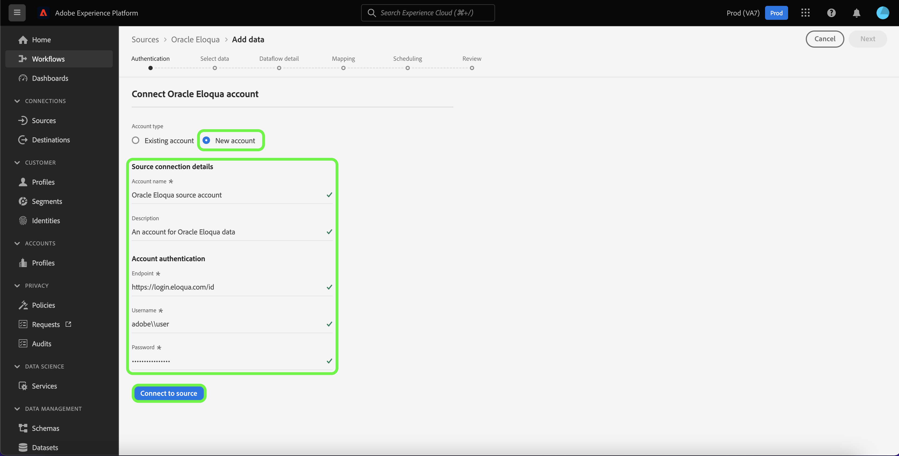

# Crie um [!DNL Oracle Eloqua] conexão de origem usando a interface do usuário da plataforma

Este tutorial fornece etapas para criar um [!DNL Oracle Eloqua] conector de origem usando a interface do usuário do Adobe Experience Platform.

## Introdução

Este guia requer uma compreensão funcional dos seguintes componentes da Platform:

* [Fontes](../../../../home.md): A Platform permite que os dados sejam assimilados de várias fontes, além de fornecer a você a capacidade de estruturar, rotular e aprimorar os dados recebidos usando os serviços da plataforma.
* [Sandboxes](../../../../../sandboxes/home.md): A Platform fornece sandboxes virtuais que particionam uma única instância da Platform em ambientes virtuais separados para ajudar a desenvolver aplicativos de experiência digital.

Se você já tiver um [!DNL Oracle Eloqua] na Platform, você pode ignorar o restante deste documento e prosseguir para o tutorial em [criação de um fluxo de dados para trazer dados de automação de marketing para a Platform](../../dataflow/marketing-automation.md).

### Obter credenciais necessárias

Para se conectar [!DNL Oracle Eloqua] para o Platform, você deve fornecer valores para as seguintes propriedades de autenticação:

| Credencial | Descrição |
| --- | --- |
| Endpoint | O terminal de sua [!DNL Oracle Eloqua]. |
| Nome do usuário | O nome de usuário de seu [!DNL Oracle Eloqua] conta. O nome de usuário deve ser formatado como `siteName + \\ + username`, onde `siteName` é o nome da empresa na qual você usou para fazer logon [!DNL Oracle Eloqua] e `username` é seu nome de usuário. Por exemplo, seu nome de usuário de logon pode ser: `adobe\\emily`. |
| Senha | A senha correspondente ao seu [!DNL Oracle Eloqua] nome de usuário. |

Para obter mais informações sobre credenciais de autenticação para [!DNL Oracle Eloqua], consulte o [[!DNL Oracle Eloqua] guia de autenticação](https://docs.oracle.com/en/cloud/saas/marketing/eloqua-rest-api/Authentication_Basic.html).

Depois de reunir suas credenciais necessárias, siga as etapas abaixo para vincular seus [!DNL Oracle Eloqua] para a Platform.

## Conecte seu [!DNL Oracle Eloqua] account

Na interface do usuário da plataforma, selecione **[!UICONTROL Fontes]** na navegação à esquerda para acessar o [!UICONTROL Fontes] espaço de trabalho. O [!UICONTROL Catálogo] exibe uma variedade de fontes com as quais você pode criar uma conta.

Você pode selecionar a categoria apropriada no catálogo no lado esquerdo da tela. Como alternativa, você pode encontrar a fonte específica com a qual deseja trabalhar usando a opção de pesquisa.

Em [!UICONTROL Automação de marketing] categoria , selecione **[!UICONTROL Oracle Eloqua]** e selecione **[!UICONTROL Adicionar dados]**.

O **[!UICONTROL Conexão da conta Eloqua do Oracle]** será exibida. Nesta página, você pode usar novas credenciais ou credenciais existentes.

### Conta existente

Para usar uma conta existente, selecione a [!DNL Oracle Eloqua] conta com a qual deseja criar um novo fluxo de dados e selecione **[!UICONTROL Próximo]** para continuar.

### Nova conta

Se estiver criando uma nova conta, selecione **[!UICONTROL Nova conta]** e forneça um nome, uma descrição opcional e os valores apropriados para sua [!DNL Oracle Eloqua] credenciais. Quando terminar, selecione **[!UICONTROL Conectar-se à origem]** e, em seguida, permitir que a nova conexão seja estabelecida.

## Próximas etapas

Ao seguir este tutorial, você autenticou e criou uma conexão de origem entre os [!DNL Oracle Eloqua] conta e plataforma. Agora você pode continuar para o próximo tutorial e [criar um fluxo de dados para trazer os dados de automação de marketing para a Platform](../../dataflow/marketing-automation.md).

