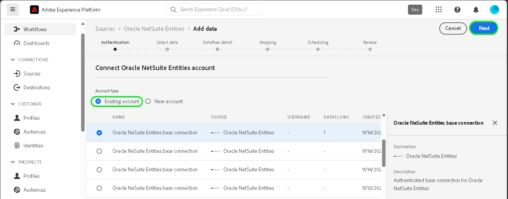

# Criar uma conexão de origem [!DNL Oracle NetSuite Entities] na interface

Leia o tutorial a seguir para saber como trazer dados de contatos e clientes da sua conta do [!DNL Oracle NetSuite Entities] para a Adobe Experience Platform na interface do usuário.

## Introdução {#getting-started}

Este tutorial requer uma compreensão funcional dos seguintes componentes do Experience Platform:

* [[!DNL Experience Data Model (XDM)] Sistema](../../../../../xdm/home.md): a estrutura padronizada pela qual o [!DNL Experience Platform] organiza os dados de experiência do cliente.
   * [Noções básicas sobre a composição de esquema](../../../../../xdm/schema/composition.md): saiba mais sobre os blocos de construção básicos de esquemas XDM, incluindo princípios-chave e práticas recomendadas na composição de esquema.
   * [Tutorial do Editor de esquemas](../../../../../xdm/tutorials/create-schema-ui.md): saiba como criar esquemas personalizados usando a interface do Editor de esquemas.
* [[!DNL Real-Time Customer Profile]](../../../../../profile/home.md): Fornece um perfil de consumidor unificado em tempo real com base em dados agregados de várias fontes.

Se você já tiver uma conta válida do [!DNL Oracle NetSuite], ignore o restante deste documento e prossiga para o tutorial em [configurando um fluxo de dados](../../dataflow/marketing-automation.md).

>[!TIP]
>
>Leia a [[!DNL Oracle NetSuite] visão geral](../../../../connectors/marketing-automation/oracle-netsuite.md) para obter informações sobre como recuperar suas credenciais de autenticação.

## Conectar sua conta do [!DNL Oracle NetSuite Activities] {#connect-account}

Na interface do Experience Platform, selecione **[!UICONTROL Fontes]** na navegação à esquerda para acessar o espaço de trabalho [!UICONTROL Fontes]. Você pode selecionar a categoria apropriada no catálogo no lado esquerdo da tela. Como alternativa, você pode encontrar a fonte específica com a qual deseja trabalhar usando a opção de pesquisa.

Na categoria *Automação de Marketing*, selecione **[!DNL Oracle NetSuite Entities]** e **[!UICONTROL Adicionar dados]**.

A página **[!UICONTROL Conectar a conta de Entidades do Oracle NetSuite]** é exibida. Nesta página, você pode usar credenciais novas ou existentes.

>[!IMPORTANT]
>
>O token de atualização expira após sete dias. Depois que o token expirar, você deverá criar uma conta no Experience Platform com o token atualizado. Se você não criar uma nova conta com o token atualizado, poderá ver a seguinte mensagem de erro: `The request could not be processed. Error from flow provider: The request could not be processed. Rest call failed with client error, status code 401 Unauthorized, please check your activity settings.`

### Conta existente {#existing-account}

Para usar uma conta existente, selecione a conta [!DNL Oracle NetSuite Entities] com a qual deseja criar um novo fluxo de dados e clique em **[!UICONTROL Avançar]** para continuar.

### Nova conta {#new-account}

Se você estiver criando uma nova conta, selecione **[!UICONTROL Nova conta]** e forneça um nome, uma descrição opcional e suas credenciais. Quando terminar, selecione **[!UICONTROL Conectar à origem]** e aguarde algum tempo para que a nova conexão seja estabelecida.

### Selecionar dados

Em seguida, selecione o tipo de objeto que deseja assimilar na Experience Platform.

| Tipo de entidade | Descrição |
| --- | --- |
| Contato | Recupere nomes de contato, emails, números de telefone e quaisquer campos personalizados relacionados a contatos associados aos clientes. |
| Cliente | Recupere dados específicos do cliente, incluindo detalhes como nomes, endereços e identificadores-chave do cliente. |

>[!BEGINTABS]

>[!TAB Contato]

>[!TAB Cliente]

>[!ENDTABS]

## Próximas etapas {#next-steps}

Seguindo este tutorial, você estabeleceu uma conexão com sua conta do [!DNL Oracle NetSuite Entities]. Agora você pode seguir para o próximo tutorial e [configurar um fluxo de dados para trazer dados de automação de marketing para o Experience Platform](../../dataflow/marketing-automation.md).

## Recursos adicionais {#additional-resources}

As seções abaixo fornecem recursos adicionais que você pode consultar ao usar a origem [!DNL Oracle NetSuite Entities].

### Mapeamento {#mapping}

O Experience Platform fornece recomendações inteligentes para campos mapeados automaticamente com base no esquema ou conjunto de dados de destino selecionado. Você pode ajustar manualmente as regras de mapeamento para atender aos seus casos de uso. Com base nas suas necessidades, você pode optar por mapear campos diretamente ou usar funções de preparação de dados para transformar dados de origem para derivar valores calculados ou calculados. Para obter etapas abrangentes sobre como usar a interface do mapeador e campos calculados, consulte o [Guia da Interface do Preparo de Dados](../../../../../data-prep/ui/mapping.md).

>[!NOTE]
>
>Os campos exibidos dependem das assinaturas às quais a conta do [!DNL Oracle NetSuite] tem acesso. Por exemplo, se você não tiver acesso a faturamento, não verá os campos relacionados a faturamento.

### Agendamento {#scheduling}

Ao agendar o fluxo de dados do [!DNL Oracle NetSuite Entities] para assimilação, você deve selecionar a seguinte configuração de frequência e intervalo:

| Frequência | Intervalo |
| --- | --- |
| `Once` | 1 |

Ao recuperar os dados, o [!DNL Oracle NetSuite] responde com a última data modificada ou criada como um formato de data em vez de um carimbo de data e hora. Assim, o cronograma é limitado a um dia.

Depois de fornecer os valores para o seu agendamento, selecione **[!UICONTROL Avançar]**.

