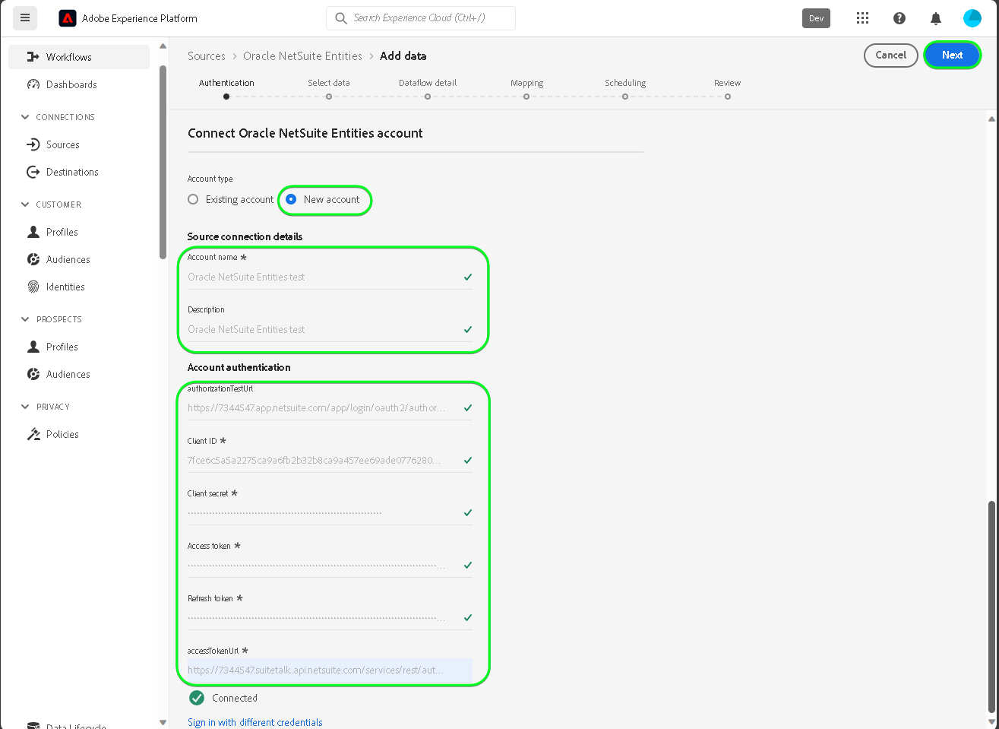

# Criar um [!DNL Oracle NetSuite Entities] conexão de origem na interface

>[!NOTE]
>
>A variável [!DNL Oracle NetSuite Entities] a fonte está na versão beta. Consulte a [visão geral das origens](../../../../home.md#terms-and-conditions) para obter mais informações sobre o uso de fontes rotuladas como beta.

Leia o tutorial a seguir para saber como trazer dados de contatos e clientes de sua [!DNL Oracle NetSuite Entities] para o Adobe Experience Platform na interface do usuário.

## Introdução {#getting-started}

Este tutorial requer um entendimento prático dos seguintes componentes do Experience Platform:

* [[!DNL Experience Data Model (XDM)] Sistema](../../../../../xdm/home.md): o quadro normalizado pelo qual [!DNL Experience Platform] organiza os dados de experiência do cliente.
   * [Noções básicas da composição do esquema](../../../../../xdm/schema/composition.md): saiba mais sobre os componentes básicos dos esquemas XDM, incluindo princípios fundamentais e práticas recomendadas na composição do esquema.
   * [Tutorial do Editor de esquemas](../../../../../xdm/tutorials/create-schema-ui.md): saiba como criar esquemas personalizados usando a interface do Editor de esquemas.
* [[!DNL Real-Time Customer Profile]](../../../../../profile/home.md): fornece um perfil de consumidor unificado em tempo real com base em dados agregados de várias fontes.

Se você já tiver um [!DNL Oracle NetSuite] conta, você pode ignorar o restante deste documento e prosseguir para o tutorial em [configuração de um fluxo de dados](../../dataflow/marketing-automation.md).

>[!TIP]
>
>Leia o [[!DNL Oracle NetSuite] visão geral](../../../../connectors/marketing-automation/oracle-netsuite.md) para obter informações sobre como recuperar suas credenciais de autenticação.

## Conecte seu [!DNL Oracle NetSuite Activities] account {#connect-account}

Na interface do usuário da Platform, selecione **[!UICONTROL Origens]** na navegação à esquerda, para acessar a [!UICONTROL Origens] espaço de trabalho. Você pode selecionar a categoria apropriada no catálogo no lado esquerdo da tela. Como alternativa, você pode encontrar a fonte específica com a qual deseja trabalhar usando a opção de pesquisa.

No *Automação de marketing* categoria, selecione **[!DNL Oracle NetSuite Entities]** e selecione **[!UICONTROL Adicionar dados]**.

A variável **[!UICONTROL Conta Conectar Entidades NetSuite do Oracle]** é exibida. Nesta página, você pode usar credenciais novas ou existentes.

>[!IMPORTANT]
>
>O token de atualização expira após sete dias. Depois que o token expirar, você deverá criar uma conta no Experience Platform com o token atualizado. Se você não criar uma nova conta com o token atualizado, poderá ver a seguinte mensagem de erro: `The request could not be processed. Error from flow provider: The request could not be processed. Rest call failed with client error, status code 401 Unauthorized, please check your activity settings.`

### Conta existente {#existing-account}

Para usar uma conta existente, selecione a variável [!DNL Oracle NetSuite Entities] conta com a qual deseja criar um novo fluxo de dados e selecione **[!UICONTROL Próxima]** para continuar.

### Nova conta {#new-account}

Se estiver criando uma nova conta, selecione **[!UICONTROL Nova conta]** e forneça um nome, uma descrição opcional e suas credenciais. Quando terminar, selecione **[!UICONTROL Conectar à origem]** e aguarde algum tempo para estabelecer a nova conexão.

### Selecionar dados

Em seguida, selecione o tipo de objeto que deseja assimilar no Experience Platform.

| Tipo de entidade | Descrição |
| --- | --- |
| Contato | Recupere nomes de contato, emails, números de telefone e quaisquer campos personalizados relacionados a contatos associados aos clientes. |
| Cliente | Recupere dados específicos do cliente, incluindo detalhes como nomes, endereços e identificadores-chave do cliente. |

>[!BEGINTABS]

>[!TAB Contato]

>[!TAB Cliente]

>[!ENDTABS]

## Próximas etapas {#next-steps}

Ao seguir este tutorial, você estabeleceu uma conexão com o seu [!DNL Oracle NetSuite Entities] conta. Agora você pode seguir para o próximo tutorial e [configurar um fluxo de dados para trazer dados de automação de marketing para a Platform](../../dataflow/marketing-automation.md).

## Recursos adicionais {#additional-resources}

As seções abaixo fornecem recursos adicionais que você pode consultar ao usar o [!DNL Oracle NetSuite Entities] origem.

### Mapeamento {#mapping}

A Platform fornece recomendações inteligentes para campos mapeados automaticamente com base no esquema ou conjunto de dados de destino selecionado. Você pode ajustar manualmente as regras de mapeamento para atender aos seus casos de uso. Com base nas suas necessidades, você pode optar por mapear campos diretamente ou usar funções de preparação de dados para transformar dados de origem para derivar valores calculados ou calculados. Para obter etapas abrangentes sobre o uso da interface do mapeador e campos calculados, consulte o [Guia da interface de preparação de dados](../../../../../data-prep/ui/mapping.md).

>[!NOTE]
>
>Os campos exibidos dependem das assinaturas que o seu [!DNL Oracle NetSuite] conta tem acesso a. Por exemplo, se você não tiver acesso a faturamento, não verá os campos relacionados a faturamento.

### Agendamento {#scheduling}

Ao agendar sua [!DNL Oracle NetSuite Entities] fluxo de dados para assimilação, você deve selecionar a seguinte configuração de frequência e intervalo:

| Frequência | Interval |
| --- | --- |
| `Once` | 1 |

Ao recuperar dados, a variável [!DNL Oracle NetSuite] responde com a última data modificada ou criada como um formato de data em vez de um carimbo de data e hora. Assim, o cronograma é limitado a um dia.

Depois de fornecer os valores para o cronograma, selecione **[!UICONTROL Próxima]**.

