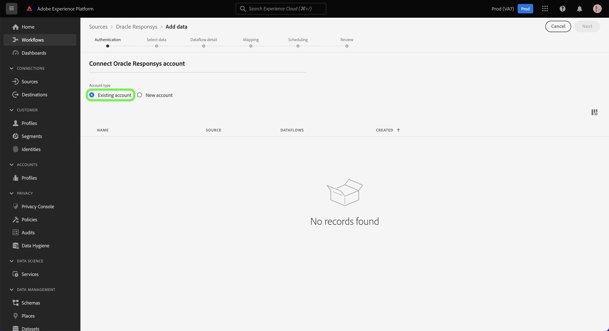

# (Beta) Criar uma conexão de origem [!DNL Oracle Responsys] usando a interface do usuário da plataforma

>[!NOTE]
>
>A origem [!DNL Oracle Responsys] está na versão beta. Consulte a [Visão geral das fontes](../../../../home.md#terms-and-conditions) para obter mais informações sobre o uso de conectores rotulados com beta.

Este tutorial fornece etapas para criar uma conexão de origem [[!DNL Oracle Responsys]](../../../../connectors/marketing-automation/oracle-responsys.md) usando a interface do usuário do Adobe Experience Platform.

## Introdução

Este guia requer uma compreensão funcional dos seguintes componentes da Platform:

* [Fontes](../../../../home.md): a Platform permite que dados sejam assimilados de várias fontes e fornece a capacidade de estruturar, rotular e aprimorar os dados recebidos usando os serviços da Platform.
* [Sandboxes](../../../../../sandboxes/home.md): a Platform fornece sandboxes virtuais que particionam uma única instância da Platform em ambientes virtuais separados para ajudar a desenvolver aplicativos de experiência digital.

Se você já tiver uma conta autenticada do [!DNL Oracle Responsys] na Platform, ignore o restante deste documento e prossiga para o tutorial em [criando um fluxo de dados para trazer dados de automação de marketing para a Platform](../../dataflow/marketing-automation.md).

### Coletar credenciais necessárias

Para conectar [!DNL Oracle Responsys] à Platform, você deve fornecer valores para as seguintes propriedades de autenticação:

| Credencial | Descrição |
| --- | --- |
| Endpoint | A URL do ponto de extremidade de autenticação REST da instância [!DNL Oracle Responsys]. |
| ID de cliente | A ID do cliente da sua instância [!DNL Oracle Responsys]. |
| Segredo do cliente | O segredo do cliente da sua instância [!DNL Oracle Responsys]. |

Para obter mais informações sobre credenciais de autenticação para [!DNL Oracle Responsys], consulte o [[!DNL Oracle Responsys] guia sobre autenticação](https://docs.oracle.com/en/cloud/saas/marketing/responsys-develop/API/GetStarted/authentication.htm).

Depois de obter as credenciais necessárias, você poderá seguir as etapas abaixo para vincular sua conta do [!DNL Oracle Responsys] à Platform.

## Conectar sua conta do [!DNL Oracle Responsys]

Na interface da Platform, selecione **[!UICONTROL Fontes]** na navegação à esquerda para acessar o espaço de trabalho [!UICONTROL Fontes]. A tela [!UICONTROL Catálogo] exibe uma variedade de fontes com as quais você pode criar uma conta.

Você pode selecionar a categoria apropriada no catálogo no lado esquerdo da tela. Como alternativa, você pode encontrar a fonte específica com a qual deseja trabalhar usando a opção de pesquisa.

Na categoria [!UICONTROL Automação de marketing], selecione **[!UICONTROL Responsys do Oracle]** e **[!UICONTROL Adicionar dados]**.

A página **[!UICONTROL Connect Oracle Responsys account]** é exibida. Nesta página, você pode usar credenciais novas ou existentes.

### Conta existente

Para usar uma conta existente, selecione a conta [!DNL Oracle Responsys] com a qual deseja criar um novo fluxo de dados e clique em **[!UICONTROL Avançar]** para continuar.

### Nova conta

Para criar uma nova conta, selecione **[!UICONTROL Nova conta]** e forneça um nome, uma descrição opcional e os valores apropriados para suas credenciais do [!DNL Oracle Responsys]. Quando terminar, selecione **[!UICONTROL Conectar à origem]** e aguarde algum tempo para que a nova conexão seja estabelecida.

## Próximas etapas

Seguindo este tutorial, você autenticou e criou uma conexão de origem entre sua conta do [!DNL Oracle Responsys] e a Platform. Agora você pode continuar com o próximo tutorial e [criar um fluxo de dados para trazer os dados de automação de marketing para a Platform](../../dataflow/marketing-automation.md).
