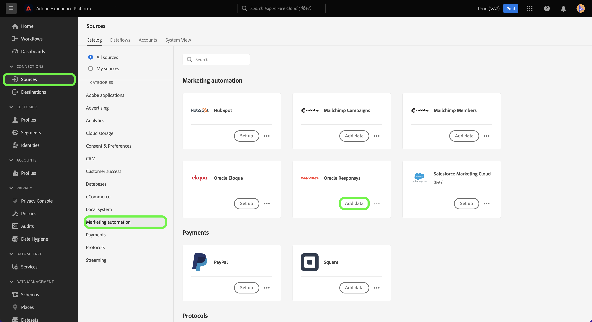

# (Beta) Criar um [!DNL Oracle Responsys] conexão de origem usando a interface do usuário da Platform

>[!NOTE]
>
>A variável [!DNL Oracle Responsys] a fonte está na versão beta. Consulte a [Visão geral das fontes](../../../../home.md#terms-and-conditions) para obter mais informações sobre o uso de conectores rotulados com beta.

Este tutorial fornece as etapas para criar um [[!DNL Oracle Responsys]](../../../../connectors/marketing-automation/oracle-responsys.md) conexão de origem usando a interface do usuário do Adobe Experience Platform.

## Introdução

Este manual necessita de uma compreensão funcional dos seguintes componentes da Platform:

* [Origens](../../../../home.md): a Platform permite que os dados sejam assimilados de várias fontes e, ao mesmo tempo, fornece a capacidade de estruturar, rotular e aprimorar os dados recebidos usando os serviços da Platform.
* [Sandboxes](../../../../../sandboxes/home.md): a Platform fornece sandboxes virtuais que particionam uma única instância da Platform em ambientes virtuais separados para ajudar a desenvolver aplicativos de experiência digital.

Se você já tiver um [!DNL Oracle Responsys] conta na Platform, ignore o restante deste documento e prossiga para o tutorial em [criação de um fluxo de dados para trazer dados de automação de marketing para a Platform](../../dataflow/marketing-automation.md).

### Coletar credenciais necessárias

Para se conectar [!DNL Oracle Responsys] Para o Platform, você deve fornecer valores para as seguintes propriedades de autenticação:

| Credencial | Descrição |
| --- | --- |
| Endpoint | O URL do ponto de extremidade de autenticação REST de seu [!DNL Oracle Responsys] instância. |
| ID do cliente | A ID do cliente do [!DNL Oracle Responsys] instância. |
| Segredo do cliente | O segredo do cliente do seu [!DNL Oracle Responsys] instância. |

Para obter mais informações sobre credenciais de autenticação para [!DNL Oracle Responsys], consulte o [[!DNL Oracle Responsys] guia sobre autenticação](https://docs.oracle.com/en/cloud/saas/marketing/responsys-develop/API/GetStarted/authentication.htm).

Depois de obter as credenciais necessárias, siga as etapas abaixo para vincular [!DNL Oracle Responsys] para a Platform.

## Conecte seu [!DNL Oracle Responsys] account

Na interface do usuário da Platform, selecione **[!UICONTROL Origens]** na navegação à esquerda, para acessar a [!UICONTROL Origens] espaço de trabalho. A variável [!UICONTROL Catálogo] exibe uma variedade de fontes com as quais você pode criar uma conta.

Você pode selecionar a categoria apropriada no catálogo no lado esquerdo da tela. Como alternativa, você pode encontrar a fonte específica com a qual deseja trabalhar usando a opção de pesquisa.

No [!UICONTROL Automação de marketing] categoria, selecione **[!UICONTROL Oracle Responsys]** e selecione **[!UICONTROL Adicionar dados]**.

A variável **[!UICONTROL Conectar conta do Responsys do Oracle]** é exibida. Nesta página, você pode usar credenciais novas ou existentes.

### Conta existente

Para usar uma conta existente, selecione a variável [!DNL Oracle Responsys] conta com a qual deseja criar um novo fluxo de dados e selecione **[!UICONTROL Próxima]** para continuar.

### Nova conta

Para criar uma nova conta, selecione **[!UICONTROL Nova conta]** e forneça um nome, uma descrição opcional e os valores apropriados para o [!DNL Oracle Responsys] credenciais. Quando terminar, selecione **[!UICONTROL Conectar à origem]** e aguarde algum tempo para estabelecer a nova conexão.

## Próximas etapas

Ao seguir este tutorial, você autenticou e criou uma conexão de origem entre [!DNL Oracle Responsys] conta e plataforma. Agora você pode seguir para o próximo tutorial e [criar um fluxo de dados para trazer dados de automação de marketing para a Platform](../../dataflow/marketing-automation.md).
