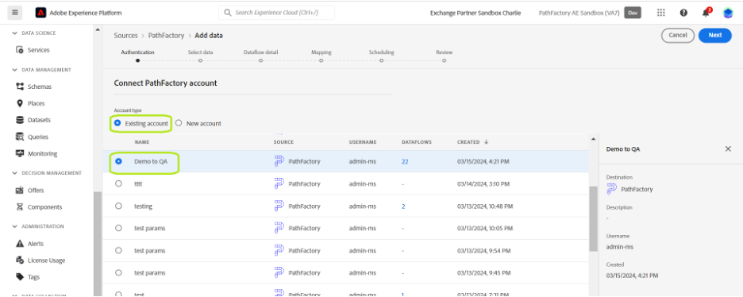

# Conectar sua conta do [!DNL PathFactory] à Experience Platform por meio da interface

Este tutorial fornece etapas sobre como conectar os dados de Visitantes, Sessões e Exibições de Página do [!DNL PathFactory] à Adobe Experience Platform por meio da interface do usuário.

## Introdução

Este tutorial requer uma compreensão funcional dos seguintes componentes do Experience Platform:

* [[!DNL Experience Data Model (XDM)] Sistema](../../../../../xdm/home.md): a estrutura padronizada pela qual o [!DNL Experience Platform] organiza os dados de experiência do cliente.
   * [Noções básicas sobre a composição de esquema](../../../../../xdm/schema/composition.md): saiba mais sobre os blocos de construção básicos de esquemas XDM, incluindo princípios-chave e práticas recomendadas na composição de esquema.
   * [Tutorial do Editor de esquemas](../../../../../xdm/tutorials/create-schema-ui.md): saiba como criar esquemas personalizados usando a interface do Editor de esquemas.
* [[!DNL Real-Time Customer Profile]](../../../../../profile/home.md): Fornece um perfil de consumidor unificado em tempo real com base em dados agregados de várias fontes.

Se você já tiver uma conta [!DNL PathFactory], ignore o restante deste documento e prossiga para o tutorial em [trazendo dados de automação de marketing para a Experience Platform usando a interface](../../dataflow/marketing-automation.md).

### Colete as credenciais necessárias {#gather-credentials}

Para acessar a conta PathFactory na Experience Platform, você deve fornecer os seguintes valores:

| Credencial | Descrição |
| ---------- | ----------- |
| Nome de usuário | Seu nome de usuário da conta PathFactory. Isso é essencial para identificar sua conta no sistema. |
| Senha | A senha associada à sua conta PathFactory. Verifique se isso está protegido para impedir o acesso não autorizado. |
| Domínio | O domínio associado à sua conta PathFactory. Normalmente, refere-se ao identificador exclusivo no URL do PathFactory. |
| Token de acesso | Um token exclusivo usado para autenticação de API para garantir a comunicação segura entre seus sistemas e o PathFactory. |
| Endpoints de API | Endpoints de API específicos para acessar dados: Visitantes, Sessões e Exibições de página. Cada endpoint corresponde a diferentes conjuntos de dados que você pode recuperar. **Observação:** são predefinidos por [!DNL PathFactory] e são específicos para os dados que você pretende acessar: <ul><li>**Ponto de Extremidade dos Visitantes**: `/api/public/v3/data_lake_apis/visitors.json`</li><li>**Ponto de Extremidade de Sessões**: `/api/public/v3/data_lake_apis/sessions.json`</li><li>**Ponto de Extremidade de Exibições de Página**: `/api/public/v3/data_lake_apis/page_views.json`</li></ul> |

Para obter orientação detalhada sobre como proteger e usar suas credenciais, e para obter informações sobre como obter e atualizar seu token de acesso, visite o [Centro de Suporte PathFactory](https://support.pathfactory.com/categories/adobe/). Esse recurso oferece guias abrangentes sobre como gerenciar suas credenciais e garantir uma integração de API eficaz e segura.

## Conectar sua conta do [!DNL PathFactory]

Na interface do Experience Platform, selecione **[!UICONTROL Fontes]** na navegação à esquerda para acessar o espaço de trabalho [!UICONTROL Fontes]. O [!UICONTROL Catálogo] exibe uma variedade de fontes suportadas pela Experience Platform.

Você pode selecionar a categoria apropriada na lista de categorias. Você também pode usar a barra de pesquisa para filtrar por uma fonte específica.

Na categoria [!UICONTROL Automação de marketing], selecione **[!UICONTROL PathFactory]** e selecione **[!UICONTROL Configurar]**.

A página **[!UICONTROL Conectar-se ao PathFactory]** é exibida. Nesta página, você pode criar uma nova conta ou usar uma conta existente.

### Nova conta

Para criar uma nova conta, selecione **[!UICONTROL Nova conta]** e forneça um nome para a sua conta, uma descrição opcional e as credenciais de autenticação que correspondem à sua conta do [!DNL PathFactory].

Quando terminar, selecione **[!UICONTROL Conectar à origem]** e aguarde algum tempo para que a nova conexão seja estabelecida.

### Conta existente

Se você já tiver uma conta existente, selecione **[!UICONTROL Conta existente]** e, em seguida, selecione a conta que deseja usar na lista exibida.

## Próximas etapas

Seguindo este tutorial, você estabeleceu uma conexão entre sua conta do [!DNL PathFactory] e a Experience Platform. Agora você pode seguir para o próximo tutorial e [criar um fluxo de dados para trazer seus dados de automação de marketing para o Experience Platform](../../dataflow/marketing-automation.md).
