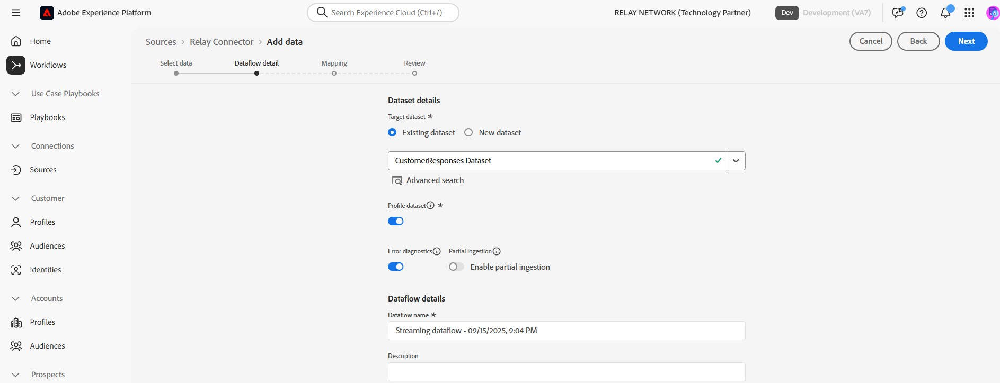

# Connect Relay to Experience Platform na interface do usuário

>[!NOTE]
>
>A origem [!DNL Relay Connector] está na versão beta. Leia a [visão geral das fontes](../../../../home.md#terms-and-conditions) para obter mais informações sobre o uso de fontes com rótulo beta.

Com o [!DNL Relay Connector], você pode oferecer experiências personalizadas aos seus clientes nos momentos mais significativos da jornada, ajudando-os a construir relações mais fortes e a gerar maior fidelidade e valor criando uma conexão de entrada para transmitir Eventos da sua integração do [!DNL Relay Network] para a Adobe Experience Platform.

Leia este guia para saber como usar o [!DNL Relay Connector] no espaço de trabalho de origens da interface do usuário do Experience Platform.

>[!IMPORTANT]
>
>Esta página de documentação é mantida pela equipe *[!DNL Relay Network]*. Para qualquer consulta ou solicitação de atualização, contate-os diretamente em *[[!DNL Relay Network]](https://www.relaynetwork.com/) ou envie um email para [info@relaynetwork.com](mailto:info@relaynetwork.com)*.

## Conecte sua origem do [!DNL Relay Connector]

Na interface do usuário do Experience Platform, selecione **[!UICONTROL Fontes]** na barra de navegação esquerda para acessar o espaço de trabalho [!UICONTROL Fontes]. A tela [!UICONTROL Catálogo] exibe uma variedade de fontes com as quais você pode criar uma conta. Você pode selecionar a categoria apropriada no catálogo no lado esquerdo da tela ou usar a opção de pesquisa para encontrar uma fonte específica.

Na categoria *[!UICONTROL Automação de marketing]*, selecione o cartão de origem [!DNL Relay Connector] e selecione **[!UICONTROL Adicionar dados]**.

>[!TIP]
>
>As fontes no catálogo de fontes exibem a opção **[!UICONTROL Configurar]** quando não existe nenhuma conta autenticada. Após a autenticação da conta, esta opção muda para **[!UICONTROL Adicionar dados]**.

### Selecionar dados

A interface de origem **[!UICONTROL Connect Relay Connector]** é exibida. Use a interface *[!UICONTROL Selecionar dados]* para procurar ou especificar o esquema de dados de origem. Como alternativa, você pode fazer upload de um arquivo JSON de amostra para definir o esquema de origem.

>[!NOTE]
>
>O tamanho de arquivo aceitável é de até 1 GB.

Depois que os dados forem carregados, você poderá usar a seção [!UICONTROL Visualizar dados de amostra] para visualizar os dados.

### Detalhes do fluxo de dados

Em seguida, use a interface *[!UICONTROL Detalhes do fluxo de dados]* para fornecer um **nome** e uma **descrição opcional** para o fluxo de dados. Além disso, selecione o **[!UICONTROL Conjunto de dados de destino]** que você deseja usar. Você pode criar um novo conjunto de dados ou usar um conjunto de dados existente.

### Mapeamento

Você pode mapear os campos de origem para campos de esquema XDM usando a funcionalidade de mapeamento automático, que corresponde a campos com base em seus nomes, ou criar mapeamentos personalizados para obter controle mais preciso. Se necessário, você também pode aplicar transformações como concatenação, formatação ou renomeação para garantir que seus dados se encaixem perfeitamente no esquema de destino. Para obter mais informações sobre mapeamento, leia o [Guia da Interface do Usuário do Preparo de Dados](../../../../../data-prep/ui/mapping.md).

>[!TIP]
>
>Para obter detalhes sobre os tipos de eventos e valores de dados que o Relay enviará para sua origem, leia a documentação dos [[!DNL Relay Network] Eventos de push](https://docs.relaynetwork.com/docs/push-events). Estas informações ajudarão você a criar adequadamente o seu **Esquema de Eventos de Experiência**.

### Revisar

Por fim, examine todas as configurações, incluindo sua **fonte, conjunto de dados e mapeamentos**. Quando terminar, selecione **Concluir** para criar o fluxo de dados.

### Recupere o URL do ponto de extremidade de streaming

Depois de criar o fluxo de dados, você encontrará a *URL do ponto de extremidade de streaming* e outros detalhes relacionados na seção **Propriedades** no lado direito da página de fluxo de dados.

Use esses valores para configurar o webhook no **Console de Retransmissão**. Para obter instruções detalhadas sobre como configurar o push, consulte a documentação de Retransmissão: [Configurando a API de Push](https://docs.relaynetwork.com/docs/configuring-the-push-api).

## Recursos adicionais

* [Criar uma nova especificação de conexão usando a API de Serviço de Fluxo](https://experienceleague.adobe.com/en/docs/experience-platform/sources/sdk/streaming-sdk/create)
* [Conectar à sua origem usando a interface](https://experienceleague.adobe.com/en/docs/experience-platform/sources/sdk/streaming-sdk/submit#test-your-source-using-the-ui)
