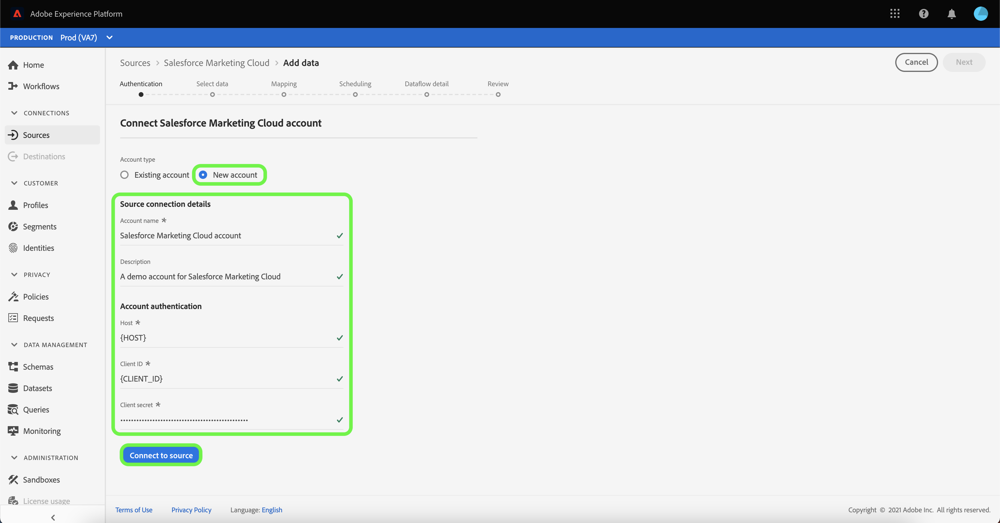

# Criar uma conexão de origem [!DNL Salesforce Marketing Cloud] na interface do usuário

>[!NOTE]
>
> A origem [!DNL Salesforce Marketing Cloud] está em beta. Consulte a [visão geral das fontes](../../../../home.md#terms-and-conditions) para obter mais informações sobre o uso de fontes com rótulo beta.

Os conectores de origem no Adobe Experience Platform oferecem a capacidade de assimilar dados de origem externa de acordo com a programação. Este tutorial fornece etapas para criar um conector de origem [!DNL Salesforce Marketing Cloud] usando a interface do usuário da plataforma.

## Introdução

Este tutorial requer uma compreensão funcional dos seguintes componentes do Adobe Experience Platform:

* [[!DNL Experience Data Model (XDM)] Sistema](../../../../../xdm/home.md): A estrutura padronizada pela qual  [!DNL Experience Platform] organiza os dados de experiência do cliente.
   * [Noções básicas da composição](../../../../../xdm/schema/composition.md) do schema: Saiba mais sobre os elementos básicos dos esquemas XDM, incluindo princípios-chave e práticas recomendadas na composição do schema.
   * [Tutorial](../../../../../xdm/tutorials/create-schema-ui.md) do Editor de esquema: Saiba como criar esquemas personalizados usando a interface do Editor de esquemas.
* [[!DNL Real-time Customer Profile]](../../../../../profile/home.md): Fornece um perfil de consumidor unificado e em tempo real com base em dados agregados de várias fontes.

Se você já tiver uma conexão [!DNL Salesforce Marketing Cloud], poderá ignorar o restante deste documento e prosseguir para o tutorial em [configurar um fluxo de dados](../../dataflow/marketing-automation.md).

### Obter credenciais necessárias

Para acessar sua conta [!DNL Salesforce Marketing Cloud] no Platform, você deve fornecer os seguintes valores:

| Credencial | Descrição |
| ---------- | ----------- |
| `host` | O servidor host do seu aplicativo. Esse é frequentemente o seu subdomínio. |
| `clientId` | A ID do cliente associada ao aplicativo [!DNL Salesforce Marketing Cloud]. |
| `clientSecret` | O segredo do cliente associado ao seu aplicativo [!DNL Salesforce Marketing Cloud]. |

Para obter mais informações sobre a introdução, consulte este [[!DNL Salesforce Marketing Cloud] documento](https://developer.salesforce.com/docs/atlas.en-us.mc-apis.meta/mc-apis/authentication.htm).

## Conecte sua conta [!DNL Salesforce Marketing Cloud]

Depois de reunir suas credenciais necessárias, siga as etapas abaixo para vincular sua conta [!DNL Salesforce Marketing Cloud] à Platform.

Na interface do usuário da plataforma, selecione **[!UICONTROL Fontes]** no painel de navegação esquerdo para acessar o espaço de trabalho [!UICONTROL Fontes]. A tela [!UICONTROL Catálogo] exibe uma variedade de fontes com as quais você pode criar uma conta.

Você pode selecionar a categoria apropriada no catálogo no lado esquerdo da tela. Você também pode usar a barra de pesquisa para restringir os conectores exibidos.

Na categoria [!UICONTROL Marketing automation], selecione **[!UICONTROL Salesforce Marketing Cloud]** e selecione **[!UICONTROL Configurar]**.

A página **[!UICONTROL Conectar-se ao Marketing Cloud do Salesforce]** é exibida. Nesta página, você pode usar novas credenciais ou credenciais existentes.

### Nova conta

Se estiver usando novas credenciais, selecione **[!UICONTROL New account]**. No formulário de entrada exibido, forneça um nome, uma descrição opcional e suas credenciais [!DNL Salesforce Marketing Cloud]. Quando terminar, selecione **[!UICONTROL Connect]** e deixe algum tempo para que a nova conexão seja estabelecida.

### Conta existente

Para conectar uma conta existente, selecione a conta [!DNL Salesforce Marketing Cloud] com a qual deseja se conectar e selecione **[!UICONTROL Próximo]** para prosseguir.

## Próximas etapas

Ao seguir este tutorial, você estabeleceu uma conexão com sua conta [!DNL Salesforce Marketing Cloud]. Agora você pode continuar para o próximo tutorial e [configurar um fluxo de dados para trazer dados do sistema de automação de marketing para a Platform](../../dataflow/marketing-automation.md).
