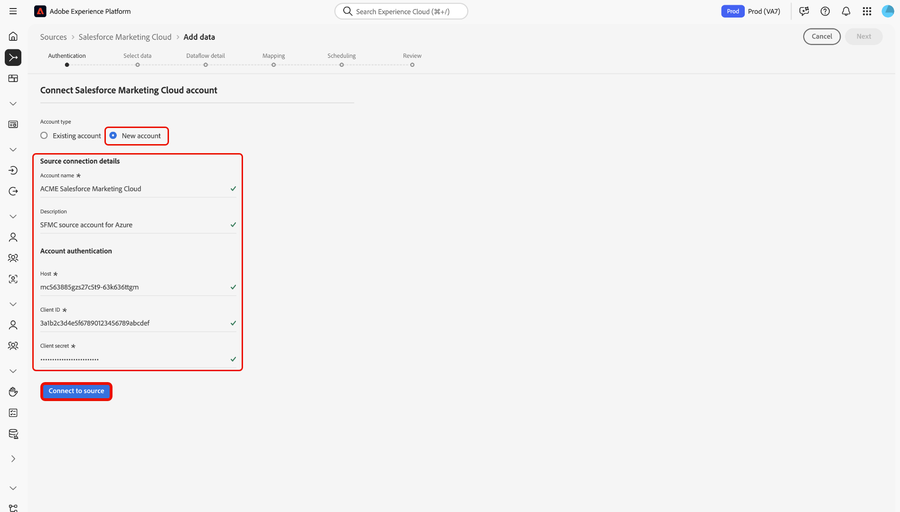

# Conectar sua conta do [!DNL Salesforce Marketing Cloud] à Experience Platform por meio da interface

>[!WARNING]
>
>A origem [!DNL Salesforce Marketing Cloud] será substituída em janeiro de 2026. Uma nova fonte será lançada ainda este ano como alternativa. Depois que a nova origem for lançada, você deverá planejar migrar para a nova origem criando novas conexões de conta e fluxos de dados antes do final de janeiro de 2026.

Leia este guia para saber como conectar sua conta do [!DNL Salesforce Marketing Cloud] à Adobe Experience Platform usando o espaço de trabalho de fontes na interface do usuário do Experience Platform.

## Introdução

Este tutorial requer uma compreensão funcional dos seguintes componentes do Experience Platform:

* [[!DNL Experience Data Model (XDM)] Sistema](../../../../../xdm/home.md): a estrutura padronizada pela qual o [!DNL Experience Platform] organiza os dados de experiência do cliente.
   * [Noções básicas sobre a composição de esquema](../../../../../xdm/schema/composition.md): saiba mais sobre os blocos de construção básicos de esquemas XDM, incluindo princípios-chave e práticas recomendadas na composição de esquema.
   * [Tutorial do Editor de esquemas](../../../../../xdm/tutorials/create-schema-ui.md): saiba como criar esquemas personalizados usando a interface do Editor de esquemas.
* [[!DNL Real-Time Customer Profile]](../../../../../profile/home.md): Fornece um perfil de consumidor unificado em tempo real com base em dados agregados de várias fontes.

Se você já tiver uma conta [!DNL Salesforce Marketing Cloud], ignore o restante deste documento e prossiga para o tutorial em [trazendo dados de automação de marketing para a Experience Platform usando a interface](../../dataflow/marketing-automation.md).

### Coletar credenciais necessárias

Leia a [[!DNL Salesforce Marketing Cloud] visão geral](../../../../connectors/marketing-automation/salesforce-marketing-cloud.md#prerequisites) para obter informações sobre autenticação.

## Navegar pelo catálogo de origens

>[!IMPORTANT]
>
>No momento, a assimilação de objetos personalizados não tem suporte da integração de origem [!DNL Salesforce Marketing Cloud].

Na interface do Experience Platform, selecione **[!UICONTROL Fontes]** na navegação à esquerda para acessar o espaço de trabalho *[!UICONTROL Fontes]*. Escolha uma categoria ou use a barra de pesquisa para localizar sua fonte.

Para se conectar a [!DNL Salesforce Marketing Cloud], vá para a categoria *[!UICONTROL Automação de Marketing]*, selecione o cartão de origem **[!UICONTROL Salesforce Marketing Cloud]** e selecione **[!UICONTROL Configurar]**.

>[!TIP]
>
>As origens no catálogo de origens exibem a opção **[!UICONTROL Configurar]** quando uma determinada origem ainda não tem uma conta autenticada. Após a criação de uma conta autenticada, esta opção será alterada para **[!UICONTROL Adicionar dados]**.

## Usar uma conta existente {#existing}

Para usar uma conta existente, selecione **[!UICONTROL Conta existente]** e depois selecione a conta [!DNL Salesforce Marketing Cloud] que deseja usar.

## Criar uma nova conta {#new}

Você pode usar a origem [!DNL Salesforce Marketing Cloud] para se conectar ao Experience Platform em [!DNL Azure] ou [!DNL Amazon Web Services] (AWS).

### Conectar-se ao Experience Platform em [!DNL Azure] {#azure}

Para se conectar ao Experience Platform em [!DNL Azure], forneça um nome de conta, uma descrição opcional e suas [credenciais de autenticação de conta](../../../../connectors/marketing-automation/salesforce-marketing-cloud.md#azure). Quando terminar, selecione **[!UICONTROL Conectar à origem]** e aguarde alguns momentos para estabelecer a conexão.

### Conectar-se ao Experience Platform no Amazon Web Services (AWS) {#aws}

>[!AVAILABILITY]
>
>Esta seção se aplica às implementações do Experience Platform em execução no Amazon Web Services (AWS). O Experience Platform em execução no AWS está disponível atualmente para um número limitado de clientes. Para saber mais sobre a infraestrutura do Experience Platform compatível, consulte a [visão geral da nuvem múltipla do Experience Platform](../../../../../landing/multi-cloud.md).

Para se conectar ao Experience Platform em [!DNL AWS], verifique se você está em uma sandbox VA6 e forneça um nome de conta, uma descrição opcional e suas [credenciais de autenticação de conta](../../../../connectors/marketing-automation/salesforce-marketing-cloud.md#aws). Quando terminar, selecione **[!UICONTROL Conectar à origem]** e aguarde alguns momentos para estabelecer a conexão.

## Criar um fluxo de dados para dados de [!DNL Salesforce Marketing Cloud]

Agora que você conectou o [!DNL Salesforce Marketing Cloud] com êxito, é possível [criar um fluxo de dados e assimilar dados do seu provedor de automação de marketing no Experience Platform](../../dataflow/marketing-automation.md).
