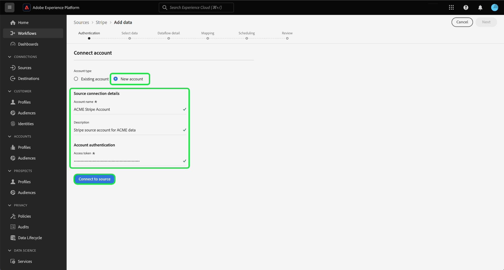

# Assimilar dados de pagamentos de seu [!DNL Stripe] conta para Experience Platform usando a interface do usuário

>[!NOTE]
>
>A variável [!DNL Stripe] a fonte está na versão beta. Leia o [termos e condições](../../../../home.md#terms-and-conditions) na visão geral de fontes para obter mais informações sobre o uso de fontes com rótulo beta.

Leia o tutorial a seguir para saber como assimilar dados de pagamentos de seu [!DNL Stripe] para a Adobe Experience Platform usando a interface do usuário.

## Introdução

Este tutorial requer um entendimento prático dos seguintes componentes do Experience Platform:

* [[!DNL Experience Data Model (XDM)] Sistema](../../../../../xdm/home.md): o quadro normalizado pelo qual [!DNL Experience Platform] organiza os dados de experiência do cliente.
   * [Noções básicas da composição do esquema](../../../../../xdm/schema/composition.md): saiba mais sobre os componentes básicos dos esquemas XDM, incluindo princípios fundamentais e práticas recomendadas na composição do esquema.
   * [Tutorial do Editor de esquemas](../../../../../xdm/tutorials/create-schema-ui.md): saiba como criar esquemas personalizados usando a interface do Editor de esquemas.
* [[!DNL Real-Time Customer Profile]](../../../../../profile/home.md): fornece um perfil de consumidor unificado em tempo real com base em dados agregados de várias fontes.

### Autenticação

Leia o [[!DNL Stripe] visão geral](../../../../connectors/payments/stripe.md) para obter informações sobre como recuperar suas credenciais de autenticação.

## Conecte seu [!DNL Stripe] account {#connect}

Na interface do usuário da Platform, selecione **[!UICONTROL Origens]** na navegação à esquerda, para acessar a [!UICONTROL Origens] espaço de trabalho. Você pode selecionar a categoria apropriada no catálogo no lado esquerdo da tela. Como alternativa, você pode encontrar a fonte específica com a qual deseja trabalhar usando a opção de pesquisa.

No *Pagamentos* categoria, selecione **[!DNL Stripe]** e selecione **[!UICONTROL Configurar]**.

>[!TIP]
>
>As origens no catálogo de origens exibem a variável **[!UICONTROL Configurar]** opção quando uma determinada fonte ainda não tiver uma conta autenticada. Quando uma conta autenticada existir, essa opção será alterada para **[!UICONTROL Adicionar dados]**.

A variável **[!UICONTROL Conectar conta Stripe]** é exibida. Nesta página, você pode usar credenciais novas ou existentes.

>[!BEGINTABS]

>[!TAB Criar uma nova conta]

Para criar uma nova conta, selecione **[!UICONTROL Nova conta]** e forneça um nome, uma descrição opcional e suas credenciais.

Quando terminar, selecione **[!UICONTROL Conectar à origem]** e aguarde algum tempo para estabelecer a nova conexão.

| Credencial | Descrição |
| --- | --- |
| Token de acesso | Seu [!DNL Stripe] token de acesso. Para obter informações sobre como recuperar o token de acesso, leia a [[!DNL Stripe] guia de autenticação](../../../../connectors/payments/stripe.md). |

>[!TAB Usar uma conta existente]

Para usar uma conta existente, selecione **[!UICONTROL Conta existente]** e selecione a conta que deseja usar no catálogo de contas existente.

Selecione **[!UICONTROL Próximo]** para continuar.

>[!ENDTABS]

## Selecionar dados {#select-data}

Agora que você tem acesso à sua conta, é necessário identificar o caminho apropriado para a [!DNL Stripe] dados que você deseja assimilar. Selecionar **[!UICONTROL Caminho do recurso]** e selecione o endpoint do qual deseja assimilar dados. As opções disponíveis [!DNL Stripe] Os endpoints do são:

* Encargos
* Assinaturas
* Reembolsos
* Transações de Saldo
* Clientes
* Preços

Depois que o endpoint é selecionado, a interface é atualizada em uma tela de pré-visualização, exibindo a estrutura de dados do [!DNL Stripe] ponto de extremidade selecionado. Selecione **[!UICONTROL Próximo]** para continuar.

## Fornecer detalhes do conjunto de dados e do fluxo de dados {#provide-dataset-and-dataflow-details}

Em seguida, você deve fornecer informações sobre seu conjunto de dados e seu fluxo de dados.

### Detalhes do conjunto de dados {#dataset-details}

Um conjunto de dados é uma construção de armazenamento e gerenciamento para uma coleção de dados, normalmente uma tabela, que contém um esquema (colunas) e campos (linhas). Os dados assimilados com sucesso no Experience Platform são armazenados no data lake como conjuntos de dados. Durante essa etapa, você pode criar um novo conjunto de dados ou usar um conjunto de dados existente.

>[!BEGINTABS]

>[!TAB Usar um novo conjunto de dados]

Para usar um novo conjunto de dados, selecione **[!UICONTROL Novo conjunto de dados]** e forneça um nome e uma descrição opcional para seu conjunto de dados. Você também deve selecionar um esquema do Experience Data Model (XDM) ao qual seu conjunto de dados adere.

| Detalhes do novo conjunto de dados | Descrição |
| --- | --- |
| Nome do conjunto de dados de saída | O nome do novo conjunto de dados. |
| Descrição | (Opcional) Uma breve explicação do novo conjunto de dados. |
| Esquema | Uma lista suspensa de esquemas que existem em sua organização. Você também pode criar seu próprio esquema antes do processo de configuração de origem. Para obter mais informações, leia o guia em [criação de um esquema XDM na interface do usuário](../../../../../xdm/tutorials/create-schema-ui.md). |

>[!TAB Usar um conjunto de dados existente]

Se você já tiver um conjunto de dados, selecione **[!UICONTROL Conjunto de dados existente]** e, em seguida, use o **[!UICONTROL Pesquisa avançada]** opção para exibir uma janela de todos os conjuntos de dados em sua organização, incluindo seus respectivos detalhes, como se eles estão habilitados para assimilação no Perfil do cliente em tempo real ou não.

>[!ENDTABS]

+++Selecione para obter as etapas para habilitar a Assimilação de perfil, o diagnóstico de erros e a assimilação parcial.

Se o conjunto de dados estiver ativado para o Perfil de cliente em tempo real, durante essa etapa é possível alternar **[!UICONTROL Conjunto de dados Perfil]** para ativar seus dados para assimilação de perfis. Você também pode usar esta etapa para habilitar **[!UICONTROL Diagnóstico de erro]** e **[!UICONTROL Assimilação parcial]**.

* **[!UICONTROL Diagnóstico de erro]**: Selecionar **[!UICONTROL Diagnóstico de erro]** para instruir a origem a produzir diagnósticos de erro que você poderá consultar posteriormente ao monitorar a atividade do conjunto de dados e o status do fluxo de dados.
* **[!UICONTROL Assimilação parcial]**: a assimilação parcial de lotes é a capacidade de assimilar dados que contêm erros, até um determinado limite configurável. Esse recurso permite assimilar com sucesso todos os seus dados precisos no Experience Platform, enquanto todos os seus dados incorretos são armazenados em lote separadamente com informações sobre por que são inválidos.

+++

### Detalhes do fluxo de dados {#dataflow-details}

Depois que o conjunto de dados é configurado, você deve fornecer detalhes sobre o fluxo de dados, incluindo um nome, uma descrição opcional e configurações de alerta.

| Configurações de fluxo de dados | Descrição |
| --- | --- |
| Nome do fluxo de dados | O nome do fluxo de dados.  Por padrão, esse campo usará o nome do arquivo que está sendo importado. |
| Descrição | (Opcional) Uma breve descrição do fluxo de dados. |
| Alertas | O Experience Platform pode produzir alertas baseados em eventos que os usuários podem assinar. Todas essas opções exigem um fluxo de dados em execução para serem acionadas.  Para obter mais informações, leia a [visão geral dos alertas](../../alerts.md) <ul><li>**Início da execução do fluxo de dados de fontes**: selecione esse alerta para receber uma notificação quando a execução do fluxo de dados começar.</li><li>**Êxito na execução do fluxo de dados de fontes**: selecione esse alerta para receber uma notificação se o fluxo de dados terminar sem erros.</li><li>**Falha na execução do fluxo de dados de fontes**: selecione esse alerta para receber uma notificação se a execução do fluxo de dados terminar com erros.</li></ul> |

Quando terminar, selecione **[!UICONTROL Próxima]** para continuar.

## Mapear campos para um esquema XDM {#mapping}

A variável **[!UICONTROL Mapeamento]** é exibida. Use a interface de mapeamento para mapear os dados de origem para os campos de esquema apropriados antes de assimilar esses dados no Experience Platform. Para obter um guia extenso sobre como usar a interface de mapeamento, leia o [Guia da interface de preparação de dados](../../../../../data-prep/ui/mapping.md) para obter mais informações.

## Configurar programação de assimilação {#scheduling}

Em seguida, use a interface de programação para criar uma programação de assimilação para o fluxo de dados.

Selecione a lista suspensa de frequência para configurar a frequência de assimilação do fluxo de dados.

Você também pode selecionar o ícone de calendário e usar um calendário pop-up para configurar a hora de início da assimilação.

| Configuração de agendamento | Descrição |
| --- | --- |
| Frequência | Configure a frequência para indicar a frequência de execução do fluxo de dados. Você pode definir a frequência como: <ul><li>**Uma vez**: Defina a frequência como `once` para criar uma assimilação única. As configurações para intervalo e preenchimento retroativo não estão disponíveis ao criar um fluxo de dados de assimilação única. Por padrão, a frequência de agendamento é definida como uma vez.</li><li>**Minuto**: Defina a frequência como `minute` para agendar seu fluxo de dados para assimilar dados por minuto.</li><li>**Hora**:Defina sua frequência como `hour` para agendar seu fluxo de dados para assimilar dados por hora.</li><li>**Dia**: Defina a frequência como `day` para agendar seu fluxo de dados para assimilar dados diariamente.</li><li>**Semana**: Defina a frequência como `week` para agendar seu fluxo de dados para assimilar dados por semana.</li></ul> |
| Interval | Depois de selecionar uma frequência, você pode definir o intervalo para estabelecer o intervalo de tempo entre cada assimilação. Por exemplo, se você definir a frequência como dia e configurar o intervalo como 15, o fluxo de dados será executado a cada 15 dias. **Nota**: não é possível definir o intervalo como zero. |
| Hora de início | O carimbo de data e hora da execução projetada, apresentado no fuso horário UTC. |
| Preenchimento retroativo | O preenchimento retroativo determina quais dados são assimilados inicialmente. Se o preenchimento retroativo estiver ativado, todos os arquivos atuais no caminho especificado serão assimilados durante a primeira assimilação agendada. Se o preenchimento retroativo estiver desativado, somente os arquivos carregados entre a primeira execução da assimilação e a hora de início serão assimilados. Os arquivos carregados antes da hora de início não serão assimilados. |

Depois de configurar a programação de assimilação do fluxo de dados, selecione **[!UICONTROL Próxima]**.

## Revisar seu fluxo de dados

A etapa final no processo de criação do fluxo de dados é revisar o fluxo de dados antes de executá-lo. Use o **[!UICONTROL Revisão]** etapa para revisar os detalhes do novo fluxo de dados antes de ele ser executado. Os detalhes estão agrupados nas seguintes categorias:

* **Conexão**: mostra o tipo de origem, o caminho relevante do arquivo de origem escolhido e o número de colunas nesse arquivo de origem.
* **Atribuir conjunto de dados e mapear campos**: mostra em qual conjunto de dados os dados de origem estão sendo assimilados, incluindo o esquema ao qual o conjunto de dados adere.
* **Agendamento**: mostra o período, a frequência e o intervalo ativos da programação de assimilação.

Depois de revisar o fluxo de dados, selecione **[!UICONTROL Concluir]** e aguarde algum tempo para criar o fluxo de dados.

## Próximas etapas

Seguindo este tutorial, você criou com êxito um fluxo de dados para trazer dados de pagamentos de seu [!DNL Stripe] origem para Experience Platform. Para obter recursos adicionais, consulte a documentação descrita abaixo.

### Monitorar seu fluxo de dados

Depois que o fluxo de dados for criado, você poderá monitorar os dados que estão sendo assimilados por meio dele para exibir informações sobre taxas de assimilação, sucesso e erros. Para obter mais informações sobre como monitorar o fluxo de dados, consulte o tutorial em [monitoramento de contas e fluxos de dados na interface do](../../../../../dataflows/ui/monitor-sources.md).

### Atualizar seu fluxo de dados

Para atualizar as configurações para o agendamento de fluxos de dados, mapeamento e informações gerais, visite o tutorial em [atualização de fluxos de dados de fontes na interface do usuário](../../update-dataflows.md).

### Excluir seu fluxo de dados

É possível excluir fluxos de dados que não são mais necessários ou que foram criados incorretamente usando o **[!UICONTROL Excluir]** disponível na **[!UICONTROL Fluxos de dados]** espaço de trabalho. Para obter mais informações sobre como excluir fluxos de dados, consulte o tutorial em [exclusão de fluxos de dados na interface](../../delete.md).
