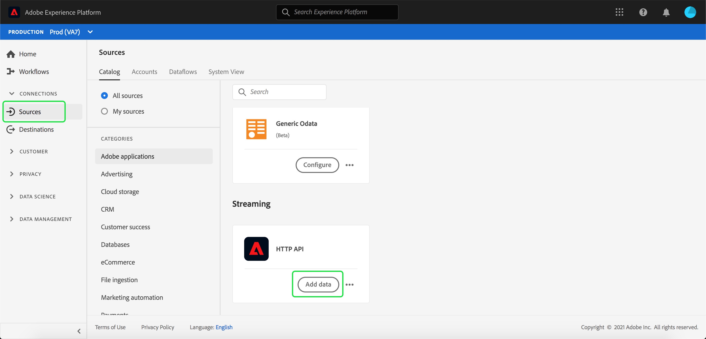
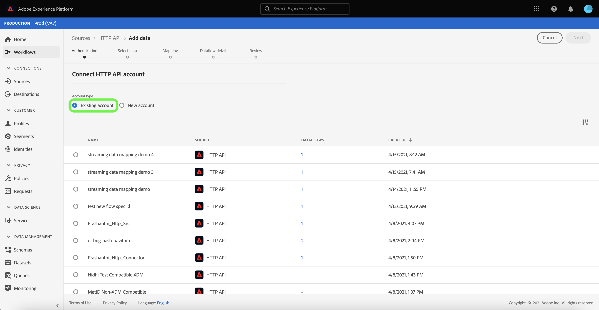
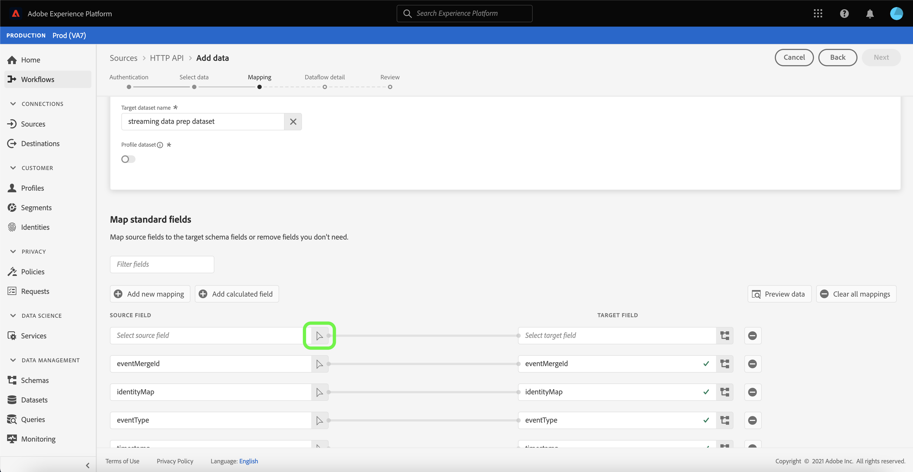
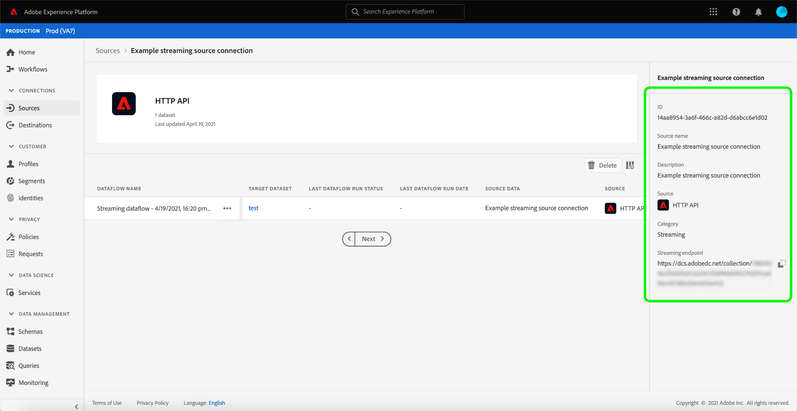

# Crie um [!DNL HTTP API] conexão de transmissão usando a interface do usuário

Este tutorial fornece etapas para criar uma conexão de origem de fluxo usando o [!UICONTROL Fontes] espaço de trabalho.

## Introdução

Este tutorial requer uma compreensão funcional dos seguintes componentes do Adobe Experience Platform:

- [[!DNL Experience Data Model (XDM)] Sistema](../../../../../xdm/home.md): O quadro normalizado pelo qual [!DNL Experience Platform] organiza os dados de experiência do cliente.
   - [Noções básicas da composição do schema](../../../../../xdm/schema/composition.md): Saiba mais sobre os elementos básicos dos esquemas XDM, incluindo princípios-chave e práticas recomendadas na composição do schema.
   - [Tutorial do Editor de esquemas](../../../../../xdm/tutorials/create-schema-ui.md): Saiba como criar esquemas personalizados usando a interface do Editor de esquemas.
- [[!DNL Real-time Customer Profile]](../../../../../profile/home.md): Fornece um perfil de consumidor unificado e em tempo real com base em dados agregados de várias fontes.

## Criar uma conexão de transmissão

Na interface do usuário da plataforma, selecione **[!UICONTROL Fontes]** na navegação à esquerda para acessar o [!UICONTROL Fontes] espaço de trabalho. O [!UICONTROL Catálogo] exibe uma variedade de fontes com as quais você pode criar uma conta.

Você pode selecionar a categoria apropriada no catálogo no lado esquerdo da tela. Como alternativa, você pode encontrar a fonte específica com a qual deseja trabalhar usando a opção de pesquisa.

Em **[!UICONTROL Streaming]** categoria , selecione **[!UICONTROL API HTTP]** e depois selecione **[!UICONTROL Adicionar dados]**.

O **[!UICONTROL Conexão da conta da API HTTP]** será exibida. Nesta página, você pode usar novas credenciais ou credenciais existentes.

### Conta existente

Para usar uma conta existente, selecione a conta da API HTTP com a qual deseja criar um novo fluxo de dados e selecione **[!UICONTROL Próximo]** para continuar.

### Nova conta

Se estiver criando uma nova conta, selecione **[!UICONTROL Nova conta]**. No formulário de entrada exibido, forneça um nome de conta e uma descrição opcional. Você também terá a opção de fornecer as seguintes propriedades de configuração:

- **[!UICONTROL Autenticação]:** Essa propriedade determina se a conexão de transmissão requer autenticação. A autenticação garante que os dados sejam coletados de fontes confiáveis. Se você estiver lidando com Informações pessoais identificáveis (PII), essa propriedade deve ser ativada. Por padrão, essa propriedade está desativada.
- **[!UICONTROL Compatível com XDM]:** Essa propriedade indica se essa conexão de transmissão enviará eventos compatíveis com esquemas XDM. Por padrão, essa propriedade está desativada.

Quando terminar, selecione **[!UICONTROL Conectar-se à origem]** e depois selecione **[!UICONTROL Próximo]** para continuar.

## Selecionar dados

Depois de criar a conexão da API HTTP, a variável **[!UICONTROL Selecionar dados]** será exibida, fornecendo uma interface para carregar e visualizar seus dados.

Selecionar **[!UICONTROL Upload de arquivos]** para carregar seus dados. Como alternativa, você pode arrastar e soltar seus dados no [!UICONTROL Arrastar e soltar arquivos] da interface.

Com os dados carregados, você pode usar o lado direito da interface para visualizar a hierarquia do arquivo. Selecionar **[!UICONTROL Próximo]** para continuar.

## Mapear campos de dados para um esquema XDM

O [!UICONTROL Mapeamento] é exibida, fornecendo uma interface para mapear os dados de origem para um conjunto de dados da plataforma.

Os arquivos de parâmetro devem ser compatíveis com XDM e não exigem a configuração manual do mapeamento, enquanto os arquivos CSV exigem a configuração explícita do mapeamento, mas permitem que você escolha os campos de dados de origem a serem mapeados. Os arquivos JSON, se marcados como reclamação XDM, não exigem configuração manual. No entanto, se não estiver marcado como compatível com XDM, será necessário configurar explicitamente o mapeamento.

Escolha um conjunto de dados para os dados de entrada que serão assimilados. Você pode usar um conjunto de dados existente ou criar um novo.

### Criar um novo conjunto de dados

Para criar um novo conjunto de dados, selecione **[!UICONTROL Novo conjunto de dados]**. No formulário exibido, forneça o nome, uma descrição opcional e o esquema de destino do conjunto de dados. Se você selecionar uma [!DNL Profile]-enabled schema, você pode escolher se o conjunto de dados também deve ser [!DNL Profile]habilitado para .

### Usar um conjunto de dados existente

Para usar um conjunto de dados existente, selecione **[!UICONTROL Conjunto de dados existente]**. No formulário exibido, selecione o conjunto de dados que deseja usar. Depois de selecionar um conjunto de dados, você pode escolher se o conjunto de dados deve ser [!DNL Profile]habilitado para .

### Mapear campos padrão

Com base em suas necessidades, você pode optar por mapear campos diretamente ou usar funções de preparação de dados para transformar dados de origem em valores calculados ou calculados. Para obter mais informações sobre funções mapeadoras e campos calculados, consulte a [Guia de funções de Preparação de dados](../../../../../data-prep/functions.md) ou [guia de campos calculados](../../../../../data-prep/calculated-fields.md).

Para adicionar um novo campo de origem, selecione **[!UICONTROL Adicionar novo mapeamento]**.

Um novo campo de origem e o emparelhamento de campo de destino são exibidos. Para adicionar um novo campo de origem, selecione o ícone de seta ao lado do [!UICONTROL Selecionar campo de origem] barra de entrada.

O [!UICONTROL Selecionar atributos] O painel permite explorar sua hierarquia de arquivos e selecionar um campo de origem específico para mapear para um campo XDM de destino. Após selecionar o campo de origem que deseja mapear, selecione **[!UICONTROL Selecionar]** para continuar.

Com um campo de origem selecionado, agora é possível identificar o campo XDM de destino apropriado para o qual mapear. Selecione o ícone de schema na seção target field .

O [!UICONTROL Mapear campo de origem para campo de destino] for exibida, fornecendo uma interface para explorar o esquema do conjunto de dados do target. Selecione o campo de destino que corresponde ao campo de origem e selecione **[!UICONTROL Selecionar]** para continuar.

Depois que os campos de origem forem mapeados para os campos XDM de destino apropriados, selecione **[!UICONTROL Próximo]**

## Detalhes do fluxo de dados

O **[!UICONTROL Detalhes do fluxo de dados]** será exibida. Nesta página, você pode fornecer detalhes para o fluxo de dados criado, fornecendo um nome e uma descrição opcional.

Depois de fornecer os detalhes do fluxo de dados, selecione **[!UICONTROL Próximo]**.

## Revisão

O **[!UICONTROL Revisão]** é exibida, permitindo que você revise os detalhes do fluxo de dados antes de criá-lo. Os detalhes são agrupados nas seguintes categorias:

- **[!UICONTROL Conexão]**: Mostra o nome da conta, a plataforma de origem e o nome de origem.
- **[!UICONTROL Atribuir conjunto de dados e mapear campos]**: Mostra o conjunto de dados de destino e o esquema ao qual o conjunto de dados adere.

Depois de confirmar se os detalhes estão corretos, selecione **[!UICONTROL Concluir]**.

## Obter URL de ponto de extremidade de fluxo

Com a conexão criada, a página de detalhes das fontes é exibida. Esta página mostra detalhes da conexão recém-criada, incluindo fluxos de dados executados anteriormente, ID e URL do endpoint de transmissão.

## Próximas etapas

Ao seguir este tutorial, você criou uma conexão HTTP de transmissão, permitindo usar o endpoint de transmissão para acessar uma variedade de [!DNL Data Ingestion] APIs. Para obter instruções sobre como criar uma conexão de transmissão na API, leia o [tutorial de criação de uma conexão de transmissão](../../../api/create/streaming/http.md).

Para saber como transmitir dados para a Platform, leia o tutorial em [dados da série de tempo de transmissão](../../../../../ingestion/tutorials/streaming-time-series-data.md) ou o tutorial em [dados de registro de transmissão](../../../../../ingestion/tutorials/streaming-record-data.md).
