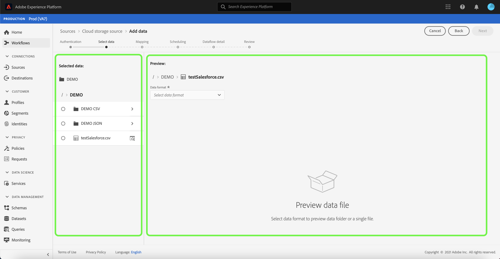
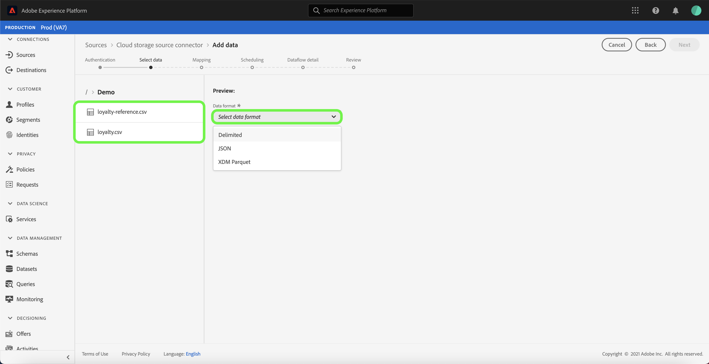
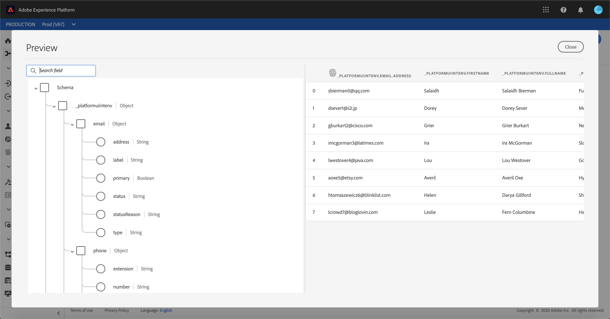

# Configurar um fluxo de dados para uma conexão em lote de armazenamento em nuvem na interface do usuário

Um fluxo de dados é uma tarefa agendada que recupera e assimila dados de uma fonte para um conjunto de dados [!DNL Platform]. Este tutorial fornece etapas para configurar um novo fluxo de dados usando sua conta de armazenamento em nuvem.

## Introdução

Este tutorial requer uma compreensão funcional dos seguintes componentes do Adobe Experience Platform:

* [[!DNL Experience Data Model (XDM)] Sistema](../../../../../xdm/home.md): A estrutura padronizada pela qual  [!DNL Experience Platform] organiza os dados de experiência do cliente.
   * [Noções básicas da composição](../../../../../xdm/schema/composition.md) do schema: Saiba mais sobre os elementos básicos dos esquemas XDM, incluindo princípios-chave e práticas recomendadas na composição do schema.
   * [Tutorial](../../../../../xdm/tutorials/create-schema-ui.md) do Editor de esquema: Saiba como criar esquemas personalizados usando a interface do Editor de esquemas.
* [[!DNL Real-time Customer Profile]](../../../../../profile/home.md): Fornece um perfil de consumidor unificado e em tempo real com base em dados agregados de várias fontes.

Além disso, este tutorial requer uma conta de armazenamento em nuvem estabelecida. Uma lista de tutoriais para criar diferentes contas de armazenamento em nuvem na interface do usuário pode ser encontrada na [visão geral dos conectores de origem](../../../../home.md).

### Formatos de arquivo não suportados

[!DNL Experience Platform] O suporta os seguintes formatos de arquivo a serem assimilados de armazenamentos externos:

* Valores separados por delimitador (DSV): Qualquer valor de caractere único pode ser usado como delimitador para arquivos de dados formatados em DSV.
* [!DNL JavaScript Object Notation] (JSON): Os arquivos de dados formatados em JSON devem ser compatíveis com XDM.
* [!DNL Apache Parquet]: Os arquivos de dados formatados com parâmetro devem ser compatíveis com XDM.
* Arquivos compactados: JSON e arquivos delimitados podem ser compactados como: `bzip2`, `gzip`, `deflate`, `zipDeflate`, `tarGzip` e `tar`.

## Selecionar dados

Depois de criar a conta de armazenamento em nuvem, a etapa **[!UICONTROL Selecionar dados]** é exibida, fornecendo uma interface para explorar a hierarquia de arquivos de armazenamento em nuvem.

* A parte esquerda da interface é um navegador de diretório, exibindo seus arquivos e diretórios de armazenamento em nuvem.
* A parte direita da interface permite visualizar até 100 linhas de dados de um arquivo compatível.

Selecionar uma pasta listada permite atravessar a hierarquia de pastas em pastas mais profundas. Você pode selecionar uma única pasta para assimilar todos os arquivos na pasta recursivamente. Ao assimilar uma pasta inteira, você deve garantir que todos os arquivos na pasta compartilhem o mesmo esquema.

Depois de selecionar um arquivo ou pasta compatível, selecione o formato de dados correspondente no menu suspenso [!UICONTROL Select data format].

A tabela a seguir exibe o formato de dados apropriado para os tipos de arquivos suportados:

| Tipo de arquivo | Formato dos dados |
| --- | --- |
| CSV | [!UICONTROL Delimitado] |
| JSON | [!UICONTROL JSON] |
| Parquet | [!UICONTROL Parqueta XDM] |

Selecione **[!UICONTROL JSON]** e aguarde alguns segundos até que a interface de visualização seja preenchida.

>[!NOTE]
>
>Diferentemente dos tipos de arquivos delimitados e JSON, os arquivos formatados em Parquet não estão disponíveis para visualização.

A interface de visualização permite inspecionar o conteúdo e a estrutura de um arquivo. Por padrão, a interface de visualização exibe o primeiro arquivo na pasta selecionada.

Para visualizar um arquivo diferente, selecione o ícone de visualização ao lado do nome do arquivo que deseja inspecionar.

Após inspecionar o conteúdo e a estrutura dos arquivos na pasta, selecione **[!UICONTROL Next]** para assimilar todos os arquivos na pasta recursivamente.

Se preferir selecionar um arquivo específico, selecione o arquivo que deseja assimilar e selecione **[!UICONTROL Next]**.

### Definir um delimitador personalizado para arquivos delimitados

Você pode definir um delimitador personalizado ao assimilar arquivos delimitados. Selecione a opção **[!UICONTROL Delimitador]** e selecione um delimitador no menu suspenso. O menu exibe as opções mais usadas para delimitadores, incluindo uma vírgula (`,`), uma guia (`\t`) e uma barra vertical (`|`). Se preferir usar um delimitador personalizado, selecione **[!UICONTROL Personalizado]** e insira um delimitador de caractere único de sua escolha na barra de entrada pop-up.

Depois de selecionar seu formato de dados e definir seu delimitador, selecione **[!UICONTROL Next]**.

### Assimilar arquivos compactados

Você pode assimilar arquivos compactados JSON ou delimitados especificando seu tipo de compactação.

Na etapa [!UICONTROL Select data], selecione um arquivo compactado para assimilação e selecione seu tipo de arquivo apropriado e se ele é compatível com XDM ou não. Em seguida, selecione **[!UICONTROL Compression type]** e selecione o tipo de arquivo compactado apropriado para seus dados de origem.

Com um tipo de arquivo compactado identificado, selecione **[!UICONTROL Next]** para continuar.

## Mapear campos de dados para um esquema XDM

A etapa **[!UICONTROL Mapeamento]** é exibida, fornecendo uma interface interativa para mapear os dados de origem para um conjunto de dados [!DNL Platform]. Os arquivos de origem formatados no Parquet devem ser compatíveis com XDM e não exigem a configuração manual do mapeamento, enquanto os arquivos CSV exigem a configuração explícita do mapeamento, mas permitem que você escolha os campos de dados de origem a serem mapeados. Arquivos JSON, se marcados como reclamação XDM, não exigem configuração manual. No entanto, se não estiver marcado como compatível com XDM, será necessário configurar explicitamente o mapeamento.

Escolha um conjunto de dados para os dados de entrada que serão assimilados. Você pode usar um conjunto de dados existente ou criar um novo.

**Usar um conjunto de dados existente**

Para assimilar dados em um conjunto de dados existente, selecione **[!UICONTROL Conjunto de dados existente]** e selecione o ícone do conjunto de dados.

A caixa de diálogo **[!UICONTROL Selecionar conjunto de dados]** é exibida. Encontre o conjunto de dados que deseja usar, selecione-o e clique em **[!UICONTROL Continuar]**.

**Usar um novo conjunto de dados**

Para assimilar dados em um novo conjunto de dados, selecione **[!UICONTROL New dataset]** e insira um nome e uma descrição para o conjunto de dados nos campos fornecidos. Para adicionar um schema, você pode inserir um nome de schema existente na caixa de diálogo **[!UICONTROL Selecionar schema]**. Como alternativa, você pode selecionar o **[!UICONTROL Schema advanced search]** para procurar um schema apropriado.

Durante essa etapa, você pode ativar seu conjunto de dados para [!DNL Real-time Customer Profile] e criar uma exibição holística dos atributos e comportamentos de uma entidade. Os dados de todos os conjuntos de dados ativados serão incluídos em [!DNL Profile] e as alterações serão aplicadas quando você salvar o fluxo de dados.

Alterne o botão **[!UICONTROL Conjunto de dados de perfil]** para ativar seu conjunto de dados de destino para [!DNL Profile].

A caixa de diálogo **[!UICONTROL Selecionar esquema]** é exibida. Selecione o schema que deseja aplicar ao novo conjunto de dados e selecione **[!UICONTROL Concluído]**.

Com base em suas necessidades, você pode optar por mapear campos diretamente ou usar funções de preparação de dados para transformar dados de origem em valores calculados ou calculados. Para obter mais informações sobre funções do mapeador e campos calculados, consulte o [Guia de funções de Preparação de Dados](../../../../../data-prep/functions.md) ou o [guia de campos calculados](../../../../../data-prep/calculated-fields.md).

Para arquivos JSON, além de mapear campos diretamente para outros campos, é possível mapear objetos diretamente para outros objetos e arrays para outros arrays. Também é possível visualizar e mapear tipos de dados complexos, como arrays em arquivos JSON, usando um conector de origem de armazenamento na nuvem.

Observe que não é possível mapear em tipos diferentes. Por exemplo, não é possível mapear um objeto para uma matriz ou um campo para um objeto.

>[!TIP]
>
>A Platform fornece recomendações inteligentes para campos mapeados automaticamente com base no esquema de destino ou conjunto de dados selecionado. Você pode ajustar manualmente as regras de mapeamento de acordo com seus casos de uso.

Selecione **[!UICONTROL Preview data]** para ver os resultados de mapeamento de até 100 linhas de dados de amostra do conjunto de dados selecionado.

Durante a visualização, a coluna de identidade é priorizada como o primeiro campo, pois são as informações principais necessárias ao validar resultados de mapeamento.

Depois que os dados de origem forem mapeados, selecione **[!UICONTROL Fechar]**.

## Agendar execução de ingestão

A etapa **[!UICONTROL Scheduling]** é exibida, permitindo configurar um agendamento de assimilação para assimilar automaticamente os dados de origem selecionados usando os mapeamentos configurados. A tabela a seguir descreve os diferentes campos configuráveis para programação:

| Campo | Descrição |
| --- | --- |
| Frequência | As frequências selecionáveis incluem `Once`, `Minute`, `Hour`, `Day` e `Week`. |
| Intervalo | Um número inteiro que define o intervalo para a frequência selecionada. |
| Hora de início | Um carimbo de data e hora UTC indicando quando a primeira assimilação está definida para ocorrer. |
| Preenchimento retroativo | Um valor booleano que determina quais dados são assimilados inicialmente. Se **[!UICONTROL Backfill]** estiver ativado, todos os arquivos atuais no caminho especificado serão assimilados durante a primeira assimilação agendada. Se **[!UICONTROL Backfill]** estiver desativado, somente os arquivos carregados entre a primeira execução de assimilação e a hora de início serão assimilados. Os arquivos carregados antes da hora de início não serão assimilados. |

Os fluxos de dados são projetados para assimilar dados automaticamente de forma programada. Comece selecionando a frequência de assimilação. Em seguida, defina o intervalo para designar o período entre duas execuções de fluxo. O valor do intervalo deve ser um número inteiro diferente de zero e deve ser definido como maior ou igual a 15.

Para definir a hora de início da assimilação, ajuste a data e a hora exibidas na caixa de hora de início. Como alternativa, você pode selecionar o ícone de calendário para editar o valor de hora de início. A hora de início deve ser maior ou igual à hora atual em UTC.

Forneça valores para o agendamento e selecione **[!UICONTROL Next]**.

### Configurar um fluxo de dados de ingestão único

Para configurar a assimilação única, selecione a seta suspensa de frequência e selecione **[!UICONTROL Once]**. Você pode continuar fazendo edições em um conjunto de fluxo de dados para uma assimilação de frequência única, desde que o tempo de início permaneça no futuro. Depois que a hora de início tiver passado, o valor de frequência única não poderá mais ser editado. **** Intervale  **** Backfile não é visível ao configurar um fluxo de dados de ingestão único.

>[!IMPORTANT]
>
>É altamente recomendável agendar seu fluxo de dados para uma assimilação única ao usar o [conector FTP](../../../../connectors/cloud-storage/ftp.md).

Depois de fornecer os valores apropriados ao agendamento, selecione **[!UICONTROL Next]**.

## Fornecer detalhes do fluxo de dados

A etapa **[!UICONTROL Detalhes do fluxo de dados]** é exibida, permitindo nomear e fornecer uma breve descrição sobre o novo fluxo de dados.

Durante esse processo, você também pode ativar **[!UICONTROL Assimilação parcial]** e **[!UICONTROL Diagnóstico de erro]**. Habilitar **[!UICONTROL Assimilação parcial]** fornece a capacidade de assimilar dados contendo erros, até um determinado limite que pode ser definido. Habilitar **[!UICONTROL Diagnósticos de erro]** fornecerá detalhes sobre quaisquer dados incorretos que sejam armazenados em lotes separadamente. Para obter mais informações, consulte a [visão geral da ingestão parcial de lote](../../../../../ingestion/batch-ingestion/partial.md).

Forneça valores para o fluxo de dados e selecione **[!UICONTROL Next]**.

## Revisar o fluxo de dados

A etapa **[!UICONTROL Revisar]** é exibida, permitindo que você revise o novo fluxo de dados antes de ele ser criado. Os detalhes são agrupados nas seguintes categorias:

* **[!UICONTROL Conexão]**: Mostra o tipo de origem, o caminho relevante do arquivo de origem escolhido e a quantidade de colunas dentro desse arquivo de origem.
* **[!UICONTROL Atribuir conjunto de dados e mapear campos]**: Mostra em qual conjunto de dados os dados de origem estão sendo assimilados, incluindo o esquema ao qual o conjunto de dados adere.
* **[!UICONTROL Agendamento]**: Mostra o período ativo, a frequência e o intervalo do agendamento de ingestão.

Depois de revisar o fluxo de dados, clique em **[!UICONTROL Finish]** e aguarde algum tempo para que o fluxo de dados seja criado.

## Monitorar o fluxo de dados

Depois que o fluxo de dados for criado, você poderá monitorar os dados que estão sendo assimilados por meio dele para ver informações sobre taxas de ingestão, sucesso e erros. Para obter mais informações sobre como monitorar o fluxo de dados, consulte o tutorial em [monitorando contas e fluxos de dados na interface do usuário](../../monitor.md).

## Excluir seu fluxo de dados

Você pode excluir fluxos de dados que não são mais necessários ou foram criados incorretamente usando a função **[!UICONTROL Delete]** disponível no espaço de trabalho **[!UICONTROL Fluxos de dados]**. Para obter mais informações sobre como excluir fluxos de dados, consulte o tutorial em [excluir fluxos de dados na interface do usuário](../../delete.md).

## Próximas etapas

Ao seguir este tutorial, você criou com sucesso um fluxo de dados para trazer dados de um armazenamento externo em nuvem e ganhou informações sobre o monitoramento de conjuntos de dados. Para saber mais sobre como criar fluxos de dados, você pode complementar seu aprendizado assistindo ao vídeo abaixo. Além disso, os dados recebidos agora podem ser usados por serviços [!DNL Platform] downstream, como [!DNL Real-time Customer Profile] e [!DNL Data Science Workspace]. Consulte os seguintes documentos para obter mais detalhes:

* [[!DNL Real-time Customer Profile] visão geral](../../../../../profile/home.md)
* [[!DNL Data Science Workspace] visão geral](../../../../../data-science-workspace/home.md)

>[!WARNING]
>
> A interface [!DNL Platform] mostrada no vídeo a seguir está desatualizada. Consulte a documentação acima para obter as capturas de tela e a funcionalidade mais recentes da interface do usuário.

>[!VIDEO](https://video.tv.adobe.com/v/29695?quality=12&learn=on)

## Apêndice

As seções a seguir fornecem informações adicionais para trabalhar com conectores de origem.

### Desativar um fluxo de dados

Quando um fluxo de dados é criado, ele imediatamente se torna ativo e assimila dados de acordo com o cronograma que foi fornecido. Você pode desativar um fluxo de dados ativo a qualquer momento seguindo as instruções abaixo.

No espaço de trabalho **[!UICONTROL Fontes]**, clique na guia **[!UICONTROL Procurar]**. Em seguida, clique no nome da conta associada ao fluxo de dados ativo que você deseja desativar.

A página **[!UICONTROL Source activity]** é exibida. Selecione o fluxo de dados ativo na lista para abrir a coluna **[!UICONTROL Propriedades]** no lado direito da tela, que contém um botão de alternância **[!UICONTROL Ativado]**. Clique no botão de alternância para desativar o fluxo de dados. A mesma alternância pode ser usada para reativar um fluxo de dados depois que ele for desativado.

### Ativar dados de entrada para a população [!DNL Profile]

Os dados de entrada do conector de origem podem ser usados para enriquecer e preencher os dados de [!DNL Real-time Customer Profile]. Para obter mais informações sobre como preencher os dados [!DNL Real-time Customer Profile], consulte o tutorial em [População do perfil](../../profile.md).
