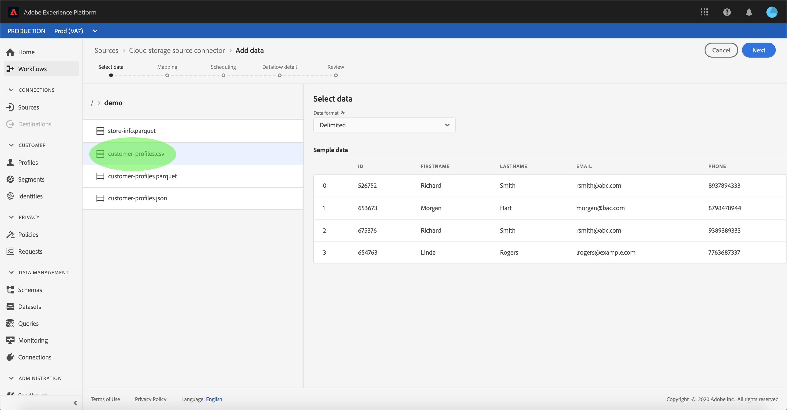

# Configurar um fluxo de dados para um conector de lote de armazenamentos em nuvem na interface do usuário

Um fluxo de dados é uma tarefa programada que recupera e ingere dados de uma fonte para um [!DNL Platform] conjunto de dados. Este tutorial fornece etapas para configurar um novo fluxo de dados usando sua conta de armazenamento em nuvem.

## Introdução

Este tutorial requer uma compreensão funcional dos seguintes componentes do Adobe Experience Platform:

* [Sistema](../../../../../xdm/home.md)do Experience Data Model (XDM): A estrutura padronizada pela qual [!DNL Experience Platform] organiza os dados de experiência do cliente.
   * [Noções básicas da composição](../../../../../xdm/schema/composition.md)do schema: Saiba mais sobre os elementos básicos dos schemas XDM, incluindo princípios-chave e práticas recomendadas na composição do schema.
   * [Tutorial](../../../../../xdm/tutorials/create-schema-ui.md)do Editor de Schemas: Saiba como criar schemas personalizados usando a interface do editor de Schemas.
* [Perfil](../../../../../profile/home.md)do cliente em tempo real: Fornece um perfil unificado e em tempo real para o consumidor, com base em dados agregados de várias fontes.

Além disso, este tutorial requer uma conta de armazenamento em nuvem estabelecida. Uma lista de tutoriais para criar diferentes contas de armazenamento na nuvem na interface do usuário pode ser encontrada na visão geral [dos conectores de](../../../../home.md)origem.

### Formatos de arquivo não suportados

[!DNL Experience Platform] oferece suporte aos seguintes formatos de arquivo para serem assimilados de armazenamentos externos:

* Valores separados por delimitador (DSV): Atualmente, o suporte para arquivos de dados formatados em DSV está limitado a valores separados por vírgulas. O valor dos cabeçalhos de campo nos arquivos formatados em DSV deve consistir apenas em caracteres alfanuméricos e sublinhados. O suporte para arquivos DSV gerais será fornecido no futuro.
* [!DNL JavaScript Object Notation] (JSON): Os arquivos de dados formatados JSON devem ser compatíveis com XDM.
* [!DNL Apache Parquet]: Os arquivos de dados formatados em parâmetro devem ser compatíveis com XDM.

## Selecionar dados

Depois de criar sua conta de armazenamento em nuvem, a etapa *[!UICONTROL Selecionar dados]* é exibida, fornecendo uma interface interativa para explorar a hierarquia de armazenamentos em nuvem.

* A metade esquerda da interface é um navegador de diretório que exibe os arquivos e diretórios do servidor.
* A metade direita da interface permite que você pré-visualização até 100 linhas de dados de um arquivo compatível.

Selecionar uma pasta listada permite que você transfira a hierarquia de pastas para pastas mais profundas. Depois que você tiver um arquivo ou pasta compatível selecionado, a lista suspensa **[!UICONTROL Selecionar formato]** de dados será exibida, onde você poderá escolher um formato para exibir os dados na janela de pré-visualização.

Quando a janela pré-visualização for preenchida, você poderá selecionar **[!UICONTROL Próximo]** para carregar todos os arquivos dentro da pasta selecionada. Se você quiser fazer upload para um arquivo específico, selecione-o na lista antes de selecionar **[!UICONTROL Próximo]**.

### Ingest Parquet ou arquivos JSON

Os formatos de arquivo suportados para uma conta de armazenamento na nuvem também incluem JSON e Parquet. Os arquivos JSON e Parquet devem ser compatíveis com XDM. Para assimilar arquivos JSON ou Parquet, selecione o formato de arquivo apropriado no navegador de diretório e aplique o formato de dados compatível na interface correta. Selecione **[!UICONTROL Avançar]** para continuar.

>[!IMPORTANT]
>
>Diferentemente dos tipos de arquivos delimitados, os arquivos formatados JSON e Parquet não estão disponíveis para pré-visualização.

## Mapear campos de dados para um schema XDM

A etapa *[!UICONTROL Mapeamento]* é exibida, fornecendo uma interface interativa para mapear os dados de origem para um [!DNL Platform] conjunto de dados. Os arquivos de origem formatados em JSON ou Parquet devem ser compatíveis com XDM e não exigem a configuração manual do mapeamento. Os arquivos CSV, inversamente, exigem que você configure explicitamente o mapeamento, mas permitem que você escolha quais campos de dados de origem serão mapeados.

Escolha um conjunto de dados para os dados de entrada a serem ingeridos. Você pode usar um conjunto de dados existente ou criar um novo.

**Usar um conjunto de dados existente**

Para assimilar dados em um conjunto de dados existente, selecione Conjunto de dados **[!UICONTROL existente]** e, em seguida, selecione o ícone do conjunto de dados.

A caixa de diálogo *[!UICONTROL Selecionar conjunto de dados]* é exibida. Encontre o conjunto de dados que deseja usar, selecione-o e clique em **[!UICONTROL Continuar]**.

**Usar um novo conjunto de dados**

Para assimilar dados em um novo conjunto de dados, selecione **[!UICONTROL Novo conjunto de dados]** e insira um nome e uma descrição para o conjunto de dados nos campos fornecidos. Para adicionar um schema, você pode inserir um nome de schema existente na caixa de diálogo *[!UICONTROL Selecionar schema]* . Como alternativa, você pode selecionar a pesquisa **[!UICONTROL avançada do]** Schema para procurar um schema apropriado.

A caixa de diálogo *[!UICONTROL Selecionar schema]* é exibida. Selecione o schema que deseja aplicar ao novo conjunto de dados e, em seguida, selecione **[!UICONTROL Concluído]**.

Com base em suas necessidades, você pode optar por mapear os campos diretamente ou usar as funções do mapeador para transformar dados de origem para derivar valores calculados ou calculados. Para obter mais informações sobre funções de mapeamento e mapeamento de dados, consulte o tutorial sobre como [mapear dados CSV para campos](../../../../../ingestion/tutorials/map-a-csv-file.md)de schema XDM.

Depois que os dados de origem forem mapeados, selecione **[!UICONTROL Avançar]**.

## Execuções de ingestão agendada

A etapa *[!UICONTROL Agendamento]* é exibida, permitindo que você configure um agendamento de ingestão para assimilar automaticamente os dados de origem selecionados usando os mapeamentos configurados. A tabela a seguir descreve os diferentes campos configuráveis para programação:

| Campo | Descrição |
| --- | --- |
| Frequência | As frequências selecionáveis incluem `Once`, `Minute`, `Hour`, `Day`e `Week`. |
| Intervalo | Um número inteiro que define o intervalo para a frequência selecionada. |
| hora do Start | Um carimbo de data e hora UTC indicando quando a primeira ingestão está definida para ocorrer. |
| Backfill | Um valor booliano que determina quais dados são inicialmente assimilados. Se o *[!UICONTROL preenchimento retroativo]* estiver ativado, todos os arquivos atuais no caminho especificado serão ingeridos durante a primeira ingestão programada. Se o *preenchimento retroativo* estiver desativado, somente os arquivos carregados entre a primeira execução da ingestão e a hora *[!UICONTROL do]* Start serão assimilados. Os arquivos carregados antes da hora *[!UICONTROL do]* Start não serão ingeridos. |

Os fluxos de dados são projetados para assimilar dados automaticamente de acordo com uma programação. Start selecionando a frequência da ingestão. Em seguida, defina o intervalo para designar o período entre duas execuções de fluxo. O valor do intervalo deve ser um número inteiro diferente de zero e deve ser definido como maior ou igual a 15.

Para definir a hora de ingestão do start, ajuste a data e a hora exibidas na caixa da hora do start. Como alternativa, você pode selecionar o ícone de calendário para editar o valor de hora do start. O tempo de Start deve ser maior ou igual ao tempo atual em UTC.

Forneça valores para o agendamento e selecione **[!UICONTROL Próximo]**.

### Configurar um fluxo de dados de ingestão única

Para configurar a ingestão única, selecione a seta suspensa de frequência e selecione **[!UICONTROL Uma vez]**. Você pode continuar fazendo edições em um conjunto de fluxo de dados para uma ingestão de frequência única, desde que o tempo de start permaneça no futuro. Depois que a hora do start passar, o valor de frequência única não poderá mais ser editado.

>[!TIP] **[!UICONTROL O intervalo]** e o preenchimento **[!UICONTROL retroativo]** não são visíveis durante uma ingestão única.

Depois de fornecer os valores apropriados para a programação, selecione **[!UICONTROL Avançar]**.

## Fornecer detalhes do fluxo de dados

A etapa de detalhes *[!UICONTROL do]* Dataflow é exibida, permitindo que você nomeie e forneça uma breve descrição sobre seu novo dataflow.

Durante esse processo, você também pode ativar a assimilação *[!UICONTROL parcial]* e o diagnóstico *[!UICONTROL de]* erro. Habilitar a ingestão *[!UICONTROL parcial]* fornece a capacidade de assimilar dados que contêm erros, até um certo limite que você pode definir. Ativar o diagnóstico ** de erro fornecerá detalhes sobre quaisquer dados incorretos armazenados em lote separadamente. Para obter mais informações, consulte a visão geral da ingestão em lote parcial.

Forneça valores para o fluxo de dados e selecione **[!UICONTROL Próximo]**.

## Revisar seu fluxo de dados

A etapa *[!UICONTROL Revisar]* é exibida, permitindo que você revise seu novo fluxo de dados antes de ele ser criado. Os detalhes são agrupados nas seguintes categorias:

* *[!UICONTROL Conexão]*: Mostra o tipo de origem, o caminho relevante do arquivo de origem escolhido e a quantidade de colunas nesse arquivo de origem.
* *[!UICONTROL Atribuir campos]* do conjunto de dados e mapear: Mostra em qual conjunto de dados os dados de origem estão sendo assimilados, incluindo o schema ao qual o conjunto de dados adere.
* *[!UICONTROL Agendamento]*: Mostra o período ativo, a frequência e o intervalo do agendamento da ingestão.

Depois de revisar seu fluxo de dados, clique em **[!UICONTROL Concluir]** e aguarde algum tempo para que o fluxo de dados seja criado.

## Monitore e exclua seu fluxo de dados

Depois que seu fluxo de dados de armazenamento em nuvem for criado, você poderá monitorar os dados que estão sendo assimilados por ele. Para obter mais informações sobre monitoramento e exclusão de fluxos de dados, consulte o tutorial sobre [monitoramento de fluxos de dados](../../../../../ingestion/quality/monitor-data-flows.md).

## Próximas etapas

Ao seguir este tutorial, você criou com êxito um fluxo de dados para trazer dados de um armazenamento de nuvem externo e obteve insight sobre conjuntos de dados de monitoramento. Para saber mais sobre como criar fluxos de dados, você pode complementar seu aprendizado assistindo ao vídeo abaixo. Além disso, os dados de entrada agora podem ser usados por [!DNL Platform] serviços de downstream, como [!DNL Real-time Customer Profile] e [!DNL Data Science Workspace]. Consulte os seguintes documentos para obter mais detalhes:

* [Visão geral do Perfil do cliente em tempo real](../../../../../profile/home.md)
* [Visão geral da Análise do espaço de trabalho da Data Science](../../../../../data-science-workspace/home.md)

>[!WARNING]
>
> A [!DNL Platform] interface do usuário exibida no vídeo a seguir está desatualizada. Consulte a documentação acima para obter as capturas de tela e a funcionalidade mais recentes da interface do usuário.

>[!VIDEO](https://video.tv.adobe.com/v/29695?quality=12&learn=on)

## Apêndice

As seções a seguir fornecem informações adicionais para trabalhar com conectores de origem.

### Desativar um fluxo de dados

Quando um fluxo de dados é criado, ele imediatamente se torna ativo e ingere dados de acordo com o agendamento que foi fornecido. Você pode desativar um fluxo de dados ativo a qualquer momento seguindo as instruções abaixo.

Na área de trabalho *[!UICONTROL Fontes]* , clique na guia **[!UICONTROL Procurar]** . Em seguida, clique no nome da conta que está associada ao fluxo de dados ativo que você deseja desativar.

A página *[!UICONTROL atividade]* de origem é exibida. Selecione o fluxo de dados ativo na lista para abrir sua coluna *[!UICONTROL Propriedades]* no lado direito da tela, que contém um botão de alternância **[!UICONTROL Ativado]** . Clique na alternância para desativar o fluxo de dados. A mesma alternância pode ser usada para reativar um fluxo de dados depois que ele for desativado.

### Ativar dados de entrada para [!DNL Profile] população

Os dados de entrada do conector de origem podem ser usados para enriquecer e preencher seus [!DNL Real-time Customer Profile] dados. Para obter mais informações sobre como preencher seus [!DNL Profile] dados do cliente real, consulte o tutorial sobre a população [do](../../profile.md)Perfil.
