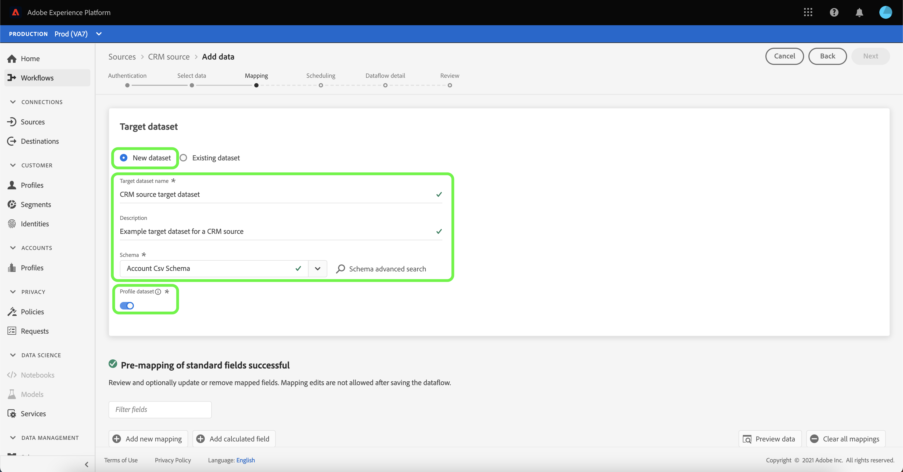
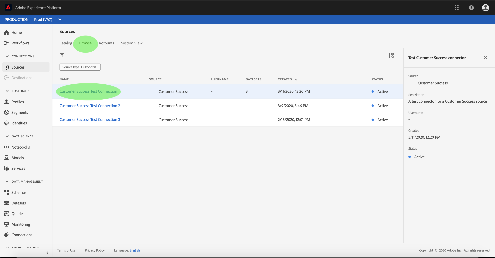
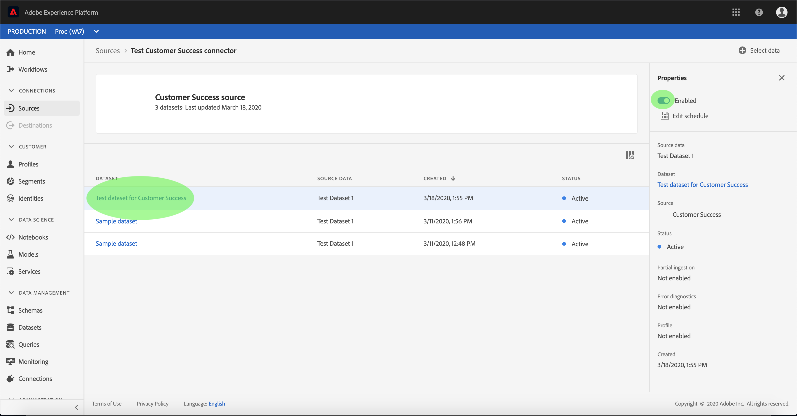

# Configurar um fluxo de dados para uma conexão bem-sucedida do cliente na interface do usuário

Um fluxo de dados é uma tarefa agendada que recupera e assimila dados de uma fonte para um conjunto de dados [!DNL Platform]. Este tutorial fornece etapas para configurar um novo fluxo de dados usando a conta de sucesso do cliente.

## Introdução

Este tutorial requer uma compreensão funcional dos seguintes componentes do Adobe Experience Platform:

- [[!DNL Experience Data Model (XDM)] Sistema](../../../../xdm/home.md): A estrutura padronizada pela qual  [!DNL Experience Platform] organiza os dados de experiência do cliente.
   - [Noções básicas da composição](../../../../xdm/schema/composition.md) do schema: Saiba mais sobre os elementos básicos dos esquemas XDM, incluindo princípios-chave e práticas recomendadas na composição do schema.
   - [Tutorial](../../../../xdm/tutorials/create-schema-ui.md) do Editor de esquema: Saiba como criar esquemas personalizados usando a interface do Editor de esquemas.
- [[!DNL Real-time Customer Profile]](../../../../profile/home.md): Fornece um perfil de consumidor unificado e em tempo real com base em dados agregados de várias fontes.

Além disso, este tutorial requer que você já tenha criado uma conta de sucesso do cliente. Uma lista de tutoriais para criar diferentes conectores de sucesso do cliente na interface do usuário pode ser encontrada na [visão geral dos conectores de origem](../../../home.md).

## Selecionar dados

Depois de criar o conector de sucesso do cliente, a etapa **[!UICONTROL Select data]** é exibida, fornecendo uma interface interativa para explorar a hierarquia de arquivos.

- A metade esquerda da interface é um navegador de diretório, que exibe os arquivos e diretórios do seu servidor.
- A metade direita da interface permite visualizar até 100 linhas de dados de um arquivo compatível.

Você pode usar a opção **[!UICONTROL Search]** na parte superior da página para identificar rapidamente os dados de origem que pretende usar.

>[!NOTE]
>
>A opção de dados de origem da pesquisa está disponível para todos os conectores de origem baseados em tabelas, excluindo os conectores Analytics, Classificações, Hubs de eventos e Kinesis.

Depois de encontrar os dados de origem, selecione o diretório e clique em **[!UICONTROL Next]**.

## Mapear campos de dados para um esquema XDM

A etapa **[!UICONTROL Mapping]** é exibida, fornecendo uma interface interativa para mapear os dados de origem para um conjunto de dados [!DNL Platform].

Escolha um conjunto de dados para os dados de entrada que serão assimilados. Você pode usar um conjunto de dados existente ou criar um novo conjunto de dados.

### Usar um conjunto de dados existente

Para assimilar dados em um conjunto de dados existente, selecione **[!UICONTROL Use existing dataset]** e clique no ícone do conjunto de dados.

A caixa de diálogo **[!UICONTROL Select dataset]** é exibida. Encontre o conjunto de dados que deseja usar, selecione-o e clique em **[!UICONTROL Continue]**.

### Usar um novo conjunto de dados

Para assimilar dados em um novo conjunto de dados, selecione **[!UICONTROL Create new dataset]** e insira um nome e uma descrição para o conjunto de dados nos campos fornecidos.

Você pode anexar um campo de esquema inserindo um nome de esquema na barra de pesquisa **[!UICONTROL Select schema]**. Você também pode selecionar o ícone suspenso para ver uma lista de schemas existentes. Como alternativa, você pode selecionar **[!UICONTROL Advanced search]** para acessar a tela de esquemas existentes, incluindo seus respectivos detalhes.

Durante essa etapa, você pode ativar seu conjunto de dados para [!DNL Real-time Customer Profile] e criar uma exibição holística dos atributos e comportamentos de uma entidade. Os dados de todos os conjuntos de dados ativados serão incluídos em [!DNL Profile] e as alterações serão aplicadas quando você salvar o fluxo de dados.

Alterne o botão **[!UICONTROL Profile dataset]** para ativar o conjunto de dados de destino para [!DNL Profile].

A caixa de diálogo **[!UICONTROL Select schema]** é exibida. Selecione o schema que deseja aplicar ao novo conjunto de dados e clique em **[!UICONTROL Done]**.

Com base em suas necessidades, você pode optar por mapear campos diretamente ou usar funções de mapeador para transformar dados de origem para derivar valores calculados ou calculados. Para obter mais informações sobre mapeamento de dados e funções de mapeador, consulte o tutorial em [mapear dados CSV para campos de esquema XDM](../../../../ingestion/tutorials/map-a-csv-file.md).

>[!TIP]
>
>[!DNL Platform] fornece recomendações inteligentes para campos mapeados automaticamente com base no esquema de destino ou conjunto de dados selecionado. Você pode ajustar manualmente as regras de mapeamento de acordo com seus casos de uso.

Selecione **[!UICONTROL Preview data]** para ver os resultados do mapeamento de até 100 linhas de dados de amostra do conjunto de dados selecionado.

Durante a visualização, a coluna de identidade é priorizada como o primeiro campo, pois são as informações principais necessárias ao validar resultados de mapeamento.

Depois que os dados de origem forem mapeados, selecione **[!UICONTROL Close]**.

## Agendar execução de ingestão

A etapa **[!UICONTROL Scheduling]** é exibida, permitindo configurar um agendamento de assimilação para assimilar automaticamente os dados de origem selecionados usando os mapeamentos configurados. A tabela a seguir descreve os diferentes campos configuráveis para programação:

| Campo | Descrição |
| --- | --- |
| Frequência | As frequências selecionáveis incluem `Once`, `Minute`, `Hour`, `Day` e `Week`. |
| Intervalo | Um número inteiro que define o intervalo para a frequência selecionada. |
| Hora de início | Um carimbo de data e hora UTC indicando quando a primeira assimilação está definida para ocorrer. |
| Preenchimento retroativo | Um valor booleano que determina quais dados são assimilados inicialmente. Se **[!UICONTROL Backfill]** estiver ativado, todos os arquivos atuais no caminho especificado serão assimilados durante a primeira assimilação agendada. Se **[!UICONTROL Backfill]** estiver desativado, somente os arquivos carregados entre a primeira execução da assimilação e a hora de início serão assimilados. Os arquivos carregados antes da hora de início não serão assimilados. |
| Coluna Delta | Uma opção com um conjunto filtrado de campos do schema de origem do tipo, data ou hora. Esse campo é usado para diferenciar dados novos e existentes. Os dados incrementais serão assimilados com base no carimbo de data e hora da coluna selecionada. |

Os fluxos de dados são projetados para assimilar dados automaticamente de forma programada. Comece selecionando a frequência de assimilação. Em seguida, defina o intervalo para designar o período entre duas execuções de fluxo. O valor do intervalo deve ser um número inteiro diferente de zero e deve ser definido como maior ou igual a 15.

Para definir a hora de início da assimilação, ajuste a data e a hora exibidas na caixa de hora de início. Como alternativa, você pode selecionar o ícone de calendário para editar o valor de hora de início. A hora de início deve ser maior ou igual à hora UTC atual.

Selecione **[!UICONTROL Load incremental data by]** para atribuir a coluna delta. Este campo estabelece uma distinção entre dados novos e dados existentes.

### Configurar um fluxo de dados de ingestão único

Para configurar a assimilação única, selecione a seta suspensa de frequência e selecione **[!UICONTROL Once]**.

>[!TIP]
>
>**[!UICONTROL Interval]** e não  **[!UICONTROL Backfill]** são visíveis durante uma ingestão única.

Depois de fornecer os valores apropriados ao agendamento, selecione **[!UICONTROL Next]**.

## Fornecer detalhes do fluxo de dados

A etapa **[!UICONTROL Dataflow detail]** é exibida, permitindo nomear e fornecer uma breve descrição sobre o novo fluxo de dados.

Durante esse processo, também é possível ativar **[!UICONTROL Partial ingestion]** e **[!UICONTROL Error diagnostics]**. Habilitar **[!UICONTROL Partial ingestion]** fornece a capacidade de assimilar dados contendo erros até um determinado limite. Quando **[!UICONTROL Partial ingestion]** estiver ativado, arraste o seletor **[!UICONTROL Error threshold %]** para ajustar o limite de erro do lote. Como alternativa, você pode ajustar manualmente o limite selecionando a caixa de entrada. Para obter mais informações, consulte a [visão geral da ingestão parcial de lote](../../../../ingestion/batch-ingestion/partial.md).

Forneça valores para o fluxo de dados e selecione **[!UICONTROL Next]**.

## Revisar o fluxo de dados

A etapa **[!UICONTROL Review]** é exibida, permitindo que você revise o novo fluxo de dados antes de ele ser criado. Os detalhes são agrupados nas seguintes categorias:

- **[!UICONTROL Connection details]**: Mostra o tipo de origem, o caminho relevante do arquivo de origem escolhido e a quantidade de colunas dentro desse arquivo de origem.
- **[!UICONTROL Mapping details]**: Mostra em qual conjunto de dados os dados de origem estão sendo assimilados, incluindo o esquema ao qual o conjunto de dados adere.
- **[!UICONTROL Schedule details]**: Mostra o período ativo, a frequência e o intervalo do agendamento de ingestão.

Depois de revisar o fluxo de dados, clique em **[!UICONTROL Finish]** e aguarde algum tempo para que o fluxo de dados seja criado.

## Monitorar o fluxo de dados

Depois que o fluxo de dados for criado, você poderá monitorar os dados que estão sendo assimilados por meio dele para ver informações sobre taxas de ingestão, sucesso e erros. Para obter mais informações sobre como monitorar o fluxo de dados, consulte o tutorial em [monitorando contas e fluxos de dados na interface do usuário](../monitor.md).

## Excluir seu fluxo de dados

Você pode excluir fluxos de dados que não são mais necessários ou foram criados incorretamente usando a função **[!UICONTROL Delete]** disponível no espaço de trabalho **[!UICONTROL Dataflows]**. Para obter mais informações sobre como excluir fluxos de dados, consulte o tutorial em [excluir fluxos de dados na interface do usuário](../delete.md).

## Próximas etapas

Ao seguir este tutorial, você criou com sucesso um fluxo de dados para trazer dados de uma fonte de sucesso do cliente e ganhou informações sobre o monitoramento de conjuntos de dados. Os dados recebidos agora podem ser usados por serviços [!DNL Platform] downstream, como [!DNL Real-time Customer Profile] e [!DNL Data Science Workspace]. Consulte os seguintes documentos para obter mais detalhes:

- [Visão geral do perfil do cliente em tempo real](../../../../profile/home.md)
- [Visão geral do Data Science Workspace](../../../../data-science-workspace/home.md)

## Apêndice

As seções a seguir fornecem informações adicionais para trabalhar com conectores de origem.

### Desativar um fluxo de dados

Quando um fluxo de dados é criado, ele imediatamente se torna ativo e assimila dados de acordo com o cronograma que foi fornecido. Você pode desativar um fluxo de dados ativo a qualquer momento seguindo as instruções abaixo.

Na tela **[!UICONTROL Authentication]**, selecione o nome da conta associada ao fluxo de dados que você deseja desativar.

A página **[!UICONTROL Source activity]** é exibida. Selecione o fluxo de dados ativo na lista para abrir sua coluna **[!UICONTROL Properties]** no lado direito da tela, que contém um botão de alternância **[!UICONTROL Enabled]**. Clique no botão de alternância para desativar o fluxo de dados. A mesma alternância pode ser usada para reativar um fluxo de dados depois que ele for desativado.

### Ativar dados de entrada para a população [!DNL Profile]

Os dados de entrada do conector de origem podem ser usados para enriquecer e preencher os dados de [!DNL Real-time Customer Profile]. Para obter mais informações sobre como preencher os dados [!DNL Real-time Customer Profile], consulte o tutorial em [População do perfil](../profile.md).
