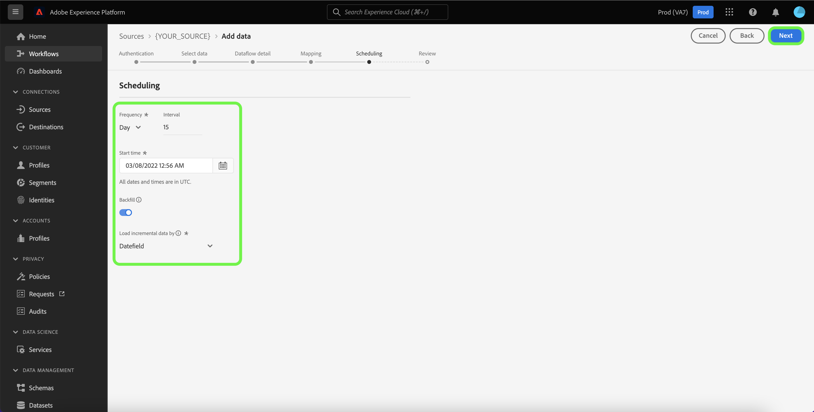

# Criar um fluxo de dados usando uma fonte de sucesso do cliente na interface do usuário

Um fluxo de dados é uma tarefa agendada que recupera e assimila dados de uma fonte para um conjunto de dados no Adobe Experience Platform. Este tutorial fornece etapas sobre como criar um fluxo de dados para uma fonte de sucesso do cliente usando a interface do usuário da plataforma.

>[!NOTE]
>
>Para criar um fluxo de dados, você já deve ter uma conta autenticada com uma fonte de sucesso do cliente. Uma lista de tutoriais para criar diferentes contas de origem de sucesso do cliente na interface do usuário pode ser encontrada no [visão geral das fontes](../../../home.md#customer-success).

## Introdução

Este tutorial requer uma compreensão funcional dos seguintes componentes da Platform:

* [Fontes](../../../home.md): A Platform permite que os dados sejam assimilados de várias fontes, além de fornecer a você a capacidade de estruturar, rotular e aprimorar os dados recebidos usando [!DNL Platform] serviços.
* [[!DNL Experience Data Model (XDM)] Sistema](../../../../xdm/home.md): A estrutura padronizada pela qual o Experience Platform organiza os dados de experiência do cliente.
   * [Noções básicas da composição do schema](../../../../xdm/schema/composition.md): Saiba mais sobre os elementos básicos dos esquemas XDM, incluindo princípios-chave e práticas recomendadas na composição do schema.
   * [Tutorial do Editor de esquemas](../../../../xdm/tutorials/create-schema-ui.md): Saiba como criar esquemas personalizados usando a interface do Editor de esquemas.
* [[!DNL Real-time Customer Profile]](../../../../profile/home.md): Fornece um perfil de consumidor unificado e em tempo real com base em dados agregados de várias fontes.
* [[!DNL Data Prep]](../../../../data-prep/home.md): Permite que os engenheiros de dados mapeiem, transformem e validem dados de e para o Experience Data Model (XDM).

## Adicionar dados

Depois de criar a conta de origem de sucesso do cliente, a variável **[!UICONTROL Adicionar dados]** for exibida, fornecendo uma interface para explorar a hierarquia de tabela da conta de origem de sucesso do cliente.

* A metade esquerda da interface é um navegador que exibe uma lista de tabelas de dados contidas em sua conta. A interface também inclui uma opção de pesquisa que permite identificar rapidamente os dados de origem que você pretende usar.
* A metade direita da interface é um painel de visualização, que permite visualizar até 100 linhas de dados.

>[!NOTE]
>
>A opção pesquisar dados da fonte de dados está disponível para todas as fontes baseadas em tabela, exceto o Adobe Analytics, [!DNL Amazon Kinesis]e [!DNL Azure Event Hubs].

Depois de encontrar os dados de origem, selecione a tabela e selecione **[!UICONTROL Próximo]**.

## Fornecer detalhes do fluxo de dados

O [!UICONTROL Detalhes do fluxo de dados] permite selecionar se deseja usar um conjunto de dados existente ou um novo conjunto de dados. Durante esse processo, também é possível definir as configurações para [!UICONTROL Conjunto de dados de perfil], [!UICONTROL Diagnóstico de erros], [!UICONTROL Ingestão parcial]e [!UICONTROL Alertas].

### Usar um conjunto de dados existente

Para assimilar dados em um conjunto de dados existente, selecione **[!UICONTROL Conjunto de dados existente]**. Você pode recuperar um conjunto de dados existente usando o [!UICONTROL Pesquisa avançada] ou percorrendo a lista de conjuntos de dados existentes no menu suspenso. Depois de selecionar um conjunto de dados, forneça um nome e uma descrição para o seu fluxo de dados.

### Usar um novo conjunto de dados

Para assimilar em um novo conjunto de dados, selecione **[!UICONTROL Novo conjunto de dados]** e, em seguida, forneça um nome de conjunto de dados de saída e uma descrição opcional. Em seguida, selecione um esquema para mapear usando o [!UICONTROL Pesquisa avançada] ou rolando pela lista de schemas existentes no menu suspenso. Depois de selecionar um esquema, forneça um nome e uma descrição para o seu fluxo de dados.

### Habilitar [!DNL Profile] e diagnóstico de erros

Em seguida, selecione o **[!UICONTROL Conjunto de dados de perfil]** alternar para ativar o conjunto de dados para [!DNL Profile]. Isso permite criar uma visualização holística dos atributos e comportamentos de uma entidade. Dados de todos [!DNL Profile]-conjuntos de dados habilitados serão incluídos em [!DNL Profile] As alterações e são aplicadas quando você salva o fluxo de dados.

[!UICONTROL Diagnóstico de erros] permite a geração detalhada de mensagens de erro para qualquer registro incorreto que ocorra no seu fluxo de dados, enquanto [!UICONTROL Ingestão parcial] O permite assimilar dados contendo erros, até um determinado limite definido manualmente. Consulte a [visão geral da ingestão parcial de lote](../../../../ingestion/batch-ingestion/partial.md) para obter mais informações.

### Ativar alertas

Você pode habilitar alertas para receber notificações sobre o status do seu fluxo de dados. Selecione um alerta na lista para assinar e receber notificações sobre o status do seu fluxo de dados. Para obter mais informações sobre alertas, consulte o guia sobre [inscrever-se em alertas de origens usando a interface do usuário](../alerts.md).

Quando terminar de fornecer detalhes do fluxo de dados, selecione **[!UICONTROL Próximo]**.

## Mapear campos de dados para um esquema XDM

O [!UICONTROL Mapeamento] é exibida, fornecendo uma interface para mapear os campos de origem do esquema de origem para os campos XDM de destino apropriados no esquema de destino.

A Platform fornece recomendações inteligentes para campos mapeados automaticamente com base no esquema de destino ou conjunto de dados selecionado. Você pode ajustar manualmente as regras de mapeamento de acordo com seus casos de uso. Com base em suas necessidades, você pode optar por mapear campos diretamente ou usar funções de preparação de dados para transformar dados de origem em valores calculados ou calculados. Para obter etapas abrangentes sobre o uso da interface do mapeador e dos campos calculados, consulte o [Guia da interface do usuário de preparação de dados](../../../../data-prep/ui/mapping.md).

Depois que os dados de origem forem mapeados com êxito, selecione **[!UICONTROL Próximo]**.

## Agendar execução de ingestão

O [!UICONTROL Agendamento] é exibida, permitindo configurar um agendamento de assimilação para assimilar automaticamente os dados de origem selecionados usando os mapeamentos configurados. Por padrão, a programação está definida como `Once`. Para ajustar a frequência de ingestão, selecione **[!UICONTROL Frequência]** e selecione uma opção no menu suspenso.

>[!TIP]
>
>O intervalo e o preenchimento retroativo não são visíveis durante uma ingestão única.

Se você definir sua frequência de ingestão como `Minute`, `Hour`, `Day`ou `Week`, é necessário definir um intervalo para estabelecer um intervalo de tempo definido entre cada ingestão. Por exemplo, uma frequência de assimilação definida como `Day` e um intervalo definido como `15` significa que o fluxo de dados está agendado para assimilar dados a cada 15 dias.

Durante essa etapa, também é possível ativar **preenchimento retroativo** e defina uma coluna para a assimilação incremental de dados. O preenchimento retroativo é usado para assimilar dados históricos, enquanto a coluna definida para assimilação incremental permite que novos dados sejam diferenciados dos dados existentes.

Consulte a tabela abaixo para obter mais informações sobre configurações de agendamento.

| Campo | Descrição |
| --- | --- |
| Frequência | A frequência em que ocorre uma ingestão. As frequências selecionáveis incluem `Once`, `Minute`, `Hour`, `Day`e `Week`. |
| Intervalo | Um número inteiro que define o intervalo para a frequência selecionada. O valor do intervalo deve ser um número inteiro diferente de zero e deve ser definido como maior ou igual a 15. |
| Hora de início | Um carimbo de data e hora UTC indicando quando a primeira assimilação está definida para ocorrer. A hora de início deve ser maior ou igual à hora UTC atual. |
| Preenchimento retroativo | Um valor booleano que determina quais dados são assimilados inicialmente. Se o preenchimento retroativo estiver ativado, todos os arquivos atuais no caminho especificado serão assimilados durante a primeira assimilação programada. Se o preenchimento retroativo estiver desativado, somente os arquivos carregados entre a primeira execução da assimilação e a hora de início serão assimilados. Os arquivos carregados antes da hora de início não serão assimilados. |
| Carregar dados incrementais por | Uma opção com um conjunto filtrado de campos do schema de origem do tipo, data ou hora. Esse campo é usado para diferenciar dados novos e existentes. Os dados incrementais serão assimilados com base no carimbo de data e hora da coluna selecionada. |

## Revisar o fluxo de dados

O **[!UICONTROL Revisão]** é exibida, permitindo que você revise o novo fluxo de dados antes de criá-lo. Os detalhes são agrupados nas seguintes categorias:

* **[!UICONTROL Conexão]**: Mostra o tipo de origem, o caminho relevante do arquivo de origem escolhido e a quantidade de colunas dentro desse arquivo de origem.
* **[!UICONTROL Atribuir conjunto de dados e mapear campos]**: Mostra em qual conjunto de dados os dados de origem estão sendo assimilados, incluindo o esquema ao qual o conjunto de dados adere.
* **[!UICONTROL Agendamento]**: Mostra o período ativo, a frequência e o intervalo do agendamento de ingestão.

Depois de revisar o fluxo de dados, selecione **[!UICONTROL Concluir]** e permitir que o fluxo de dados seja criado.

## Monitorar o fluxo de dados

Depois que o fluxo de dados for criado, você poderá monitorar os dados que estão sendo assimilados por meio dele para ver informações sobre taxas de ingestão, sucesso e erros. Para obter mais informações sobre como monitorar o fluxo de dados, consulte o tutorial em [monitoramento de contas e fluxos de dados na interface do usuário](../monitor.md).

## Excluir seu fluxo de dados

É possível excluir os fluxos de dados que não são mais necessários ou foram criados incorretamente usando o **[!UICONTROL Excluir]** disponível na função **[!UICONTROL Fluxos de dados]** espaço de trabalho. Para obter mais informações sobre como excluir fluxos de dados, consulte o tutorial em [exclusão de fluxos de dados na interface do usuário](../delete.md).

## Próximas etapas

Ao seguir este tutorial, você criou com sucesso um fluxo de dados para trazer os dados da fonte de sucesso do cliente para a Platform. Os dados recebidos agora podem ser usados pelo downstream [!DNL Platform] serviços como [!DNL Real-time Customer Profile] e [!DNL Data Science Workspace]. Consulte os seguintes documentos para obter mais detalhes:

* [[!DNL Real-time Customer Profile] visão geral](../../../../profile/home.md)
* [[!DNL Data Science Workspace] visão geral](../../../../data-science-workspace/home.md)

>[!WARNING]
>
> A interface do usuário da plataforma exibida no vídeo a seguir está desatualizada. Consulte a documentação acima para obter as capturas de tela e a funcionalidade mais recentes da interface do usuário.
>
>[!VIDEO](https://video.tv.adobe.com/v/29711?quality=12&learn=on)