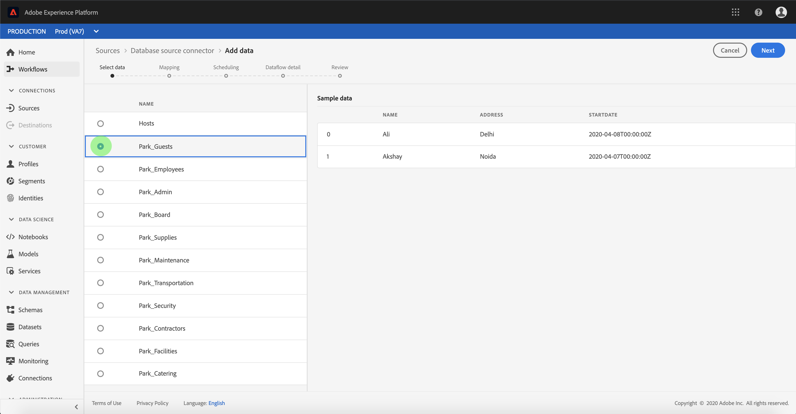

# Configurar um fluxo de dados para um conector de banco de dados na interface do usuário

Um fluxo de dados é uma tarefa programada que recupera e ingere dados de uma fonte para um conjunto de dados da plataforma. Este tutorial fornece etapas para configurar um novo fluxo de dados usando sua conta de banco de dados.

## Introdução

Este tutorial requer uma compreensão funcional dos seguintes componentes do Adobe Experience Platform:

- [[!DNL Experience Data Model] (XDM) Sistema](../../../../xdm/home.md): A estrutura padronizada pela qual o Experience Platform organiza os dados de experiência do cliente.
   - [Noções básicas da composição](../../../../xdm/schema/composition.md)do schema: Saiba mais sobre os elementos básicos dos schemas XDM, incluindo princípios-chave e práticas recomendadas na composição do schema.
   - [Tutorial](../../../../xdm/tutorials/create-schema-ui.md)do Editor de schemas: Saiba como criar schemas personalizados usando a interface do editor de Schemas.
- [[!DNL Perfil do cliente em tempo real]](../../../../profile/home.md): Fornece um perfil unificado e em tempo real para o consumidor, com base em dados agregados de várias fontes.

Além disso, este tutorial requer que você já tenha criado uma conta de banco de dados. Uma lista de tutoriais para criar diferentes conectores de banco de dados na interface do usuário pode ser encontrada na visão geral [dos conectores de](../../../home.md)origem.

## Selecionar dados

Depois de criar sua conta de banco de dados, a etapa **[!UICONTROL Selecionar dados]** é exibida, fornecendo uma interface interativa para que você explore sua hierarquia de banco de dados.

- A metade esquerda da interface é um navegador, exibindo a lista de bancos de dados de sua conta.
- A metade direita da interface permite que você pré-visualização até 100 linhas de dados.

Selecione o banco de dados que deseja usar e clique em **[!UICONTROL Avançar]**.

## Mapear campos de dados para um schema XDM

A etapa *Mapeamento* é exibida, fornecendo uma interface interativa para mapear os dados de origem para um conjunto de dados da Plataforma.

Escolha um conjunto de dados para os dados de entrada a serem ingeridos. Você pode usar um conjunto de dados existente ou criar um novo conjunto de dados.

### Usar um conjunto de dados existente

Para assimilar dados em um conjunto de dados existente, selecione Conjunto de dados **** existente e clique no ícone do conjunto de dados.

A caixa de diálogo **[!UICONTROL Selecionar conjunto de dados]** é exibida. Encontre o conjunto de dados que deseja usar, selecione-o e clique em **[!UICONTROL Continuar]**.

### Usar um novo conjunto de dados

Para assimilar dados em um novo conjunto de dados, selecione **[!UICONTROL Novo conjunto de dados]** e insira um nome e uma descrição para o conjunto de dados nos campos fornecidos.

É possível anexar um campo de schema inserindo um nome de schema na barra de pesquisa **[!UICONTROL Selecionar schema]** . Você também pode selecionar o ícone suspenso para ver uma lista de schemas existentes. Como alternativa, você pode selecionar Pesquisa **** avançada para acessar a tela de schemas existentes, incluindo seus respectivos detalhes.

A caixa de diálogo **[!UICONTROL Selecionar schema]** é exibida. Selecione o schema que deseja aplicar ao novo conjunto de dados e clique em **[!UICONTROL Concluído]**.

Com base em suas necessidades, você pode optar por mapear os campos diretamente ou usar as funções do mapeador para transformar dados de origem para derivar valores calculados ou calculados. Para obter mais informações sobre funções de mapeamento e mapeamento de dados, consulte o tutorial sobre como [mapear dados CSV para campos](../../../../ingestion/tutorials/map-a-csv-file.md)de schema XDM.

Depois que os dados de origem forem mapeados, clique em **[!UICONTROL Avançar]**.

## Execuções de ingestão agendada

A etapa **[!UICONTROL Agendamento]** é exibida, permitindo que você configure um agendamento de ingestão para assimilar automaticamente os dados de origem selecionados usando os mapeamentos configurados. A tabela a seguir descreve os diferentes campos configuráveis para programação:

| Campo | Descrição |
| --- | --- |
| Frequência | As frequências selecionáveis incluem `Once`, `Minute`, `Hour`, `Day`e `Week`. |
| Intervalo | Um número inteiro que define o intervalo para a frequência selecionada. |
| hora do start | Um carimbo de data e hora UTC indicando quando a primeira ingestão está definida para ocorrer. |
| Backfill | Um valor booliano que determina quais dados são inicialmente assimilados. Se o **[!UICONTROL preenchimento retroativo]** estiver ativado, todos os arquivos atuais no caminho especificado serão ingeridos durante a primeira ingestão programada. Se o **[!UICONTROL preenchimento retroativo]** estiver desativado, somente os arquivos carregados entre a primeira execução da ingestão e a hora **[!UICONTROL do]** Start serão assimilados. Os arquivos carregados antes da hora **[!UICONTROL do]** Start não serão ingeridos. |
| Coluna Delta | Uma opção com um conjunto filtrado de campos de schema de origem de tipo, data ou hora. Esse campo é usado para diferenciar entre dados novos e existentes. Os dados incrementais serão ingeridos com base no carimbo de data e hora da coluna selecionada. |

Os fluxos de dados são projetados para assimilar dados automaticamente de acordo com uma programação. Start selecionando a frequência da ingestão. Em seguida, defina o intervalo para designar o período entre duas execuções de fluxo. O valor do intervalo deve ser um número inteiro diferente de zero e deve ser definido como maior ou igual a 15.

Para definir a hora de ingestão do start, ajuste a data e a hora exibidas na caixa da hora do start. Como alternativa, você pode selecionar o ícone de calendário para editar o valor de hora do start. O tempo de start deve ser maior ou igual ao tempo UTC atual.

Selecione **[!UICONTROL Carregar dados incrementais por]** para atribuir a coluna delta. Este campo fornece uma distinção entre dados novos e existentes.

### Configurar um fluxo de dados de ingestão única

Para configurar a ingestão única, selecione a seta suspensa de frequência e selecione **[!UICONTROL Uma vez]**.

>[!TIP]
>
>**[!UICONTROL O intervalo]** e o preenchimento **[!UICONTROL retroativo]** não são visíveis durante uma ingestão única.

Depois de fornecer os valores apropriados para a programação, selecione **[!UICONTROL Avançar]**.

## Fornecer detalhes do fluxo de dados

A etapa de detalhes **[!UICONTROL do]** Dataflow é exibida, permitindo que você nomeie e forneça uma breve descrição sobre seu novo dataflow.

Durante esse processo, você também pode ativar a assimilação **[!UICONTROL parcial]** e o diagnóstico **[!UICONTROL de]** erro. Habilitar a ingestão **[!UICONTROL parcial]** fornece a capacidade de assimilar dados que contenham erros até um certo limite. Quando a ingestão **** parcial estiver ativada, arraste a discagem do limite de **[!UICONTROL Erro %]** para ajustar o limite de erro do lote. Como alternativa, você pode ajustar manualmente o limite selecionando a caixa de entrada. Para obter mais informações, consulte a visão geral da ingestão em lote parcial.
Forneça valores para o fluxo de dados e selecione **[!UICONTROL Próximo]**.

## Revisar seu fluxo de dados

A etapa **[!UICONTROL Revisar]** é exibida, permitindo que você revise seu novo fluxo de dados antes de ele ser criado. Os detalhes são agrupados nas seguintes categorias:

- **[!UICONTROL Conexão]**: Mostra o tipo de origem, o caminho relevante do arquivo de origem escolhido e a quantidade de colunas nesse arquivo de origem.
- **[!UICONTROL Atribuir campos]** do conjunto de dados e mapear: Mostra em qual conjunto de dados os dados de origem estão sendo assimilados, incluindo o schema ao qual o conjunto de dados adere.
- **[!UICONTROL Agendamento]**: Mostra o período ativo, a frequência e o intervalo do agendamento da ingestão.

Depois de revisar seu fluxo de dados, clique em **[!UICONTROL Concluir]** e aguarde algum tempo para que o fluxo de dados seja criado.

## Monitore seu fluxo de dados

Depois que seu fluxo de dados for criado, você poderá monitorar os dados que estão sendo assimilados por ele para ver informações sobre taxas de ingestão, sucesso e erros. Para obter mais informações sobre como monitorar o fluxo de dados, consulte o tutorial sobre contas de [monitoramento e fluxos de dados na interface do usuário](../monitor.md).

## Excluir seu fluxo de dados

Você pode excluir fluxos de dados que não são mais necessários ou foram criados incorretamente usando a função **[!UICONTROL Excluir]** disponível na área de trabalho **[!UICONTROL Fluxos de dados]** . Para obter mais informações sobre como excluir fluxos de dados, consulte o tutorial sobre como [excluir fluxos de dados na interface do usuário](../delete.md).

## Próximas etapas

Ao seguir este tutorial, você criou com êxito um fluxo de dados para trazer dados de um banco de dados externo e obteve informações sobre o monitoramento de conjuntos de dados. Os dados recebidos agora podem ser usados por [!DNL Platform] serviços de downstream, como [!DNL Real-time Customer Profile] e [!DNL Data Science Workspace]. Consulte os seguintes documentos para obter mais detalhes:

- [[!DNL Real-time Customer Profile] visão geral](../../../../profile/home.md)
- [[!DNL Data Science Workspace] visão geral](../../../../data-science-workspace/home.md)

## Apêndice

As seções a seguir fornecem informações adicionais para trabalhar com conectores de origem.

### Desativar um fluxo de dados

Quando um fluxo de dados é criado, ele imediatamente se torna ativo e ingere dados de acordo com o agendamento que foi fornecido. Você pode desativar um fluxo de dados ativo a qualquer momento seguindo as instruções abaixo.

Na área de trabalho **[!UICONTROL Fontes]** , selecione a guia **[!UICONTROL Fluxos de dados]** . Em seguida, selecione o fluxo de dados que deseja desativar.

A coluna **[!UICONTROL Propriedades]** é exibida no lado direito da tela, incluindo um botão de alternância **[!UICONTROL Ativado]** . Selecione a alternância para desativar o fluxo de dados. A mesma alternância pode ser usada para reativar um fluxo de dados depois que ele for desativado.

### Ativar dados de entrada para [!DNL Profile] população

Os dados de entrada do conector de origem podem ser usados para enriquecer e preencher seus [!DNL Real-time Customer Profile] dados. Para obter mais informações sobre como preencher seus [!DNL Real-time Customer Profile] dados, consulte o tutorial sobre a população [do](../profile.md)Perfil.