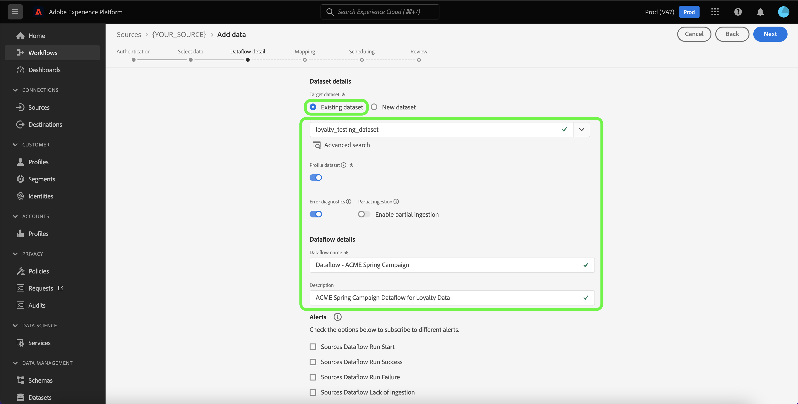

# Criar um fluxo de dados usando uma origem de protocolos na interface

Um fluxo de dados é uma tarefa agendada que recupera e assimila dados de uma origem para um conjunto de dados na Adobe Experience Platform. Este tutorial fornece etapas sobre como criar um fluxo de dados para uma origem de protocolos usando a interface do usuário da plataforma.

>[!NOTE]
>
>Para criar um fluxo de dados, você já deve ter uma conta autenticada com uma origem de protocolos. Uma lista de tutoriais para criar diferentes contas de origem de protocolos na interface do usuário pode ser encontrada no [visão geral das origens](../../../home.md#protocols).

## Introdução

Este tutorial requer uma compreensão funcional dos seguintes componentes da Platform:

* [Origens](../../../home.md): a Platform permite que os dados sejam assimilados de várias fontes e fornece a capacidade de estruturar, rotular e aprimorar os dados recebidos usando o [!DNL Platform] serviços.
* [[!DNL Experience Data Model (XDM)] Sistema](../../../../xdm/home.md): a estrutura padronizada pela qual o Experience Platform organiza os dados de experiência do cliente.
   * [Noções básicas da composição do esquema](../../../../xdm/schema/composition.md): saiba mais sobre os componentes básicos dos esquemas XDM, incluindo princípios fundamentais e práticas recomendadas na composição do esquema.
   * [Tutorial do Editor de esquemas](../../../../xdm/tutorials/create-schema-ui.md): saiba como criar esquemas personalizados usando a interface do Editor de esquemas.
* [[!DNL Real-Time Customer Profile]](../../../../profile/home.md): fornece um perfil de consumidor unificado em tempo real com base em dados agregados de várias fontes.
* [[!DNL Data Prep]](../../../../data-prep/home.md): permite que os engenheiros de dados mapeiem, transformem e validem dados de e para o Experience Data Model (XDM).

## Adicionar dados

Após criar a conta de origem dos protocolos, a variável **[!UICONTROL Adicionar dados]** é exibida, fornecendo uma interface para que você explore a hierarquia de tabelas da conta de origem de protocolos.

* A metade esquerda da interface é um navegador que exibe uma lista das tabelas de dados contidas na sua conta. A interface também inclui uma opção de pesquisa que permite identificar rapidamente os dados de origem que você pretende usar.
* A metade direita da interface é um painel de visualização, que permite visualizar até 100 linhas de dados.

>[!NOTE]
>
>A opção pesquisar dados de origem está disponível para todas as origens com base em tabela, excluindo o Adobe Analytics, [!DNL Amazon Kinesis], e [!DNL Azure Event Hubs].

Depois de localizar os dados de origem, selecione a tabela e, em seguida, **[!UICONTROL Próxima]**.

## Fornecer detalhes do fluxo de dados

A variável [!UICONTROL Detalhes do fluxo de dados] permite selecionar se deseja usar um conjunto de dados existente ou um novo conjunto de dados. Durante esse processo, você também pode definir configurações para [!UICONTROL Conjunto de dados Perfil], [!UICONTROL Diagnóstico de erro], [!UICONTROL Assimilação parcial], e [!UICONTROL Alertas].

### Usar um conjunto de dados existente

Para assimilar dados em um conjunto de dados existente, selecione **[!UICONTROL Conjunto de dados existente]**. É possível recuperar um conjunto de dados existente usando o [!UICONTROL Pesquisa avançada] ou rolando pela lista de conjuntos de dados existentes no menu suspenso. Depois de selecionar um conjunto de dados, forneça um nome e uma descrição para o fluxo de dados.

### Usar um novo conjunto de dados

Para assimilar em um novo conjunto de dados, selecione **[!UICONTROL Novo conjunto de dados]** e forneça um nome de conjunto de dados de saída e uma descrição opcional. Em seguida, selecione um esquema para mapear usando o [!UICONTROL Pesquisa avançada] ou rolando pela lista de esquemas existentes no menu suspenso. Depois de selecionar um esquema, forneça um nome e uma descrição para o fluxo de dados.

### Ativar [!DNL Profile] e diagnóstico de erro

Em seguida, selecione o **[!UICONTROL Conjunto de dados Perfil]** ativar ou desativar o conjunto de dados para [!DNL Profile]. Isso permite criar uma visualização integral dos atributos e comportamentos de uma entidade. Dados de todos [!DNL Profile]Os conjuntos de dados habilitados para serão incluídos no [!DNL Profile] As alterações e são aplicadas quando você salva o fluxo de dados.

[!UICONTROL Diagnóstico de erro] permite a geração de mensagens de erro detalhadas para qualquer registro incorreto que ocorra em seu fluxo de dados, enquanto [!UICONTROL Assimilação parcial] O permite assimilar dados que contêm erros, até um determinado limite definido manualmente. Consulte a [visão geral da assimilação parcial de lotes](../../../../ingestion/batch-ingestion/partial.md) para obter mais informações.

### Ativar alertas

Você pode ativar os alertas para receber notificações sobre o status do fluxo de dados. Selecione um alerta na lista para assinar e receber notificações sobre o status do seu fluxo de dados. Para obter mais informações sobre alertas, consulte o manual sobre [assinatura de alertas de origens usando a interface do usuário](../alerts.md).

Quando terminar de fornecer detalhes ao seu fluxo de dados, selecione **[!UICONTROL Próxima]**.

## Mapear campos de dados para um esquema XDM

A variável [!UICONTROL Mapeamento] é exibida, fornecendo uma interface para mapear os campos de origem do esquema de origem para os campos XDM de destino apropriados no esquema de destino.

A Platform fornece recomendações inteligentes para campos mapeados automaticamente com base no esquema ou conjunto de dados de destino selecionado. Você pode ajustar manualmente as regras de mapeamento para atender aos seus casos de uso. Com base nas suas necessidades, você pode optar por mapear campos diretamente ou usar funções de preparação de dados para transformar dados de origem para derivar valores calculados ou calculados. Para obter etapas abrangentes sobre o uso da interface do mapeador e campos calculados, consulte o [Guia da interface de preparação de dados](../../../../data-prep/ui/mapping.md).

Depois que os dados de origem forem mapeados com sucesso, selecione **[!UICONTROL Próxima]**.

## Programar execuções de assimilação

A variável [!UICONTROL Agendamento] Esta etapa permite configurar uma programação de assimilação para assimilar automaticamente os dados de origem selecionados usando os mapeamentos configurados. Por padrão, o agendamento está definido como `Once`. Para ajustar a frequência de assimilação, selecione **[!UICONTROL Frequência]** e selecione uma opção no menu suspenso.

>[!TIP]
>
>O intervalo e o preenchimento retroativo não ficam visíveis durante uma assimilação única.

Se você definir a frequência de assimilação como `Minute`, `Hour`, `Day`ou `Week`, você deve definir um intervalo para estabelecer um intervalo de tempo definido entre cada assimilação. Por exemplo, uma frequência de assimilação definida como `Day` e um intervalo definido como `15` significa que seu fluxo de dados está programado para assimilar dados a cada 15 dias.

Durante essa etapa, você também pode ativar **preenchimento retroativo** e definir uma coluna para a assimilação incremental de dados. O preenchimento retroativo é usado para assimilar dados históricos, enquanto a coluna definida para assimilação incremental permite que novos dados sejam diferenciados dos dados existentes.

Consulte a tabela abaixo para obter mais informações sobre como programar configurações.

| Campo | Descrição |
| --- | --- |
| Frequência | A frequência na qual ocorre uma assimilação. As frequências selecionáveis incluem `Once`, `Minute`, `Hour`, `Day`, e `Week`. |
| Interval | Um número inteiro que define o intervalo para a frequência selecionada. O valor do intervalo deve ser um inteiro diferente de zero e deve ser definido como maior ou igual a 15. |
| Hora de início | Um carimbo de data e hora UTC que indica quando a primeira assimilação está definida para ocorrer. A hora de início deve ser maior ou igual à hora UTC atual. |
| Preenchimento retroativo | Um valor booleano que determina quais dados são assimilados inicialmente. Se o preenchimento retroativo estiver ativado, todos os arquivos atuais no caminho especificado serão assimilados durante a primeira assimilação agendada. Se o preenchimento retroativo estiver desativado, somente os arquivos carregados entre a primeira execução da assimilação e a hora de início serão assimilados. Os arquivos carregados antes da hora de início não serão assimilados. |
| Carregar dados incrementais por | Uma opção com um conjunto filtrado de campos de esquema de origem de tipo, data ou hora. O campo selecionado para **[!UICONTROL Carregar dados incrementais por]** O deve ter seus valores de data e hora no fuso horário UTC para carregar corretamente os dados incrementais. Todas as origens de lote baseadas em tabela selecionam dados incrementais comparando um valor de carimbo de data/hora da coluna delta com a janela de execução de fluxo correspondente Horário UTC e, em seguida, copiando os dados da origem, se algum dado novo for encontrado na janela de tempo UTC. |

## Revisar seu fluxo de dados

A variável **[!UICONTROL Revisão]** é exibida, permitindo que você revise seu novo fluxo de dados antes de ele ser criado. Os detalhes são agrupados nas seguintes categorias:

* **[!UICONTROL Conexão]**: mostra o tipo de origem, o caminho relevante do arquivo de origem escolhido e a quantidade de colunas nesse arquivo de origem.
* **[!UICONTROL Atribuir conjunto de dados e mapear campos]**: mostra em qual conjunto de dados os dados de origem estão sendo assimilados, incluindo o esquema ao qual o conjunto de dados adere.
* **[!UICONTROL Agendamento]**: mostra o período, a frequência e o intervalo ativos da programação de assimilação.

Depois de revisar o fluxo de dados, selecione **[!UICONTROL Concluir]** e aguarde algum tempo para criar o fluxo de dados.

## Monitorar seu fluxo de dados

Depois que o fluxo de dados for criado, você poderá monitorar os dados que estão sendo assimilados por meio dele para ver informações sobre taxas de assimilação, sucesso e erros. Para obter mais informações sobre como monitorar o fluxo de dados, consulte o tutorial em [monitoramento de contas e fluxos de dados na interface do](../monitor.md).

## Excluir seu fluxo de dados

É possível excluir fluxos de dados que não são mais necessários ou que foram criados incorretamente usando o **[!UICONTROL Excluir]** disponível na **[!UICONTROL Fluxos de dados]** espaço de trabalho. Para obter mais informações sobre como excluir fluxos de dados, consulte o tutorial sobre [exclusão de fluxos de dados na interface](../delete.md).

## Próximas etapas

Ao seguir este tutorial, você criou com sucesso um fluxo de dados para trazer dados da origem dos protocolos para a Platform. Os dados recebidos agora podem ser usados pelo downstream [!DNL Platform] serviços como [!DNL Real-Time Customer Profile] e [!DNL Data Science Workspace]. Consulte os seguintes documentos para obter mais detalhes:

* [Visão geral do [!DNL Real-Time Customer Profile]](../../../../profile/home.md)
* [Visão geral do [!DNL Data Science Workspace]](../../../../data-science-workspace/home.md)

>[!WARNING]
>
> A interface do usuário da Platform mostrada no vídeo a seguir está desatualizada. Consulte a documentação acima para obter as capturas de tela e a funcionalidade mais recentes da interface.
>
>[!VIDEO](https://video.tv.adobe.com/v/29711?quality=12&learn=on)