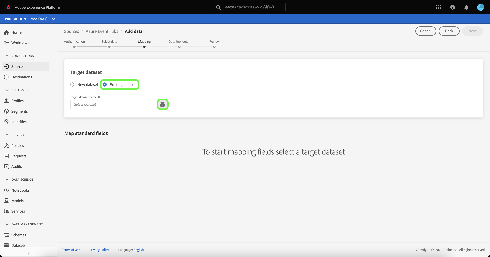
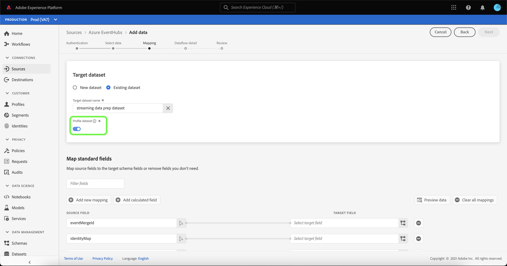

# Crie um fluxo de dados para uma fonte de armazenamento em nuvem na interface do usuário do

Um fluxo de dados é uma tarefa agendada que recupera e assimila dados de uma fonte para um conjunto de dados da Adobe Experience Platform. Este tutorial fornece etapas para criar um fluxo de dados de fluxo para uma fonte de armazenamento em nuvem na interface do usuário do .

Antes de tentar este tutorial, primeiro você deve estabelecer uma conexão válida e autenticada entre sua conta de armazenamento em nuvem e a Plataforma. Se você ainda não tiver uma conexão autenticada, consulte um dos seguintes tutoriais para obter informações sobre como autenticar suas contas de armazenamento da nuvem de fluxo:

- [[!DNL Amazon Kinesis]](../../../ui/create/cloud-storage/kinesis.md)
- [[!DNL Azure Event Hubs]](../../../ui/create/cloud-storage/eventhub.md)
- [[!DNL Google PubSub]](../../../ui/create/cloud-storage/google-pubsub.md)

## Introdução

Este tutorial requer uma compreensão funcional dos seguintes componentes do Adobe Experience Platform:

- [Fluxos de dados](../../../../../dataflows/home.md): Os fluxos de dados são uma representação de trabalhos de dados que movem dados pela Plataforma. Os fluxos de dados são configurados em diferentes serviços, de fontes, para [!DNL Identity Service], para [!DNL Profile] e para [!DNL Destinations].
- [Preparação](../../../../../data-prep/home.md) de dados: A Preparação de dados permite que os engenheiros de dados mapeiem, transformem e validem dados de e para o Experience Data Model (XDM). A Preparação de dados aparece como uma etapa &quot;Mapa&quot; nos processos de Assimilação de dados, incluindo o fluxo de trabalho de Assimilação CSV.
- [[!DNL Experience Data Model (XDM)] Sistema](../../../../../xdm/home.md): A estrutura padronizada pela qual  [!DNL Experience Platform] organiza os dados de experiência do cliente.
   - [Noções básicas da composição](../../../../../xdm/schema/composition.md) do schema: Saiba mais sobre os elementos básicos dos esquemas XDM, incluindo princípios-chave e práticas recomendadas na composição do schema.
   - [Tutorial](../../../../../xdm/tutorials/create-schema-ui.md) do Editor de esquema: Saiba como criar esquemas personalizados usando a interface do Editor de esquemas.
- [[!DNL Real-time Customer Profile]](../../../../../profile/home.md): Fornece um perfil de consumidor unificado e em tempo real com base em dados agregados de várias fontes.

## Adicionar dados

Depois de criar a autenticação da conta de armazenamento da nuvem de transmissão, a etapa **[!UICONTROL Selecionar dados]** é exibida, fornecendo uma interface para selecionar qual fluxo de dados você trará para a Plataforma.

- A parte esquerda da interface é um navegador que permite visualizar os fluxos de dados disponíveis em sua conta;
- A parte direita da interface permite visualizar até 100 linhas de dados de um arquivo JSON.

Selecione o fluxo de dados que deseja usar e selecione **[!UICONTROL Choose file]** para fazer upload de um esquema de amostra.

>[!TIP]
>
>Se os dados forem compatíveis com XDM, você poderá ignorar o upload de um schema de amostra e selecionar **[!UICONTROL Next]** para prosseguir.

Depois que o esquema é carregado, a interface de visualização é atualizada para exibir uma pré-visualização do esquema carregado. A interface de visualização permite inspecionar o conteúdo e a estrutura de um arquivo. Você também pode usar o utilitário [!UICONTROL Search field] para acessar itens específicos de dentro do esquema.

Quando terminar, selecione **[!UICONTROL Next]**.

## Mapeamento

A etapa **[!UICONTROL Mapeamento]** é exibida, fornecendo uma interface para mapear os dados de origem para um conjunto de dados da plataforma.

Escolha um conjunto de dados para os dados de entrada que serão assimilados. Você pode usar um conjunto de dados existente ou criar um novo.

### Novo conjunto de dados

Para assimilar dados em um novo conjunto de dados, selecione **[!UICONTROL New dataset]** e insira um nome e uma descrição para o conjunto de dados nos campos fornecidos. Para adicionar um schema, você pode inserir um nome de schema existente na caixa de diálogo **[!UICONTROL Selecionar schema]**. Como alternativa, você pode selecionar **[!UICONTROL Schema advanced search]** para procurar um schema apropriado.

A janela [!UICONTROL Select schema] é exibida, fornecendo uma lista de schemas disponíveis para escolha. Selecione um schema na lista para atualizar o painel direito para exibir detalhes específicos do schema selecionado, incluindo informações sobre se o schema está ativado para [!DNL Profile].

Depois de identificar e selecionar o schema que deseja usar, selecione **[!UICONTROL Concluído]**.

A página [!UICONTROL Conjunto de dados do Target] é atualizada com o esquema selecionado exibido como parte do conjunto de dados. Durante essa etapa, você pode ativar seu conjunto de dados para [!DNL Profile] e criar uma exibição holística dos atributos e comportamentos de uma entidade. Os dados de todos os conjuntos de dados ativados serão incluídos em [!DNL Profile] e as alterações serão aplicadas quando você salvar o fluxo de dados.

Alterne o botão **[!UICONTROL Conjunto de dados de perfil]** para ativar seu conjunto de dados de destino para [!DNL Profile].

### Conjunto de dados existente

Para assimilar dados em um conjunto de dados existente, selecione **[!UICONTROL Conjunto de dados existente]** e selecione o ícone do conjunto de dados.

A caixa de diálogo **[!UICONTROL Selecionar conjunto de dados]** é exibida, fornecendo uma lista de conjuntos de dados disponíveis para escolha. Selecione um conjunto de dados na lista para atualizar o painel direito para exibir detalhes específicos do conjunto de dados selecionado, incluindo informações sobre se o conjunto de dados pode ser ativado para [!DNL Profile].

Depois de identificar e selecionar o conjunto de dados que deseja usar, selecione **[!UICONTROL Concluído]**.

Depois de selecionar seu conjunto de dados, selecione a opção [!DNL Profile] para ativar seu conjunto de dados para [!DNL Profile].

### Mapear campos padrão

Com seu conjunto de dados e esquema estabelecidos, a interface **[!UICONTROL Mapear campos padrão]** é exibida, permitindo que você configure manualmente campos de mapeamento para seus dados.

>[!TIP]
>
>A Platform fornece recomendações inteligentes para campos mapeados automaticamente com base no esquema de destino ou conjunto de dados selecionado. Você pode ajustar manualmente as regras de mapeamento de acordo com seus casos de uso.

Com base em suas necessidades, você pode optar por mapear campos diretamente ou usar funções de preparação de dados para transformar dados de origem em valores calculados ou calculados. Para obter mais informações sobre funções do mapeador e campos calculados, consulte o [Guia de funções de Preparação de Dados](../../../../../data-prep/functions.md) ou o [guia de campos calculados](../../../../../data-prep/calculated-fields.md).

Depois que os dados de origem forem mapeados, selecione **[!UICONTROL Next]**.

## Detalhes do fluxo de dados

A etapa **[!UICONTROL Detalhes do fluxo de dados]** é exibida, permitindo nomear e fornecer uma breve descrição sobre o novo fluxo de dados.

Forneça valores para o fluxo de dados e selecione **[!UICONTROL Next]**.

### Revisão

A etapa **[!UICONTROL Revisar]** é exibida, permitindo que você revise o novo fluxo de dados antes de ele ser criado. Os detalhes são agrupados nas seguintes categorias:

- **[!UICONTROL Conexão]**: Exibe o nome da conta, o tipo de origem e outras informações diversas específicas da fonte de armazenamento da nuvem de transmissão que você está usando.
- **[!UICONTROL Atribuir conjunto de dados e mapear campos]**: Exibe o conjunto de dados de destino e o esquema usado para o fluxo de dados.

Depois de revisar o fluxo de dados, selecione **[!UICONTROL Finish]** e aguarde algum tempo para que o fluxo de dados seja criado.

## Monitorar e excluir o fluxo de dados

Depois que o fluxo de dados do armazenamento em nuvem de transmissão for criado, você poderá monitorar os dados que estão sendo assimilados por meio dele. Para obter mais informações sobre como monitorar e excluir fluxos de dados de transmissão, consulte o tutorial em [monitorando fluxos de dados de transmissão](../../monitor-streaming.md).

## Próximas etapas

Ao seguir este tutorial, você criou com êxito um fluxo de dados para transmitir dados de uma fonte de armazenamento em nuvem. Os dados recebidos agora podem ser usados por serviços downstream da plataforma, como [!DNL Real-time Customer Profile] e [!DNL Data Science Workspace]. Consulte os seguintes documentos para obter mais detalhes:

- [[!DNL Real-time Customer Profile] visão geral](../../../../../profile/home.md)
- [[!DNL Data Science Workspace] visão geral](../../../../../data-science-workspace/home.md)