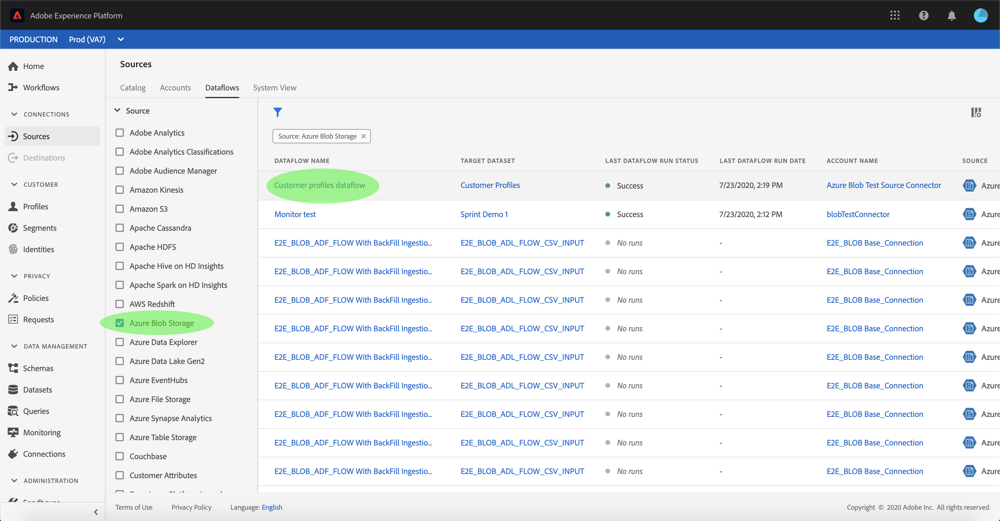

# Excluir fluxos de dados

Os conectores de origem na Adobe Experience Platform fornecem a capacidade de assimilar dados de origem externa de forma programada. Este tutorial fornece etapas para excluir fluxos de dados da área de trabalho *[!UICONTROL Fontes]* .

## Introdução

Este tutorial requer uma compreensão funcional dos seguintes componentes do Adobe Experience Platform:

- [Sistema](../../../xdm/home.md)do Experience Data Model (XDM): A estrutura padronizada pela qual [!DNL Experience Platform] organiza os dados de experiência do cliente.
   - [Noções básicas da composição](../../../xdm/schema/composition.md)do schema: Saiba mais sobre os elementos básicos dos schemas XDM, incluindo princípios-chave e práticas recomendadas na composição do schema.
   - [Tutorial](../../../xdm/tutorials/create-schema-ui.md)do Editor de schemas: Saiba como criar schemas personalizados usando a interface do editor de Schemas.
- [Perfil](../../../profile/home.md)do cliente em tempo real: Fornece um perfil unificado e em tempo real para o consumidor, com base em dados agregados de várias fontes.

## Excluir fluxos de dados usando a interface do usuário

Faça logon no [Adobe Experience Platform](https://platform.adobe.com) e selecione **[!UICONTROL Fontes]** na barra de navegação esquerda para acessar a área de trabalho *[!UICONTROL Fontes]* . A tela *[!UICONTROL Catálogo]* exibe várias fontes com as quais você pode criar contas e fluxos de dados. Cada fonte mostra o número de contas e fluxos de dados existentes associados a elas.

Selecione **[!UICONTROL Fluxos de dados]** para acessar a página *[!UICONTROL Fluxos de dados]* .

Uma lista de fluxos de dados existentes é exibida. Nesta página há uma lista de informações classificáveis para fluxos de dados existentes, como origem, nome de usuário, status de execução e data da última execução. Selecione o ícone **de** funil na parte superior esquerda para classificar.

O painel de classificação é exibido no lado esquerdo da tela, contendo uma lista de fontes disponíveis.
É possível selecionar mais de uma fonte usando a função de classificação.

Selecione a fonte que deseja acessar e localize o fluxo de dados que deseja excluir da lista de fluxos de dados na interface principal. No exemplo, a fonte selecionada é o Armazenamento **Blob do** Azure e o nome do fluxo de dados é o fluxo de dados de perfis **do cliente**. Ao selecionar várias fontes do painel de classificação, seus fluxos de dados criados mais recentemente aparecem primeiro porque a lista é classificada por data criada.

Selecione o fluxo de dados que você deseja excluir.

O painel *[!UICONTROL Propriedades]* é exibido no lado direito da tela, contendo informações relacionadas ao fluxo de dados selecionado, bem como uma opção para *[!UICONTROL Editar agendamento]*.

Para excluir o fluxo de dados, selecione **[!UICONTROL Excluir]**.

Uma caixa de diálogo de confirmação final é exibida; selecione **[!UICONTROL Excluir]** para concluir o processo.

Após alguns instantes, uma caixa de confirmação verde é exibida na parte inferior da tela para confirmar a exclusão bem-sucedida.

## Próximas etapas

Ao seguir este tutorial, você acessou com êxito contas e fluxos de dados existentes na área de trabalho *[!UICONTROL Fontes]* . Os dados recebidos agora podem ser usados por [!DNL Platform] serviços de downstream, como [!DNL Real-time Customer Profile] e [!DNL Data Science Workspace]. Consulte os seguintes documentos para obter mais detalhes:

- [Visão geral do Perfil do cliente em tempo real](../../../profile/home.md)
- [Visão geral da Análise do espaço de trabalho da Data Science](../../../data-science-workspace/home.md)