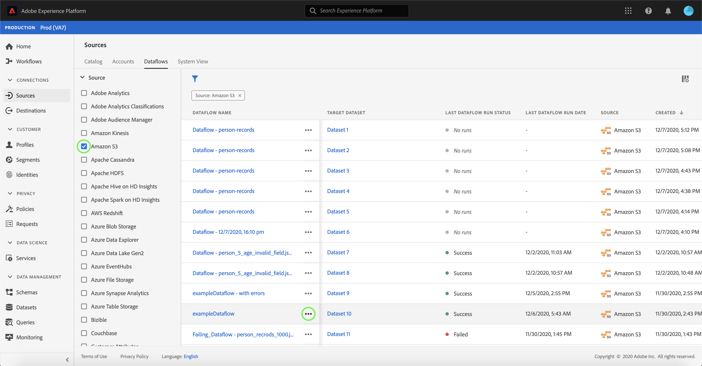

# Excluir fluxos de dados na interface do usuário

O espaço de trabalho [!UICONTROL Sources] permite excluir fluxos de dados de lote e fluxo que contêm erros ou que se tornaram obsoletos.

Este tutorial fornece etapas para excluir fluxos de dados usando o espaço de trabalho [!UICONTROL Sources] .

## Introdução

Este tutorial requer uma compreensão funcional dos seguintes componentes do Adobe Experience Platform:

- [Fontes](../../home.md):  [!DNL Experience Platform] O permite que os dados sejam assimilados de várias fontes, além de fornecer a você a capacidade de estruturar, rotular e aprimorar os dados recebidos usando  [!DNL Platform] serviços.
- [Sandboxes](../../../sandboxes/home.md):  [!DNL Experience Platform] O fornece sandboxes virtuais que particionam uma única  [!DNL Platform] instância em ambientes virtuais separados para ajudar a desenvolver aplicativos de experiência digital.

## Excluir fluxos de dados

Na [UI do Experience Platform](https://platform.adobe.com), selecione **[!UICONTROL Sources]** na navegação à esquerda para acessar o espaço de trabalho [!UICONTROL Sources] e selecione **[!UICONTROL Dataflows]** no cabeçalho superior.

A página **[!UICONTROL Dataflows]** é exibida. Nesta página, há uma lista de fluxos de dados visualizáveis, incluindo informações sobre o conjunto de dados de destino, a fonte, o nome da conta e a data de criação.

Selecione o ícone de filtro () na parte superior esquerda para iniciar o painel de classificação.

O painel de classificação fornece uma lista de todas as fontes. Você pode selecionar mais de uma fonte na lista para acessar uma seleção filtrada de fluxos de dados associada às fontes específicas selecionadas.

Selecione a fonte com a qual deseja trabalhar para ver uma lista de seus fluxos de dados existentes. Depois de identificar o fluxo de dados que deseja excluir, selecione as reticências (`...`) ao lado do nome do fluxo de dados.

Um menu suspenso é exibido, fornecendo opções para editar a programação do fluxo de dados, desativar o fluxo de dados ou excluí-lo totalmente.

Selecione **[!UICONTROL Delete]** para excluir o fluxo de dados.

Uma caixa de diálogo de confirmação final é exibida. Selecione **[!UICONTROL Delete]** para concluir o processo.

Após alguns instantes, uma caixa de confirmação será exibida na parte inferior da tela para confirmar uma exclusão bem-sucedida.

## Próximas etapas

Ao seguir este tutorial, você usou com êxito o espaço de trabalho [!UICONTROL Sources] para excluir um fluxo de dados existente.

Consulte o tutorial em [excluir fluxos de dados usando a API do Serviço de Fluxo](../../tutorials/api/delete-dataflows.md) para obter etapas sobre como executar essas operações programaticamente usando chamadas de API.
