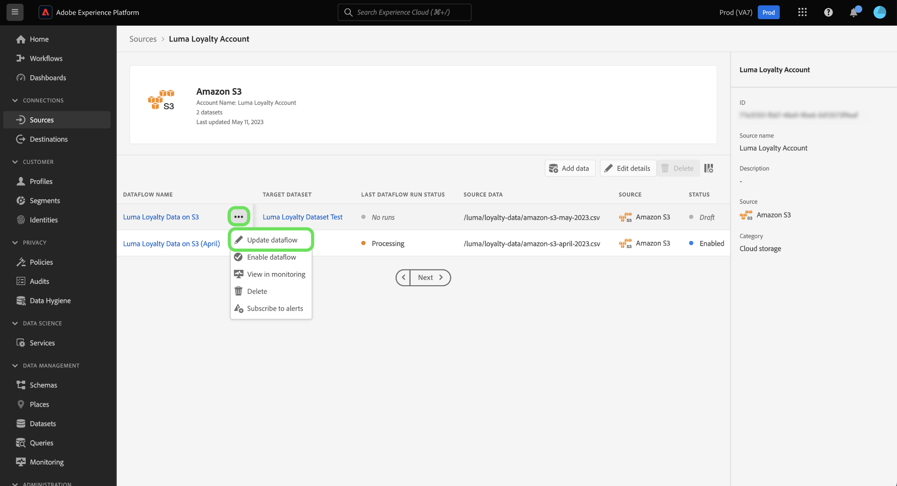
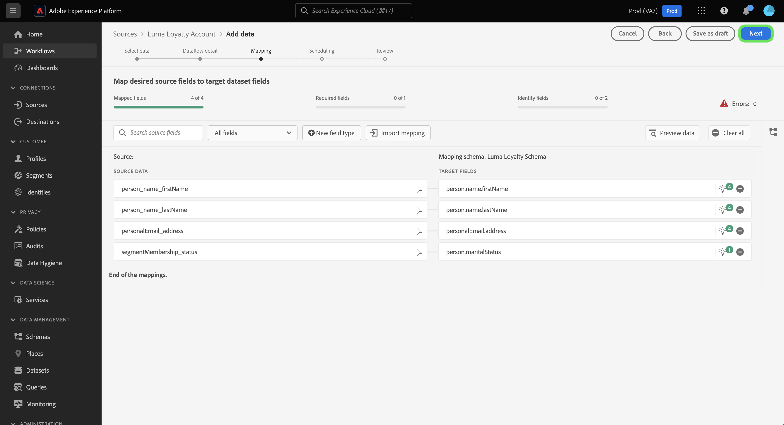

# Rascunhos de fluxos de dados na interface do

Salve o progresso do fluxo de trabalho de assimilação de dados não concluído definindo o fluxo de dados para um status de rascunho. Você pode retomar e concluir seus fluxos de dados de rascunho posteriormente.

Este documento fornece etapas sobre como salvar seus fluxos de dados ao usar o espaço de trabalho de origens na interface do Adobe Experience Platform.

## Introdução

Este documento requer uma compreensão funcional dos seguintes componentes do Adobe Experience Platform:

* [Origens](../../home.md): o Experience Platform permite que os dados sejam assimilados de várias fontes e, ao mesmo tempo, fornece a capacidade de estruturar, rotular e aprimorar os dados recebidos usando os serviços da plataforma.

## Salvar um fluxo de dados como rascunho

Você pode pausar o progresso da criação do fluxo de dados a qualquer momento depois de selecionar os dados que trará para a Plataforma.

Por exemplo, se você quiser salvar seu progresso durante a etapa de detalhes do fluxo de dados, selecione **[!UICONTROL Salvar como rascunho]**.

Depois de salvar o rascunho, você será levado para a página da conta, onde poderá ver uma lista dos fluxos de dados existentes, incluindo os rascunhos.

>[!TIP]
>
>Os fluxos de dados de rascunho não serão ativados e terão seu status definido como `draft`.

Para continuar no rascunho, selecione as reticências (`...`) ao lado do nome do fluxo de dados e selecione **[!UICONTROL Atualizar fluxo de dados]**.

>[!NOTE]
>
>Se o rascunho incluir informações de programação, a janela suspensa também oferecerá a opção de **[!UICONTROL Editar programação]**.

### Acessar seus rascunhos do catálogo de origem

Você também pode acessar seus fluxos de dados de rascunho pelo catálogo de fluxos de dados. Selecionar **[!UICONTROL Fluxos de dados]** no cabeçalho superior para acessar o catálogo de fluxos de dados. Aqui, encontre seu rascunho na lista de fluxos de dados existentes em sua organização, selecione as reticências (`...`) ao lado do nome e selecione **[!UICONTROL Atualizar fluxo de dados]**.

## Publicar seu fluxo de dados de rascunho

Você retornará à janela [!UICONTROL Adicionar dados] etapa do fluxo de trabalho de origens, em que você pode reconfirmar o formato dos dados e continuar avançando no fluxo de dados.

Depois de confirmar a formatação, o delimitador e o tipo de compactação dos dados, selecione **[!UICONTROL Próxima]** para continuar.

Em seguida, confirme os detalhes do fluxo de dados. Use a interface de detalhes do fluxo de dados para atualizar as configurações relacionadas ao nome, à descrição, à assimilação parcial, às configurações de diagnóstico de erros e às preferências de alerta do fluxo de dados.

Após concluir as configurações, selecione **[!UICONTROL Próxima]** para continuar.

A variável [!UICONTROL Mapeamento] é exibida. Durante essa etapa, você pode reconfigurar as configurações de mapeamento do fluxo de dados. Para obter um guia abrangente sobre as funções de preparação de dados usadas para mapeamento, visite o [guia da interface de preparação de dados](../../../data-prep/ui/mapping.md).

Após concluir a reconfiguração de mapeamento, selecione **[!UICONTROL Próxima]** para continuar.

Use o [!UICONTROL Agendamento] etapa para estabelecer um agendamento de assimilação para seu fluxo de dados. É possível definir a frequência de assimilação como `once`, `minute`, `hour`, `day`ou `week`. Quando terminar, selecione **[!UICONTROL Próxima]** para continuar.

Por fim, revise os detalhes do fluxo de dados e selecione **[!UICONTROL Concluir]** para publicar seu rascunho.

Depois de salvar e publicar um rascunho, o fluxo de dados será ativado e você não poderá mais redefini-lo como rascunho.

## Próximas etapas

Seguindo este tutorial, você aprendeu a salvar seu progresso e definir um fluxo de dados como rascunho. Para obter mais informações sobre fontes, visite o [visão geral das origens](../../home.md).
