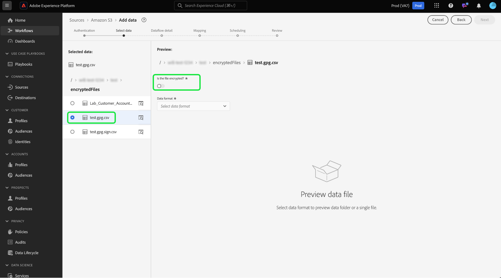

# Assimilar dados criptografados na interface do usuário de origens

Você pode assimilar arquivos e pastas de dados criptografados para a Adobe Experience Platform usando fontes de lote de armazenamento na nuvem. Com a assimilação de dados criptografados, você pode aproveitar os mecanismos assimétricos de criptografia para transferir com segurança os dados em lote para o Experience Platform. Os mecanismos de criptografia assimétrica compatíveis são PGP e GPG.

Leia este guia para saber como assimilar dados criptografados com fontes em lote de armazenamento na nuvem usando a interface do.

## Introdução

Antes de continuar com este tutorial, leia os seguintes documentos para entender melhor os seguintes recursos e conceitos do Experience Platform.

* [Fontes](../../home.md): use fontes no Experience Platform para assimilar dados de um aplicativo do Adobe ou de uma fonte de dados de terceiros.
* [Fluxos de dados](../../../dataflows/home.md): fluxos de dados são representações de trabalhos de dados que movem dados pela Experience Platform. Você pode usar o espaço de trabalho de origens para criar fluxos de dados que assimilam dados de uma determinada origem para a Experience Platform.
* [Sandboxes](../../../sandboxes/home.md): use sandboxes no Experience Platform para criar partições virtuais entre as instâncias do Experience Platform e criar ambientes dedicados ao desenvolvimento ou produção.

### Estrutura de tópicos de alto nível

* Crie um par de chaves de criptografia usando o espaço de trabalho de origens na interface do usuário do Experience Platform.
   * Como opção, você também pode criar seu próprio par de chaves de verificação de assinatura para fornecer uma camada adicional de segurança para seus dados criptografados.
* Use a chave pública do seu par de chaves de criptografia para criptografar os dados.
* Coloque os dados criptografados no armazenamento na nuvem. Durante essa etapa, você também deve garantir que tenha um arquivo de amostra de seus dados no armazenamento na nuvem que possa ser usado como referência para mapear seus dados de origem para um esquema do Experience Data Model (XDM).
* Use a fonte em lote de armazenamento na nuvem e comece o processo de assimilação de dados no espaço de trabalho de fontes na interface do usuário do Experience Platform.
* Durante o processo de criação da conexão de origem, forneça a ID da chave que corresponde à chave pública usada para criptografar seus dados.
   * Se você também usou o mecanismo de par de chaves de verificação de sinal, forneça também a ID da chave de verificação de sinal que corresponde aos dados criptografados.
* Continue com as etapas de criação do fluxo de dados.

## Criar um par de chaves de criptografia {#create-an-encryption-key-pair}

>[!CONTEXTUALHELP]
>id="platform_sources_encrypted_encryptionKeyId"
>title="ID da chave de criptografia"
>abstract="Forneça a ID da chave de criptografia que corresponde à chave usada para criptografar os dados de origem."

>[!BEGINSHADEBOX]

**O que é um par de chaves de criptografia?**

Um par de chaves de criptografia é um mecanismo de criptografia assimétrico que consiste em uma chave pública e uma chave privada. A chave pública é usada para criptografar dados, e a chave privada é então usada para descriptografar esses dados.

Você pode criar seu par de chaves de criptografia por meio da interface do usuário do Experience Platform. Quando gerada, você receberá uma chave pública e uma ID de chave correspondente. Use a chave pública para criptografar seus dados e, em seguida, use a ID da chave para confirmar sua identidade, quando estiver no processo de assimilação dos dados criptografados. A chave privada vai automaticamente para o Experience Platform, onde é armazenada em um cofre seguro, e só será usada quando os dados estiverem prontos para descriptografia.

>[!ENDSHADEBOX]

Na interface do usuário do Experience Platform, navegue até o espaço de trabalho de origens e selecione [!UICONTROL Key Pairs] no cabeçalho superior.

Você é direcionado a uma página que exibe uma lista de pares de chaves de criptografia existentes em sua organização. Esta página fornece informações sobre o título, ID, tipo, algoritmo de criptografia, expiração e status de uma determinada chave. Para criar um novo par de chaves, selecione **[!UICONTROL Create Key]**.

Em seguida, escolha o tipo de chave que deseja criar. Para criar uma chave de criptografia, selecione **[!UICONTROL Encryption Key]** e **[!UICONTROL Continue]**.

Forneça um título e uma senha para a chave de criptografia. A senha é uma camada adicional de proteção para suas chaves de criptografia. Após a criação, o Experience Platform armazena a senha em um cofre seguro diferente da chave pública. Você deve fornecer uma sequência de caracteres não vazia como senha. Quando terminar, selecione **[!UICONTROL Create]**.

Se for bem-sucedido, uma nova janela será exibida, exibindo a nova chave de criptografia, incluindo o título, a chave pública e a ID da chave. Use o valor da chave pública para criptografar seus dados. Em uma etapa posterior, você usará a ID da chave para comprovar sua identidade ao assimilar dados criptografados durante o processo de criação do fluxo de dados.

Para exibir informações sobre uma chave de criptografia existente, selecione as reticências (`...`) ao lado do título da chave. Selecione **[!UICONTROL Key details]** para exibir a chave pública e a ID da chave. Como alternativa, se você deseja excluir sua chave de criptografia, selecione **[!UICONTROL Delete]**.

### Criar uma chave de verificação de assinatura {#create-a-sign-verification-key}

>[!CONTEXTUALHELP]
>id="platform_sources_encrypted_signVerificationKeyId"
>title="ID da chave de verificação de assinatura"
>abstract="Forneça a ID da chave de verificação de assinatura que corresponde aos dados de origem assinados e criptografados."

>[!BEGINSHADEBOX]

**O que é uma chave de verificação de assinatura?**

Uma chave de verificação de sinal é outro mecanismo de criptografia que envolve uma chave privada e uma chave pública. Nesse caso, você pode criar seu par de chaves de verificação de assinatura e usar a chave privada para assinar e fornecer uma camada adicional de criptografia para seus dados. Em seguida, você compartilhará a chave pública correspondente ao Experience Platform. Durante a assimilação, o Experience Platform usará a chave pública para verificar a assinatura associada à chave privada.

>[!ENDSHADEBOX]

Para criar uma chave de verificação de assinatura, selecione **[!UICONTROL Sign Verification Key]** na janela de seleção de tipo de chave e selecione **[!UICONTROL Continue]**.

Em seguida, forneça um título e uma chave PGP codificada em [!DNL Base64] como sua chave pública e selecione **[!UICONTROL Create]**.

Se for bem-sucedido, uma nova janela será exibida, exibindo sua nova chave de verificação de assinatura, incluindo o título e a ID da chave.

## Assimilar dados criptografados {#ingest-encrypted-data}

>[!CONTEXTUALHELP]
>id="platform_sources_encrypted_isFileEncrypted"
>title="O arquivo está criptografado?"
>abstract="Selecione este botão de alternância se estiver assimilando um arquivo que já está criptografado."

>[!CONTEXTUALHELP]
>id="platform_sources_encrypted_sampleFile"
>title="Selecionar arquivo de amostra"
>abstract="É necessário assimilar um arquivo de amostra ao assimilar dados criptografados a fim de criar um mapeamento."

Você pode assimilar dados criptografados usando as seguintes fontes de lote de armazenamento na nuvem:

* [[!DNL Amazon S3]](../ui/create/cloud-storage/s3.md)
* [[!DNL Azure Blob]](../ui/create/cloud-storage/blob.md)
* [[!DNL Azure Data Lake Storage Gen2]](../ui/create/cloud-storage/adls-gen2.md)
* [[!DNL Azure File Storage]](../ui/create/cloud-storage/azure-file-storage.md)
* [[!DNL Data Landing Zone]](../ui/create/cloud-storage/data-landing-zone.md)
* [[!DNL FTP]](../ui/create/cloud-storage/ftp.md)
* [[!DNL Google Cloud Storage]](../ui/create/cloud-storage/google-cloud-storage.md)
* [[!DNL HDFS]](../ui/create/cloud-storage/hdfs.md)
* [[!DNL Oracle Object Storage]](../ui/create/cloud-storage/oracle-object-storage.md)
* [[!DNL SFTP]](../ui/create/cloud-storage/sftp.md)

Autentique com a fonte de armazenamento em nuvem de sua escolha. Durante a etapa de seleção de dados do fluxo de trabalho, selecione o arquivo ou pasta criptografado que você deseja assimilar e habilite a opção **[!UICONTROL Is the file encrypted]**.

Em seguida, selecione um arquivo de amostra dos dados de origem. Como os dados são criptografados, o Experience Platform exigirá um arquivo de amostra para criar um esquema XDM que possa ser mapeado para os dados de origem.

.

Depois de selecionar o arquivo de amostra, defina as configurações dos dados, como o formato de dados, delimitador e tipo de compactação correspondentes. Aguarde algum tempo para que a interface de visualização seja totalmente renderizada e selecione **[!UICONTROL Save]**.

Aqui, use o menu suspenso para selecionar o título da chave pública do ID da chave pública que corresponde à chave pública usada para criptografar seus dados.

Se você também usou o par de chaves de verificação de sinal para fornecer uma camada adicional de criptografia, ative a alternância de chave de verificação de sinal e, da mesma forma, use a lista suspensa para selecionar a ID de chave de verificação de sinal que corresponde à chave usada para criptografar seus dados.

Quando terminar, selecione **[!UICONTROL Next]**.

Conclua as etapas restantes no fluxo de trabalho de origens para concluir a criação do fluxo de dados.

* [Fornecer detalhes do fluxo de dados e do conjunto de dados](../ui/dataflow/batch/cloud-storage.md#provide-dataflow-details)
* [Mapear os dados de origem para um esquema XDM](../ui/dataflow/batch/cloud-storage.md#map-data-fields-to-an-xdm-schema)
* [Configurar um agendamento de assimilação para seu fluxo de dados](../ui/dataflow/batch/cloud-storage.md#schedule-ingestion-runs)
* [Revisar seu fluxo de dados](../ui/dataflow/batch/cloud-storage.md#review-your-dataflow)

Você pode continuar a [atualizar seu fluxo de dados](../ui/update-dataflows.md) depois de criá-lo com êxito.

## Próximas etapas

Ao ler este documento, agora é possível assimilar dados criptografados da origem do lote de armazenamento na nuvem para a Experience Platform. Para obter informações sobre como assimilar dados criptografados usando as APIs, leia o manual sobre [assimilação de dados criptografados usando a [!DNL Flow Service] API](../api/encrypt-data.md). Para obter informações gerais sobre fontes no Experience Platform, leia a [visão geral das fontes](../../home.md).
